## Herzlinger and Goren-Inbar 2019 - Handaxe 3D models and analysis

``` r
# To run this code, first down load the zip file containing the 3D models from this page
# https://osf.io/u3n9k/
# Next, unzip the files to a folder called data.
# This code will then loop through that folder and convert each file to a ply type.

for (filename in list.files('data', pattern = '*.3dl')) {
  new_filename = paste('data/', strsplit(filename,'\\.')[[1]][1], '.ply', sep = '')
  if (!file.exists(new_filename)) {
    
    # Read the MatLab format file
    biface_matlab_format = readMat(paste('data', filename, sep = '//'))
    
    # Convert to a more standardized formet
    biface = tmesh3d(vertices = t(biface_matlab_format$v),
                     indices = t(biface_matlab_format$f),
                     homogeneous = FALSE)
      
    # Save the result at a PLY
    vcgPlyWrite(biface, new_filename)
  }
}
```

Make a view of each and save as a PNG file.

``` r
# use rgl to render each handaxe, rotate it appropriately.  Note this routine does not
# generate proper png files if the documented is knitted.  Instead, just run this code
# block.

open3d()
```

    ## wgl 
    ##   1

``` r
for (filename in list.files('data', pattern = '*.ply')) {
  new_filename = paste('data/', strsplit(filename,'\\.')[[1]][1], '.png', sep = '')
  if (!file.exists(new_filename)) {
    biface = vcgPlyRead(paste('data', filename, sep = '//'))

    # Do PCA on the vertices to achieve a more standard orientation
      v = princomp(t(biface$vb[1:3,]), scores = TRUE, cor = FALSE)$scores
      
      # Put the PCA scores back in the mesh object along with the texture
    biface$vb[,] = t(cbind(v, biface$vb[4,]))                           
    
      # Rotate into standard view
    biface = rotaxis3d(biface, c(0, 0, 0), c(0, 1, 0), -pi / 2)
    biface = rotaxis3d(biface, c(0, 0, 0), c(0, 0, 1), -pi / 2)

    # Check to see if it looks to be upside down and flip if so
    if (sd(biface$vb[1,biface$vb[3,]<0]) < sd(biface$vb[1,biface$vb[3,]>0])) {
      biface = rotaxis3d(biface, c(0,0,0), c(1,0,0), pi) }      

    clear3d()
    
    shade3d(biface, color = '#FFD54F')
    
    snapshot3d(new_filename, fmt = 'png')
  }
}
rgl.close()
```

Now display them.

``` r
par(mfrow=c(10,10))

for (filename in list.files('data', pattern = '*.png')) {
  img <- readPNG(paste('data', filename, sep = '/')) 
  g <- rasterGrob(img, interpolate=TRUE) 
  p = ggplot(data.frame(x = 1:25, y = 1:25), aes(x, y))
  p = p + annotation_custom(g, xmin=-Inf, xmax=Inf, ymin=-Inf, ymax=Inf)
  p = p + xlab('') + ylab('')
  p = p + ggtitle(filename)
  p = p + theme_minimal()
  print(p)
}
```

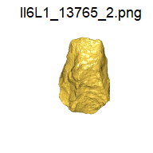<!-- -->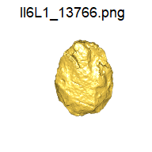<!-- -->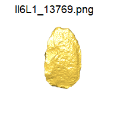<!-- --><!-- -->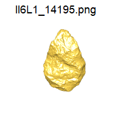<!-- --><!-- -->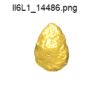<!-- --><!-- --><!-- --><!-- --><!-- --><!-- -->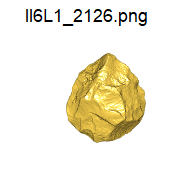<!-- --><!-- --><!-- --><!-- --><!-- --><!-- -->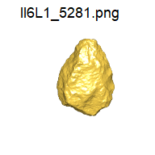<!-- --><!-- --><!-- -->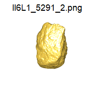<!-- --><!-- -->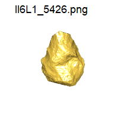<!-- --><!-- --><!-- -->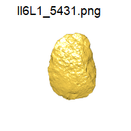<!-- --><!-- --><!-- --><!-- -->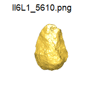<!-- --><!-- --><!-- --><!-- --><!-- -->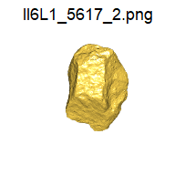<!-- -->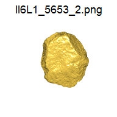<!-- -->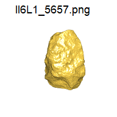<!-- --><!-- --><!-- --><!-- -->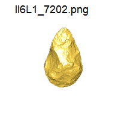<!-- --><!-- --><!-- --><!-- --><!-- -->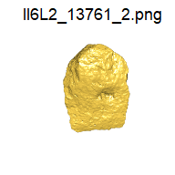<!-- -->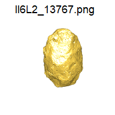<!-- -->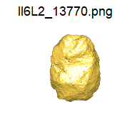<!-- --><!-- -->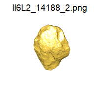<!-- --><!-- --><!-- -->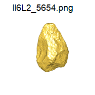<!-- -->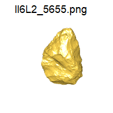<!-- -->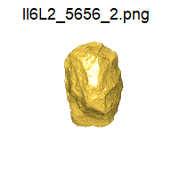<!-- --><!-- -->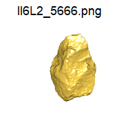<!-- --><!-- -->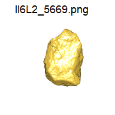<!-- -->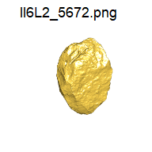<!-- --><!-- -->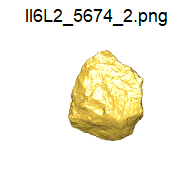<!-- -->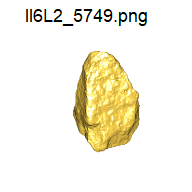<!-- -->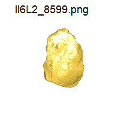<!-- -->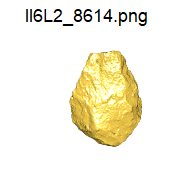<!-- -->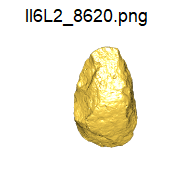<!-- -->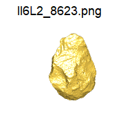<!-- -->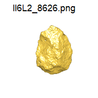<!-- --><!-- -->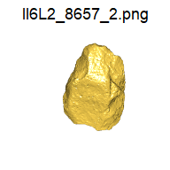<!-- --><!-- -->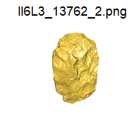<!-- --><!-- -->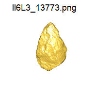<!-- -->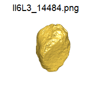<!-- -->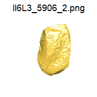<!-- --><!-- -->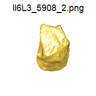<!-- -->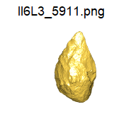<!-- --><!-- --><!-- --><!-- --><!-- --><!-- -->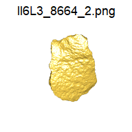<!-- -->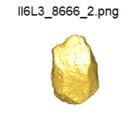<!-- --><!-- --><!-- -->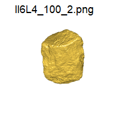<!-- -->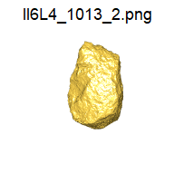<!-- -->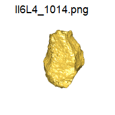<!-- --><!-- --><!-- -->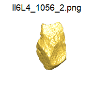<!-- -->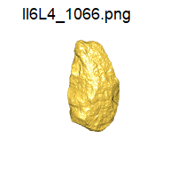<!-- -->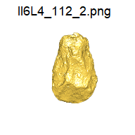<!-- -->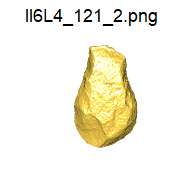<!-- --><!-- -->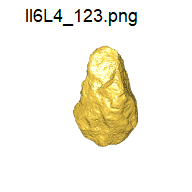<!-- -->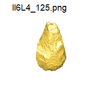<!-- --><!-- --><!-- --><!-- --><!-- --><!-- --><!-- --><!-- --><!-- --><!-- --><!-- --><!-- --><!-- --><!-- --><!-- --><!-- --><!-- --><!-- --><!-- --><!-- --><!-- --><!-- --><!-- --><!-- --><!-- --><!-- --><!-- --><!-- --><!-- --><!-- --><!-- --><!-- --><!-- --><!-- --><!-- --><!-- --><!-- --><!-- --><!-- --><!-- --><!-- --><!-- --><!-- --><!-- --><!-- --><!-- --><!-- --><!-- --><!-- --><!-- --><!-- --><!-- --><!-- --><!-- --><!-- --><!-- --><!-- --><!-- --><!-- --><!-- --><!-- --><!-- --><!-- --><!-- --><!-- --><!-- --><!-- --><!-- --><!-- --><!-- --><!-- --><!-- --><!-- --><!-- --><!-- --><!-- --><!-- --><!-- --><!-- --><!-- --><!-- --><!-- --><!-- --><!-- --><!-- --><!-- --><!-- --><!-- --><!-- --><!-- --><!-- --><!-- --><!-- --><!-- --><!-- --><!-- --><!-- --><!-- --><!-- --><!-- --><!-- --><!-- --><!-- --><!-- --><!-- --><!-- --><!-- --><!-- --><!-- --><!-- --><!-- --><!-- --><!-- --><!-- --><!-- --><!-- --><!-- --><!-- --><!-- --><!-- --><!-- --><!-- --><!-- --><!-- --><!-- --><!-- --><!-- --><!-- --><!-- --><!-- --><!-- --><!-- --><!-- --><!-- --><!-- --><!-- --><!-- --><!-- --><!-- --><!-- --><!-- --><!-- --><!-- --><!-- --><!-- --><!-- --><!-- --><!-- --><!-- --><!-- --><!-- --><!-- --><!-- --><!-- --><!-- --><!-- --><!-- --><!-- --><!-- --><!-- --><!-- --><!-- --><!-- --><!-- --><!-- --><!-- --><!-- --><!-- --><!-- --><!-- --><!-- --><!-- --><!-- --><!-- --><!-- --><!-- --><!-- --><!-- --><!-- --><!-- --><!-- --><!-- --><!-- --><!-- --><!-- --><!-- --><!-- --><!-- --><!-- --><!-- --><!-- --><!-- --><!-- --><!-- --><!-- --><!-- --><!-- --><!-- --><!-- --><!-- --><!-- --><!-- --><!-- --><!-- --><!-- --><!-- --><!-- --><!-- --><!-- --><!-- --><!-- --><!-- --><!-- --><!-- --><!-- --><!-- --><!-- --><!-- --><!-- --><!-- --><!-- --><!-- --><!-- --><!-- --><!-- --><!-- --><!-- --><!-- --><!-- --><!-- --><!-- --><!-- --><!-- --><!-- --><!-- --><!-- --><!-- --><!-- --><!-- --><!-- --><!-- --><!-- --><!-- --><!-- --><!-- --><!-- --><!-- --><!-- --><!-- --><!-- --><!-- --><!-- --><!-- --><!-- --><!-- --><!-- --><!-- --><!-- --><!-- --><!-- --><!-- --><!-- --><!-- -->
