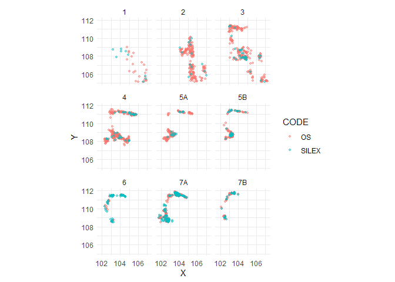

## McPherron 2018 - Orientation data from La Ferrassie

This code fetches a dataset of XYZ coordinate pairs for lithic and bone
data from the recent excavations of La Ferrassie, France. These data
were published in the supplemental information of McPherron (2018). For
more on how to use these data and code refer to that same publication
and this [GitHub site](https://github.com/surf3s/Orientations).

``` r
if (!file.exists('mcpherron_2018.rds')) {
  url = "https://doi.org/10.1371/journal.pone.0190195.s002"
  GET(url, write_disk(tf <- tempfile(fileext = ".RDS")))
  mcpherron_2018 = readRDS(tf)
  saveRDS(mcpherron_2018, 'mcpherron_2018.RDS') 
} else {
  mcpherron_2018 = readRDS('mcpherron_2018.RDS')
}
```

``` r
p = ggplot(mcpherron_2018, aes(X1, Y1, color = CODE))
p = p + geom_point(alpha = .45, size = 1)
p = p + coord_fixed()
p = p + theme_minimal()
p = p + xlab('X') + ylab('Y')
p = p + facet_wrap(~LEVEL, ncol = 3)
p
```

<!-- -->

<div id="refs" class="references hanging-indent">

<div id="ref-mcpherron_additional_2018">

McPherron, Shannon P. 2018. “Additional Statistical and Graphical
Methods for Analyzing Site Formation Processes Using Artifact
Orientations.” *PLOS ONE* 13 (1): e0190195.
<https://doi.org/10.1371/journal.pone.0190195>.

</div>

</div>
