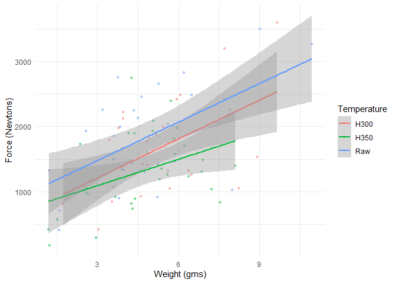

## Mraz et al. 2020 - Heating reduces the force required to remove a flake

This code fetches a dataset from a controlled experiment to test the
effect of heating raw materials on the force required to remove a flake.
The Open Access publication (Mraz et al. 2019) includes a data set on
flakes and on the cores plus some R code to analyze the data and plot
the results. Here we load the flake data and present the data slightly
differently by looking at the effect of heating on the force required to
remove a flake of a given mass.

``` r
library(httr)
library(ggplot2)

if (!file.exists('data/mraz_2020.rds')) {
  url = "https://static-content.springer.com/esm/art%3A10.1038%2Fs41598-019-51139-3/MediaObjects/41598_2019_51139_MOESM3_ESM.csv"
  GET(url, write_disk(tf <- tempfile(fileext = ".csv")))
  mraz_2020 = read.csv(tf)
  saveRDS(mraz_2020, 'data/mraz_2020.rds') 
} else {
  mraz_2020 = readRDS('data/mraz_2020.rds')
}
```

Here we build a figure showing that less force is required to remove
heat treated flakes of an equivalent weight. Regression lines are fitted
to each data class. The grey bands represent the confidence intervals on
the effect size.

``` r
p = ggplot(mraz_2020, aes(Wg, Force, color = Temperature))
p = p + geom_point(alpha = .45, size = 1)
p = p + geom_smooth(method = 'lm')
p = p + theme_minimal()
p = p + ylab('Force (Newtons)') + xlab('Weight (gms)')
p
```

<!-- -->

<div id="refs" class="references hanging-indent">

<div id="ref-mraz_thermal_2019">

Mraz, Veronica, Mike Fisch, Metin I. Eren, C. Owen Lovejoy, and Briggs
Buchanan. 2019. “Thermal Engineering of Stone Increased Prehistoric
Toolmaking Skill.” *Scientific Reports* 9 (1): 14591.
<https://doi.org/10.1038/s41598-019-51139-3>.

</div>

</div>
