Expand Archaeological Data
================

## GitHub Documents

This is an R Markdown format used for publishing markdown documents to
GitHub. When you click the **Knit** button all R code chunks are run and
a markdown file (.md) suitable for publishing to GitHub is
    generated.

## Add needed libraries

``` r
library(tidyverse)
```

    ## ── Attaching packages ───────────────────────────────────────────────────────────────── tidyverse 1.3.0 ──

    ## ✓ ggplot2 3.2.1     ✓ purrr   0.3.3
    ## ✓ tibble  2.1.3     ✓ dplyr   0.8.3
    ## ✓ tidyr   1.0.0     ✓ stringr 1.4.0
    ## ✓ readr   1.3.1     ✓ forcats 0.4.0

    ## ── Conflicts ──────────────────────────────────────────────────────────────────── tidyverse_conflicts() ──
    ## x dplyr::filter() masks stats::filter()
    ## x dplyr::lag()    masks stats::lag()

``` r
library(forcats)
library(data.table)
```

    ## 
    ## Attaching package: 'data.table'

    ## The following objects are masked from 'package:dplyr':
    ## 
    ##     between, first, last

    ## The following object is masked from 'package:purrr':
    ## 
    ##     transpose

``` r
library(DescTools)
```

    ## 
    ## Attaching package: 'DescTools'

    ## The following object is masked from 'package:data.table':
    ## 
    ##     %like%

``` r
library(googlesheets4)
library(readxl)
```

## This is a Project that is Intended to Expand the Use of Open Data in Paleolithic Research

The following code snippets are focused on trying to exapnd the use of
avaialble data in Paleolithic research. These blocks of core are focused
on providing an example of the kind of data available.

\#\#Rezek \#\#\#In 2018 Rezek published a large data set of flakes from
various contexts to investigate patterns over the course of 2 million
years.

The abstract for this paper reads as follows:

Temporal variability in flaking stone has been used as one of the
currencies for hominin behavioural and biological evolution. This
variability is usually traced through changes in artefact forms and
techniques of production, resulting overall in unilineal and normative
models of hominin adaptation. Here, we focus on the fundamental purpose
of flaking stone—the production of a sharp working edge—and model this
behaviour over evolutionary time to reassess the evolutionary efficiency
of stone tool technology. Using more than 18,000 flakes from 81
assemblages spanning two million years, we show that greater production
of sharp edges was followed by increased variability in this behaviour.
We propose that a diachronic increase in this variability was related to
a higher intensity of interrelations between different behaviours
involving the use and management of stone resources that gave fitness
advantages in particular environmental
contexts.

``` r
rezek <- fread('https://static-content.springer.com/esm/art%3A10.1038%2Fs41559-018-0488-4/MediaObjects/41559_2018_488_MOESM3_ESM.csv')
head(rezek)
```

    ##          SITENAME Unit ID LEVEL Assemblage code PERIOD  INDUSTRY LENGTH (mm)
    ## 1: Khor Musa 1017       -                 N1017      B Khormusan      25.290
    ## 2: Khor Musa 1017       -                 N1017      B Khormusan      25.355
    ## 3: Khor Musa 1017       -                 N1017      B Khormusan      25.450
    ## 4: Khor Musa 1017       -                 N1017      B Khormusan      25.570
    ## 5: Khor Musa 1017       -                 N1017      B Khormusan      25.655
    ## 6: Khor Musa 1017       -                 N1017      B Khormusan      25.800
    ##    WIDTH (mm) THICK (mm) Platform Width (mm) PD (mm) EPA (degree) MASS (g)
    ## 1:     22.325      3.100              20.120   5.375           90        2
    ## 2:     12.950      2.005              14.025   1.800           90        1
    ## 3:     21.760      3.330              10.500   2.570           81        2
    ## 4:     13.250      3.390              15.480   4.665           88        1
    ## 5:     21.045      5.280              11.680   2.940          110        3
    ## 6:     18.090      3.215              13.025   4.340           84        2
    ##    length*width/thickness^2
    ## 1:                   58.751
    ## 2:                   81.678
    ## 3:                   49.941
    ## 4:                   29.481
    ## 5:                   19.367
    ## 6:                   45.154

``` r
Desc(rezek)
```

    ## ------------------------------------------------------------------------------ 
    ## Describe rezek (data.table, data.frame):
    ## 
    ## data frame:  18167 obs. of  14 variables
    ##      15611 complete cases (85.9%)
    ## 
    ##   Nr  ColName                   Class      NAs           Levels
    ##   1   SITENAME                  character     .                
    ##   2   Unit ID                   character     .                
    ##   3   LEVEL                     character     .                
    ##   4   Assemblage code           character     .                
    ##   5   PERIOD                    character     .                
    ##   6   INDUSTRY                  character     .                
    ##   7   LENGTH (mm)               numeric      14 (0.1%)         
    ##   8   WIDTH (mm)                numeric      20 (0.1%)         
    ##   9   THICK (mm)                numeric      25 (0.1%)         
    ##   10  Platform Width (mm)       numeric    2348 (12.9%)        
    ##   11  PD (mm)                   numeric    1916 (10.5%)        
    ##   12  EPA (degree)              integer    2018 (11.1%)        
    ##   13  MASS (g)                  numeric      72 (0.4%)         
    ##   14  length*width/thickness^2  numeric      46 (0.3%)         
    ## 
    ## 
    ## ------------------------------------------------------------------------------ 
    ## 1 - SITENAME (character)
    ## 
    ##   length      n    NAs unique levels  dupes
    ##   18'167 18'167      0     34     34      y
    ##          100.0%   0.0%                     
    ## 
    ##                  level   freq   perc  cumfreq  cumperc
    ## 1        PCH IV Bordes  4'174  23.0%    4'174    23.0%
    ## 2           AbriPataud  2'653  14.6%    6'827    37.6%
    ## 3         Abri Peyrony  2'104  11.6%    8'931    49.2%
    ## 4       LaugerieHauteE  1'801   9.9%   10'732    59.1%
    ## 5           PCH IV New  1'581   8.7%   12'313    67.8%
    ## 6        Roc de Marsal  1'330   7.3%   13'643    75.1%
    ## 7        Combe Capelle    701   3.9%   14'344    79.0%
    ## 8       Contrebandiers    534   2.9%   14'878    81.9%
    ## 9   Rosh Ein Mor (D15)    379   2.1%   15'257    84.0%
    ## 10              FxJj63    247   1.4%   15'504    85.3%
    ## 11             Warwasi    207   1.1%   15'711    86.5%
    ## 12           Ksar Akil    199   1.1%   15'910    87.6%
    ## ... etc.
    ##  [list output truncated]

<!-- -->

    ## ------------------------------------------------------------------------------ 
    ## 2 - Unit ID (character)
    ## 
    ##   length      n    NAs unique levels  dupes
    ##   18'167 18'167      0 11'582 11'582      y
    ##          100.0%   0.0%                     
    ## 
    ##     level   freq   perc  cumfreq  cumperc
    ## 1          4'956  27.3%    4'956    27.3%
    ## 2       -  1'049   5.8%    6'005    33.1%
    ## 3     581     40   0.2%    6'045    33.3%
    ## 4     580     26   0.1%    6'071    33.4%
    ## 5     475     20   0.1%    6'091    33.5%
    ## 6     469     15   0.1%    6'106    33.6%
    ## 7     517     14   0.1%    6'120    33.7%
    ## 8     520     14   0.1%    6'134    33.8%
    ## 9     466     12   0.1%    6'146    33.8%
    ## 10    457     10   0.1%    6'156    33.9%
    ## 11    464      9   0.0%    6'165    33.9%
    ## 12    521      9   0.0%    6'174    34.0%
    ## ... etc.
    ##  [list output truncated]

<!-- -->

    ## ------------------------------------------------------------------------------ 
    ## 3 - LEVEL (character)
    ## 
    ##   length      n    NAs unique levels  dupes
    ##   18'167 18'167      0     88     88      y
    ##          100.0%   0.0%                     
    ## 
    ##     level   freq  perc  cumfreq  cumperc
    ## 1      3B  1'482  8.2%    1'482     8.2%
    ## 2      6A  1'163  6.4%    2'645    14.6%
    ## 3      4C  1'111  6.1%    3'756    20.7%
    ## 4       8  1'056  5.8%    4'812    26.5%
    ## 5            996  5.5%    5'808    32.0%
    ## 6    L-3B    796  4.4%    6'604    36.4%
    ## 7      3A    728  4.0%    7'332    40.4%
    ## 8       4    656  3.6%    7'988    44.0%
    ## 9    U-3A    557  3.1%    8'545    47.0%
    ## 10      5    541  3.0%    9'086    50.0%
    ## 11   L-3A    478  2.6%    9'564    52.6%
    ## 12      3    453  2.5%   10'017    55.1%
    ## ... etc.
    ##  [list output truncated]

<!-- -->

    ## ------------------------------------------------------------------------------ 
    ## 4 - Assemblage code (character)
    ## 
    ##   length      n    NAs unique levels  dupes
    ##   18'167 18'167      0     81     81      y
    ##          100.0%   0.0%                     
    ## 
    ##        level   freq  perc  cumfreq  cumperc
    ## 1      PDA3B  1'482  8.2%    1'482     8.2%
    ## 2      PDA6A  1'157  6.4%    2'639    14.5%
    ## 3      PDA4C  1'019  5.6%    3'658    20.1%
    ## 4     AP-L3B    796  4.4%    4'454    24.5%
    ## 5      PDA3A    728  4.0%    5'182    28.5%
    ## 6     AP-U3A    557  3.1%    5'739    31.6%
    ## 7     AP-L3A    478  2.6%    6'217    34.2%
    ## 8       PDA8    411  2.3%    6'628    36.5%
    ## 9   LHE10-16    395  2.2%    7'023    38.7%
    ## 10     CB5-6    384  2.1%    7'407    40.8%
    ## 11       AP4    355  2.0%    7'762    42.7%
    ## 12     PDA6B    352  1.9%    8'114    44.7%
    ## ... etc.
    ##  [list output truncated]

<!-- -->

    ## ------------------------------------------------------------------------------ 
    ## 5 - PERIOD (character)
    ## 
    ##   length      n    NAs unique levels  dupes
    ##   18'167 18'167      0      3      3      y
    ##          100.0%   0.0%                     
    ## 
    ##    level    freq   perc  cumfreq  cumperc
    ## 1      B  11'940  65.7%   11'940    65.7%
    ## 2      C   5'360  29.5%   17'300    95.2%
    ## 3      A     867   4.8%   18'167   100.0%

<!-- -->

    ## ------------------------------------------------------------------------------ 
    ## 6 - INDUSTRY (character)
    ## 
    ##   length      n    NAs unique levels  dupes
    ##   18'167 18'167      0     23     23      y
    ##          100.0%   0.0%                     
    ## 
    ##                    level   freq   perc  cumfreq  cumperc
    ## 1             Mousterian  6'964  38.3%    6'964    38.3%
    ## 2                    MTA  2'210  12.2%    9'174    50.5%
    ## 3        Middle Magdalen  1'672   9.2%   10'846    59.7%
    ## 4       Quina Mousterian  1'201   6.6%   12'047    66.3%
    ## 5            Early Aurig    853   4.7%   12'900    71.0%
    ## 6   Levantine Mousterian    828   4.6%   13'728    75.6%
    ## 7           Recent Aurig    664   3.7%   14'392    79.2%
    ## 8         NW African MSA    534   2.9%   14'926    82.2%
    ## 9                Oldowan    379   2.1%   15'305    84.2%
    ## 10         Middle Gravet    355   2.0%   15'660    86.2%
    ## 11         Recent Gravet    340   1.9%   16'000    88.1%
    ## 12             Acheulian    334   1.8%   16'334    89.9%
    ## ... etc.
    ##  [list output truncated]

<!-- -->

    ## ------------------------------------------------------------------------------ 
    ## 7 - LENGTH (mm) (numeric)
    ## 
    ##    length       n     NAs  unique      0s    mean  meanCI
    ##    18'167  18'153      14  10'027       0  44.159  43.899
    ##             99.9%    0.1%            0.0%          44.418
    ##                                                          
    ##       .05     .10     .25  median     .75     .90     .95
    ##    25.670  27.450  32.225  40.310  51.935  65.448  75.730
    ##                                                          
    ##     range      sd   vcoef     mad     IQR    skew    kurt
    ##   480.100  17.844   0.404  13.833  19.710   3.993  60.863
    ##                                                          
    ## lowest : 2.0, 4.15, 6.29, 7.96, 8.72
    ## highest: 286.9, 411.4, 416.2, 449.1, 482.1

<!-- -->

    ## ------------------------------------------------------------------------------ 
    ## 8 - WIDTH (mm) (numeric)
    ## 
    ##     length        n      NAs   unique       0s     mean   meanCI
    ##     18'167   18'147       20    8'694        0  28.5159  28.3410
    ##               99.9%     0.1%              0.0%           28.6907
    ##                                                                 
    ##        .05      .10      .25   median      .75      .90      .95
    ##    14.2300  16.7630  21.2700  26.8400  33.5725  41.7900  47.7570
    ##                                                                 
    ##      range       sd    vcoef      mad      IQR     skew     kurt
    ##   356.6800  12.0159   0.4214   8.9475  12.3025   4.8358  90.8906
    ##                                                                 
    ## lowest : 1.62, 3.37, 3.38, 3.66, 3.76
    ## highest: 205.8, 291.1, 293.6, 341.7, 358.3

<!-- -->

    ## ------------------------------------------------------------------------------ 
    ## 9 - THICK (mm) (numeric)
    ## 
    ##      length        n      NAs   unique       0s      mean       meanCI
    ##      18'167   18'142       25    4'520        0   7.71416      7.63379
    ##                99.9%     0.1%              0.0%                7.79453
    ##                                                                       
    ##         .05      .10      .25   median      .75       .90          .95
    ##     3.15500  3.75000  4.97125  6.80000  9.32000  12.46950     14.99425
    ##                                                                       
    ##       range       sd    vcoef      mad      IQR      skew         kurt
    ##   483.94000  5.52265  0.71591  3.08381  4.34875  36.94597  3'080.78744
    ##                                                                       
    ## lowest : 1.06, 1.15, 1.205, 1.23, 1.26
    ## highest: 60.8, 64.84, 66.98, 80.3, 485.0

<!-- -->

    ## ------------------------------------------------------------------------------ 
    ## 10 - Platform Width (mm) (numeric)
    ## 
    ##     length       n      NAs   unique       0s     mean   meanCI
    ##     18'167  15'819    2'348    7'436        0  18.4296  18.2789
    ##              87.1%    12.9%              0.0%           18.5803
    ##                                                                
    ##        .05     .10      .25   median      .75      .90      .95
    ##     6.4295  8.1550  11.5625  16.5400  23.2400  30.8900  36.4820
    ##                                                                
    ##      range      sd    vcoef      mad      IQR     skew     kurt
    ##   124.2050  9.6690   0.5246   8.3322  11.6775   1.4469   4.3576
    ##                                                                
    ## lowest : 2.09, 2.15, 2.23, 2.37, 2.39
    ## highest: 90.15, 91.285, 92.0, 100.555, 126.295

<!-- -->

    ## ------------------------------------------------------------------------------ 
    ## 11 - PD (mm) (numeric)
    ## 
    ##    length       n     NAs  unique      0s     mean   meanCI
    ##    18'167  16'251   1'916   3'773       0   6.2000   6.1483
    ##             89.5%   10.5%            0.0%            6.2517
    ##                                                            
    ##       .05     .10     .25  median     .75      .90      .95
    ##    2.2200  2.7200  3.8700  5.5600  7.7825  10.2900  12.2725
    ##                                                            
    ##     range      sd   vcoef     mad     IQR     skew     kurt
    ##   57.4200  3.3620  0.5423  2.8021  3.9125   2.0244  11.4891
    ##                                                            
    ## lowest : 0.88, 1.0, 1.01, 1.02, 1.04
    ## highest: 33.795, 35.435, 44.56, 51.73, 58.3

<!-- -->

    ## ------------------------------------------------------------------------------ 
    ## 12 - EPA (degree) (integer)
    ## 
    ##   length       n    NAs  unique     0s   mean  meanCI
    ##   18'167  16'149  2'018     100      0  82.01   81.80
    ##            88.9%  11.1%           0.0%          82.23
    ##                                                      
    ##      .05     .10    .25  median    .75    .90     .95
    ##    59.00   64.00  73.00   83.00  91.00  99.00  104.00
    ##                                                      
    ##    range      sd  vcoef     mad    IQR   skew    kurt
    ##   100.00   13.76   0.17   13.34  18.00  -0.14    0.26
    ##                                                      
    ## lowest : 30, 31, 32, 34 (3), 35 (4)
    ## highest: 126 (7), 127 (4), 128 (2), 129, 130 (5)

<!-- -->

    ## ------------------------------------------------------------------------------ 
    ## 13 - MASS (g) (numeric)
    ## 
    ##   length       n    NAs  unique     0s   mean  meanCI
    ##   18'167  18'095     72     755      0  15.58   15.22
    ##            99.6%   0.4%           0.0%          15.94
    ##                                                      
    ##      .05     .10    .25  median    .75    .90     .95
    ##     2.00    3.00   5.00    9.00  18.00  32.00   47.13
    ##                                                      
    ##    range      sd  vcoef     mad    IQR   skew    kurt
    ##   644.70   24.69   1.58    7.41  13.00  10.17  185.15
    ##                                                      
    ## lowest : 0.3, 0.5, 0.6 (2), 0.7 (3), 0.8
    ## highest: 589.0, 621.0, 639.0, 644.0, 645.0
    ## 
    ## heap(?): remarkable frequency (5.9%) for the mode(s) (= 6)

<!-- -->

    ## ------------------------------------------------------------------------------ 
    ## 14 - length*width/thickness^2 (numeric)
    ## 
    ##           length              n            NAs         unique             0s
    ##           18'167         18'121             46         15'706              0
    ##                           99.7%           0.3%                          0.0%
    ##                                                                             
    ##              .05            .10            .25         median            .75
    ##     6.5730000000   8.6620000000  13.5930000000  23.2610000000  39.9600000000
    ##                                                                             
    ##            range             sd          vcoef            mad            IQR
    ##   446.2961351510  30.5534298111   0.9458313898  17.2589466000  26.3670000000
    ##                                                                             
    ##            mean         meanCI
    ##   32.3032520807  31.8583688961
    ##                  32.7481352654
    ##                               
    ##             .90            .95
    ##   65.7150000000  87.2370000000
    ##                               
    ##            skew           kurt
    ##    3.3986168117  20.9154701843
    ##                               
    ## lowest : 0.001864849, 0.508, 0.55236218, 0.673, 0.888
    ## highest: 404.299, 405.736, 406.852, 424.261, 446.298

<!-- --> \#\# Reti

Reti 2015 published both archaeological and experimental data sets.
These provide a vareity of variables for whole
flakes.

``` r
#to get this data it is necessary to make sure you have googlesheets4 installed 

#First we need to make the id of the gogole sheet into a vector

#id_Reti <- "1h--GxB-4RAERvZocrkhJi5xPkU6OjTFW8JVAb9B-_oA"

#then load the sheet

#Ok we still need to work on how do we get data from googlesheets. I can't knit this becasue it requests access to my ggogledrive each time. That won't work. 

#Reti<-read_sheet(id_Reti)

Reti<-read_xlsx("RetiPLOSONEData.xlsx")

Desc(Reti)
```

    ## ------------------------------------------------------------------------------ 
    ## Describe Reti (tbl_df, tbl, data.frame):
    ## 
    ## data frame:  1388 obs. of  37 variables
    ##      1388 complete cases (100.0%)
    ## 
    ##   Nr  ColName        Class      NAs  Levels
    ##   1   Context        character  .          
    ##   2   Site           character  .          
    ##   3   Technology     character  .          
    ##   4   Location       character  .          
    ##   5   Type           character  .          
    ##   6   CAT            character  .          
    ##   7   Position       character  .          
    ##   8   BEH            character  .          
    ##   9   Material       character  .          
    ##   10  HammerCAT      character  .          
    ##   11  HammerW        numeric    .          
    ##   12  HammerMAT      character  .          
    ##   13  NUMStrikes     numeric    .          
    ##   14  CoreWeight     numeric    .          
    ##   15  CoreCAT        numeric    .          
    ##   16  Length         numeric    .          
    ##   17  Width          numeric    .          
    ##   18  Thickness      numeric    .          
    ##   19  Max Dimension  numeric    .          
    ##   20  PW             numeric    .          
    ##   21  LPW            numeric    .          
    ##   22  RPW            numeric    .          
    ##   23  PT             numeric    .          
    ##   24  LPT            numeric    .          
    ##   25  RPT            numeric    .          
    ##   26  B Thickness    numeric    .          
    ##   27  P Cortex       numeric    .          
    ##   28  D Cortex       numeric    .          
    ##   29  Weight         numeric    .          
    ##   30  Platform Area  numeric    .          
    ##   31  Area Root      numeric    .          
    ##   32  SL             numeric    .          
    ##   33  SW             numeric    .          
    ##   34  ST             numeric    .          
    ##   35  SMAX           numeric    .          
    ##   36  SBT            numeric    .          
    ##   37  SAREA          numeric    .          
    ## 
    ## 
    ## ------------------------------------------------------------------------------ 
    ## 1 - Context (character - dichotomous)
    ## 
    ##   length      n    NAs unique
    ##    1'388  1'388      0      2
    ##          100.0%   0.0%       
    ## 
    ##                  freq   perc  lci.95  uci.95'
    ## Experimental    1'217  87.7%   85.8%   89.3%
    ## Archaeological    171  12.3%   10.7%   14.2%
    ## 
    ## ' 95%-CI Wilson

<!-- -->

    ## ------------------------------------------------------------------------------ 
    ## 2 - Site (character - dichotomous)
    ## 
    ##   length      n    NAs unique
    ##    1'388  1'388      0      2
    ##          100.0%   0.0%       
    ## 
    ##       freq   perc  lci.95  uci.95'
    ## OLD  1'217  87.7%   85.8%   89.3%
    ## DK     171  12.3%   10.7%   14.2%
    ## 
    ## ' 95%-CI Wilson

<!-- -->

    ## ------------------------------------------------------------------------------ 
    ## 3 - Technology (character - dichotomous)
    ## 
    ##   length      n    NAs unique
    ##    1'388  1'388      0      2
    ##          100.0%   0.0%       
    ## 
    ##           freq   perc  lci.95  uci.95'
    ## OLDOWAN  1'217  87.7%   85.8%   89.3%
    ## Olduvai    171  12.3%   10.7%   14.2%
    ## 
    ## ' 95%-CI Wilson

<!-- -->

    ## ------------------------------------------------------------------------------ 
    ## 4 - Location (character)
    ## 
    ##   length      n    NAs unique levels  dupes
    ##    1'388  1'388      0      3      3      y
    ##          100.0%   0.0%                     
    ## 
    ##      level   freq   perc  cumfreq  cumperc
    ## 1  Rutgers  1'217  87.7%    1'217    87.7%
    ## 2      NMK    107   7.7%    1'324    95.4%
    ## 3      ANM     64   4.6%    1'388   100.0%

<!-- -->

    ## ------------------------------------------------------------------------------ 
    ## 5 - Type (character)
    ## 
    ##   length      n    NAs unique levels  dupes
    ##    1'388  1'388      0      4      4      y
    ##          100.0%   0.0%                     
    ## 
    ##    level   freq   perc  cumfreq  cumperc
    ## 1     WF  1'149  82.8%    1'149    82.8%
    ## 2     SP    185  13.3%    1'334    96.1%
    ## 3     SN     52   3.7%    1'386    99.9%
    ## 4     CF      2   0.1%    1'388   100.0%

<!-- -->

    ## ------------------------------------------------------------------------------ 
    ## 6 - CAT (character)
    ## 
    ##   length      n    NAs unique levels  dupes
    ##    1'388  1'388      0  1'329  1'329      y
    ##          100.0%   0.0%                     
    ## 
    ##                  level  freq  perc  cumfreq  cumperc
    ## 1   10.130000000000001     5  0.4%        5     0.4%
    ## 2                 11.8     4  0.3%        9     0.6%
    ## 3                16.13     4  0.3%       13     0.9%
    ## 4   19.100000000000001     4  0.3%       17     1.2%
    ## 5                 4680     4  0.3%       21     1.5%
    ## 6                 4845     4  0.3%       25     1.8%
    ## 7   8.1300000000000008     4  0.3%       29     2.1%
    ## 8   1.1000000000000001     3  0.2%       32     2.3%
    ## 9                19.12     3  0.2%       35     2.5%
    ## 10                 244     3  0.2%       38     2.7%
    ## 11                4667     3  0.2%       41     3.0%
    ## 12  8.1199999999999992     3  0.2%       44     3.2%
    ## ... etc.
    ##  [list output truncated]

<!-- -->

    ## ------------------------------------------------------------------------------ 
    ## 7 - Position (character)
    ## 
    ##   length      n    NAs unique levels  dupes
    ##    1'388  1'388      0      3      3      y
    ##          100.0%   0.0%                     
    ## 
    ##    level   freq   perc  cumfreq  cumperc
    ## 1      N  1'373  98.9%    1'373    98.9%
    ## 2      a     11   0.8%    1'384    99.7%
    ## 3      b      4   0.3%    1'388   100.0%

<!-- -->

    ## ------------------------------------------------------------------------------ 
    ## 8 - BEH (character)
    ## 
    ##   length      n    NAs unique levels  dupes
    ##    1'388  1'388      0      5      5      y
    ##          100.0%   0.0%                     
    ## 
    ##    level  freq   perc  cumfreq  cumperc
    ## 1      B   418  30.1%      418    30.1%
    ## 2      C   416  30.0%      834    60.1%
    ## 3      A   284  20.5%    1'118    80.5%
    ## 4      D   209  15.1%    1'327    95.6%
    ## 5      N    61   4.4%    1'388   100.0%

<!-- -->

    ## ------------------------------------------------------------------------------ 
    ## 9 - Material (character)
    ## 
    ##   length      n    NAs unique levels  dupes
    ##    1'388  1'388      0      3      3      y
    ##          100.0%   0.0%                     
    ## 
    ##    level  freq   perc  cumfreq  cumperc
    ## 1    BAS   753  54.3%      753    54.3%
    ## 2    QTZ   620  44.7%    1'373    98.9%
    ## 3    QUA    15   1.1%    1'388   100.0%

<!-- -->

    ## ------------------------------------------------------------------------------ 
    ## 10 - HammerCAT (character)
    ## 
    ##   length      n    NAs unique levels  dupes
    ##    1'388  1'388      0      7      7      y
    ##          100.0%   0.0%                     
    ## 
    ##    level  freq   perc  cumfreq  cumperc
    ## 1     H7   351  25.3%      351    25.3%
    ## 2     H4   331  23.8%      682    49.1%
    ## 3     H9   239  17.2%      921    66.4%
    ## 4     H6   214  15.4%    1'135    81.8%
    ## 5      N   171  12.3%    1'306    94.1%
    ## 6     H5    75   5.4%    1'381    99.5%
    ## 7     H8     7   0.5%    1'388   100.0%

<!-- -->

    ## ------------------------------------------------------------------------------ 
    ## 11 - HammerW (numeric)
    ## 
    ##   length       n     NAs  unique      0s    mean  meanCI
    ##    1'388   1'388       0       7     171  479.76  469.21
    ##           100.0%    0.0%           12.3%          490.32
    ##                                                         
    ##      .05     .10     .25  median     .75     .90     .95
    ##     0.00    0.00  438.50  464.30  625.20  659.90  659.90
    ##                                                         
    ##    range      sd   vcoef     mad     IQR    skew    kurt
    ##   669.30  200.47    0.42  238.55  186.70   -1.46    1.23
    ##                                                         
    ## 
    ##    level  freq   perc  cumfreq  cumperc
    ## 1      0   171  12.3%      171    12.3%
    ## 2  438.5   351  25.3%      522    37.6%
    ## 3  464.3   214  15.4%      736    53.0%
    ## 4  576.5    75   5.4%      811    58.4%
    ## 5  625.2   331  23.8%    1'142    82.3%
    ## 6  659.9   233  16.8%    1'375    99.1%
    ## 7  669.3    13   0.9%    1'388   100.0%
    ## 
    ## heap(?): remarkable frequency (25.3%) for the mode(s) (= 438.5)

<!-- -->

    ## ------------------------------------------------------------------------------ 
    ## 12 - HammerMAT (character)
    ## 
    ##   length      n    NAs unique levels  dupes
    ##    1'388  1'388      0      3      3      y
    ##          100.0%   0.0%                     
    ## 
    ##    level  freq   perc  cumfreq  cumperc
    ## 1    BAS   653  47.0%      653    47.0%
    ## 2    QTZ   564  40.6%    1'217    87.7%
    ## 3      N   171  12.3%    1'388   100.0%

<!-- -->

    ## ------------------------------------------------------------------------------ 
    ## 13 - NUMStrikes (numeric)
    ## 
    ##   length       n    NAs  unique     0s  mean  meanCI
    ##    1'388   1'388      0      29    175  3.58    3.36
    ##           100.0%   0.0%          12.6%          3.80
    ##                                                     
    ##      .05     .10    .25  median    .75   .90     .95
    ##     0.00    0.00   1.00    2.00   4.00  8.00   11.00
    ##                                                     
    ##    range      sd  vcoef     mad    IQR  skew    kurt
    ##    50.00    4.18   1.17    1.48   3.00  3.47   20.63
    ##                                                     
    ## lowest : 0.0 (175), 1.0 (247), 2.0 (299), 3.0 (214), 4.0 (119)
    ## highest: 25.0 (2), 27.0, 30.0, 36.0 (2), 50.0
    ## 
    ## heap(?): remarkable frequency (21.5%) for the mode(s) (= 2)

<!-- -->

    ## ------------------------------------------------------------------------------ 
    ## 14 - CoreWeight (numeric)
    ## 
    ##     length       n     NAs  unique        0s      mean    meanCI
    ##      1'388   1'388       0     163       211    868.79    839.25
    ##             100.0%    0.0%             15.2%              898.33
    ##                                                                 
    ##        .05     .10     .25  median       .75       .90       .95
    ##       0.00    0.00  511.60  806.40  1'212.30  1'681.23  2'000.00
    ##                                                                 
    ##      range      sd   vcoef     mad       IQR      skew      kurt
    ##   2'016.80  561.03    0.65  475.62    700.70      0.27     -0.50
    ##                                                                 
    ## lowest : 0.0 (211), 373.4 (9), 391.1 (12), 403.5 (5), 410.5
    ## highest: 1'834.30 (3), 1'849.30 (12), 1'976.70 (10), 2'000.0 (74), 2'016.80 (10)
    ## 
    ## heap(?): remarkable frequency (15.2%) for the mode(s) (= 0)

<!-- -->

    ## ------------------------------------------------------------------------------ 
    ## 15 - CoreCAT (numeric)
    ## 
    ##   length       n    NAs  unique     0s   mean  meanCI
    ##    1'388   1'388      0       5    171   2.57    2.51
    ##           100.0%   0.0%          12.3%           2.63
    ##                                                      
    ##      .05     .10    .25  median    .75    .90     .95
    ##     0.00    0.00   3.00    3.00   3.00   4.00    4.00
    ##                                                      
    ##    range      sd  vcoef     mad    IQR   skew    kurt
    ##     4.00    1.13   0.44    0.00   0.00  -1.34    0.77
    ##                                                      
    ## 
    ##    level  freq   perc  cumfreq  cumperc
    ## 1      0   171  12.3%      171    12.3%
    ## 2      1    58   4.2%      229    16.5%
    ## 3      2   106   7.6%      335    24.1%
    ## 4      3   912  65.7%    1'247    89.8%
    ## 5      4   141  10.2%    1'388   100.0%
    ## 
    ## heap(?): remarkable frequency (65.7%) for the mode(s) (= 3)

<!-- -->

    ## ------------------------------------------------------------------------------ 
    ## 16 - Length (numeric)
    ## 
    ##    length        n      NAs   unique       0s     mean   meanCI
    ##     1'388    1'388        0    1'214        0  34.7393  33.9900
    ##             100.0%     0.0%              0.0%           35.4887
    ##                                                                
    ##       .05      .10      .25   median      .75      .90      .95
    ##   15.6010  18.6590  23.8275  32.3650  43.0000  53.5500  61.1935
    ##                                                                
    ##     range       sd    vcoef      mad      IQR     skew     kurt
    ##   96.7400  14.2318   0.4097  14.0550  19.1725   0.8529   0.8357
    ##                                                                
    ## lowest : 7.84, 9.06, 9.28, 9.83 (2), 9.84
    ## highest: 85.09, 86.5, 87.64, 91.65, 104.58

<!-- -->

    ## ------------------------------------------------------------------------------ 
    ## 17 - Width (numeric)
    ## 
    ##    length        n      NAs   unique       0s     mean   meanCI
    ##     1'388    1'388        0    1'205        0  37.2010  36.4334
    ##             100.0%     0.0%              0.0%           37.9685
    ##                                                                
    ##       .05      .10      .25   median      .75      .90      .95
    ##   17.3680  20.4770  26.2075  35.2900  45.5200  56.9030  65.3250
    ##                                                                
    ##     range       sd    vcoef      mad      IQR     skew     kurt
    ##   95.1800  14.5773   0.3919  14.2255  19.3125   0.8275   0.7352
    ##                                                                
    ## lowest : 8.72, 8.98, 9.97, 10.44, 11.7
    ## highest: 86.85, 87.44, 89.01, 93.16, 103.9

<!-- -->

    ## ------------------------------------------------------------------------------ 
    ## 18 - Thickness (numeric)
    ## 
    ##    length       n     NAs  unique       0s     mean   meanCI
    ##     1'388   1'388       0     945        0  10.8415  10.5413
    ##            100.0%    0.0%             0.0%           11.1417
    ##                                                             
    ##       .05     .10     .25  median      .75      .90      .95
    ##    4.0800  4.9700  6.6950  9.4800  13.6500  18.5920  22.0155
    ##                                                             
    ##     range      sd   vcoef     mad      IQR     skew     kurt
    ##   36.3700  5.7012  0.5259  4.8184   6.9550   1.2505   1.8599
    ##                                                             
    ## lowest : 2.02 (2), 2.04 (3), 2.28, 2.3, 2.4
    ## highest: 33.17, 33.66, 34.54, 35.47, 38.39

<!-- -->

    ## ------------------------------------------------------------------------------ 
    ## 19 - Max Dimension (numeric)
    ## 
    ##    length       n     NAs  unique      0s    mean  meanCI
    ##     1'388   1'388       0   1'233       0  49.128  48.220
    ##            100.0%    0.0%            0.0%          50.036
    ##                                                          
    ##       .05     .10     .25  median     .75     .90     .95
    ##    24.740  28.684  36.170  47.060  59.615  72.208  80.083
    ##                                                          
    ##     range      sd   vcoef     mad     IQR    skew    kurt
    ##   100.380  17.249   0.351  17.220  23.445   0.645   0.242
    ##                                                          
    ## lowest : 14.47, 15.12, 15.57, 15.75, 15.76
    ## highest: 105.86, 106.38, 108.98, 110.65, 114.85

<!-- -->

    ## ------------------------------------------------------------------------------ 
    ## 20 - PW (numeric)
    ## 
    ##    length        n      NAs   unique       0s     mean   meanCI
    ##     1'388    1'388        0    1'171        0  28.9140  28.2674
    ##             100.0%     0.0%              0.0%           29.5606
    ##                                                                
    ##       .05      .10      .25   median      .75      .90      .95
    ##   12.3870  15.1310  19.9975  26.7350  36.0050  45.7130  52.0665
    ##                                                                
    ##     range       sd    vcoef      mad      IQR     skew     kurt
    ##   78.5500  12.2800   0.4247  11.6903  16.0075   0.8086   0.5104
    ##                                                                
    ## lowest : 4.96, 6.06, 6.83, 7.93, 8.0
    ## highest: 69.91, 70.28, 70.87, 71.05, 83.51

<!-- -->

    ## ------------------------------------------------------------------------------ 
    ## 21 - LPW (numeric)
    ## 
    ##    length       n     NAs   unique       0s     mean   meanCI
    ##     1'388   1'388       0    1'036        0  14.9257  14.5409
    ##            100.0%    0.0%              0.0%           15.3105
    ##                                                              
    ##       .05     .10     .25   median      .75      .90      .95
    ##    5.6535  7.1370  9.6100  13.6450  18.6525  24.4830  28.0595
    ##                                                              
    ##     range      sd   vcoef      mad      IQR     skew     kurt
    ##   53.0300  7.3080  0.4896   6.4715   9.0425   1.2729   2.5660
    ##                                                              
    ## lowest : 2.56, 3.0, 3.11, 3.63, 3.71
    ## highest: 45.15, 46.29, 50.09, 51.06, 55.59

<!-- -->

    ## ------------------------------------------------------------------------------ 
    ## 22 - RPW (numeric)
    ## 
    ##    length       n     NAs   unique       0s     mean   meanCI
    ##     1'388   1'388       0    1'057        0  15.4892  15.1026
    ##            100.0%    0.0%              0.0%           15.8758
    ##                                                              
    ##       .05     .10     .25   median      .75      .90      .95
    ##    5.8305  7.1170  9.9975  14.3150  19.8150  25.6930  29.2295
    ##                                                              
    ##     range      sd   vcoef      mad      IQR     skew     kurt
    ##   45.1100  7.3424  0.4740   7.2203   9.8175   0.8882   0.8325
    ##                                                              
    ## lowest : 2.4, 2.86, 2.96, 3.32, 3.35
    ## highest: 42.05 (2), 44.16, 44.48, 46.74, 47.51

<!-- -->

    ## ------------------------------------------------------------------------------ 
    ## 23 - PT (numeric)
    ## 
    ##    length       n     NAs  unique       0s     mean   meanCI
    ##     1'388   1'388       0     934        0  10.0793   9.8024
    ##            100.0%    0.0%             0.0%           10.3561
    ##                                                             
    ##       .05     .10     .25  median      .75      .90      .95
    ##    3.5135  4.4100  6.3450  9.0800  12.7125  16.9880  20.1110
    ##                                                             
    ##     range      sd   vcoef     mad      IQR     skew     kurt
    ##   55.9500  5.2580  0.5217  4.5590   6.3675   1.4301   5.1453
    ##                                                             
    ## lowest : 1.01, 1.58, 1.68, 1.81, 1.83
    ## highest: 28.3, 29.25, 29.7, 29.86, 56.96

<!-- -->

    ## ------------------------------------------------------------------------------ 
    ## 24 - LPT (numeric)
    ## 
    ##    length       n     NAs  unique      0s     mean   meanCI
    ##     1'388   1'388       0     871       0   7.5964   7.3694
    ##            100.0%    0.0%            0.0%            7.8234
    ##                                                            
    ##       .05     .10     .25  median     .75      .90      .95
    ##    2.5905  3.1800  4.4075  6.6550  9.6750  13.4600  16.1160
    ##                                                            
    ##     range      sd   vcoef     mad     IQR     skew     kurt
    ##   36.8000  4.3112  0.5675  3.6398  5.2675   1.4152   3.2906
    ##                                                            
    ## lowest : 0.81, 1.05, 1.15, 1.28, 1.31 (3)
    ## highest: 24.05, 24.75, 26.91, 31.4, 37.61

<!-- -->

    ## ------------------------------------------------------------------------------ 
    ## 25 - RPT (numeric)
    ## 
    ##    length       n     NAs  unique      0s     mean   meanCI
    ##     1'388   1'388       0     848       0   7.2886   7.0705
    ##            100.0%    0.0%            0.0%            7.5067
    ##                                                            
    ##       .05     .10     .25  median     .75      .90      .95
    ##    2.4610  3.1940  4.3775  6.3500  9.0125  12.8440  14.9395
    ##                                                            
    ##     range      sd   vcoef     mad     IQR     skew     kurt
    ##   34.8900  4.1425  0.5684  3.2543  4.6350   1.5887   4.4258
    ##                                                            
    ## lowest : 0.74, 0.96, 0.97, 1.03, 1.04
    ## highest: 26.0, 28.24, 30.69, 32.63, 35.63

<!-- -->

    ## ------------------------------------------------------------------------------ 
    ## 26 - B Thickness (numeric)
    ## 
    ##    length       n     NAs  unique       0s     mean   meanCI
    ##     1'388   1'388       0     961        0  10.1630   9.8691
    ##            100.0%    0.0%             0.0%           10.4570
    ##                                                             
    ##       .05     .10     .25  median      .75      .90      .95
    ##    3.2375  4.2670  6.0525  9.0750  12.8625  17.6090  21.0585
    ##                                                             
    ##     range      sd   vcoef     mad      IQR     skew     kurt
    ##   36.2500  5.5826  0.5493  4.9519   6.8100   1.1983   1.7733
    ##                                                             
    ## lowest : 1.06, 1.31, 1.35, 1.58, 1.63
    ## highest: 31.07, 33.06, 33.26, 34.79, 37.31

<!-- -->

    ## ------------------------------------------------------------------------------ 
    ## 27 - P Cortex (numeric)
    ## 
    ##   length       n    NAs  unique     0s   mean  meanCI
    ##    1'388   1'388      0      17    655   0.53    0.48
    ##           100.0%   0.0%          47.2%           0.57
    ##                                                      
    ##      .05     .10    .25  median    .75    .90     .95
    ##     0.00    0.00   0.00    0.60   1.00   1.00    1.00
    ##                                                      
    ##    range      sd  vcoef     mad    IQR   skew    kurt
    ##    28.94    0.91   1.73    0.59   1.00  22.15  691.97
    ##                                                      
    ## lowest : 0.0 (655), 0.05, 0.1 (4), 0.15, 0.2 (7)
    ## highest: 0.85 (2), 0.9 (21), 0.95 (30), 1.0 (623), 28.94
    ## 
    ## heap(?): remarkable frequency (47.2%) for the mode(s) (= 0)

<!-- -->

    ## ------------------------------------------------------------------------------ 
    ## 28 - D Cortex (numeric)
    ## 
    ##   length       n    NAs  unique    0s   mean  meanCI
    ##    1'388   1'388      0      22   125   0.67    0.64
    ##           100.0%   0.0%          9.0%           0.70
    ##                                                     
    ##      .05     .10    .25  median   .75    .90     .95
    ##     0.00    0.05   0.40    0.80  1.00   1.00    1.00
    ##                                                     
    ##    range      sd  vcoef     mad   IQR   skew    kurt
    ##    19.20    0.60   0.90    0.30  0.60  20.56  631.35
    ##                                                     
    ## lowest : 0.0 (125), 0.05 (17), 0.1 (28), 0.15 (31), 0.2 (42)
    ## highest: 0.85 (68), 0.9 (92), 0.95 (120), 1.0 (361), 19.2
    ## 
    ## heap(?): remarkable frequency (26.0%) for the mode(s) (= 1)

<!-- -->

    ## ------------------------------------------------------------------------------ 
    ## 29 - Weight (numeric)
    ## 
    ##    length       n    NAs  unique      0s    mean  meanCI
    ##     1'388   1'388      0     610       0  30.070  28.118
    ##            100.0%   0.0%            0.0%          32.023
    ##                                                         
    ##       .05     .10    .25  median     .75     .90     .95
    ##     2.400   3.500  7.400  17.250  37.725  73.940  99.165
    ##                                                         
    ##     range      sd  vcoef     mad     IQR    skew    kurt
    ##   347.600  37.079  1.233  17.421  30.325   3.063  13.904
    ##                                                         
    ## lowest : 0.5 (2), 0.6 (4), 0.7, 0.8 (3), 0.9 (2)
    ## highest: 262.4, 274.2, 284.0, 313.4, 348.1

<!-- -->

    ## ------------------------------------------------------------------------------ 
    ## 30 - Platform Area (numeric)
    ## 
    ##        length          n       NAs     unique         0s       mean     meanCI
    ##         1'388      1'388         0      1'387          0  222.97710  212.40199
    ##                   100.0%      0.0%                  0.0%             233.55221
    ##                                                                               
    ##           .05        .10       .25     median        .75        .90        .95
    ##      36.90010   51.17405  87.25537  160.63686  297.06037  474.32214  617.58995
    ##                                                                               
    ##         range         sd     vcoef        mad        IQR       skew       kurt
    ##   2'844.67389  200.84097   0.90072  134.45403  209.80500    3.04512   23.43813
    ##                                                                               
    ## lowest : 8.27824, 8.88925, 9.852, 10.96783, 11.9102
    ## highest: 1'080.69663, 1'247.66264, 1'249.05130, 1'277.54040, 2'852.95213

<!-- -->

    ## ------------------------------------------------------------------------------ 
    ## 31 - Area Root (numeric)
    ## 
    ##      length         n       NAs     unique         0s       mean     meanCI
    ##       1'388     1'388         0      1'387          0  13.741268  13.433436
    ##                100.0%      0.0%                  0.0%             14.049100
    ##                                                                            
    ##         .05       .10       .25     median        .75        .90        .95
    ##    6.074492  7.153604  9.341058  12.674258  17.235439  21.778936  24.851243
    ##                                                                            
    ##       range        sd     vcoef        mad        IQR       skew       kurt
    ##   50.535840  5.846305  0.425456   5.614509   7.894381   0.934988   1.629857
    ##                                                                            
    ## lowest : 2.877193, 2.981484, 3.13879, 3.311771, 3.451116
    ## highest: 32.873951, 35.322268, 35.34192, 35.742697, 53.413033

<!-- -->

    ## ------------------------------------------------------------------------------ 
    ## 32 - SL (numeric)
    ## 
    ##      length          n        NAs     unique         0s       mean     meanCI
    ##       1'388      1'388          0      1'387          0  1.6990848  1.6766432
    ##                 100.0%       0.0%                  0.0%             1.7215265
    ##                                                                              
    ##         .05        .10        .25     median        .75        .90        .95
    ##   1.1029614  1.2178113  1.4026849  1.6424470  1.9614641  2.2479492  2.4516957
    ##                                                                              
    ##       range         sd      vcoef        mad        IQR       skew       kurt
    ##   3.3305249  0.4262091  0.2508463  0.4029789  0.5587792  0.7534965  1.1372661
    ##                                                                              
    ## lowest : 0.4903086, 0.6821928, 0.7109086, 0.7603649, 0.77922
    ## highest: 3.3427082, 3.3624628, 3.3955623, 3.4975802, 3.8208335

<!-- -->

    ## ------------------------------------------------------------------------------ 
    ## 33 - SW (numeric)
    ## 
    ##      length          n        NAs     unique         0s       mean     meanCI
    ##       1'388      1'388          0      1'387          0  1.8195335  1.7984902
    ##                 100.0%       0.0%                  0.0%             1.8405768
    ##                                                                              
    ##         .05        .10        .25     median        .75        .90        .95
    ##   1.2547120  1.3531523  1.5452312  1.7677072  2.0642964  2.3537723  2.5404377
    ##                                                                              
    ##       range         sd      vcoef        mad        IQR       skew       kurt
    ##   3.0537369  0.3996515  0.2196450  0.3794986  0.5190652  0.6385336  0.7661955
    ##                                                                              
    ## lowest : 0.6999444, 0.7256529, 0.9756767, 0.9785921, 0.9939768
    ## highest: 3.1902098, 3.282186, 3.3641979, 3.4805413, 3.7536813

<!-- -->

    ## ------------------------------------------------------------------------------ 
    ## 34 - ST (numeric)
    ## 
    ##      length          n        NAs     unique         0s       mean      meanCI
    ##       1'388      1'388          0      1'387          0  0.5082858   0.5010065
    ##                 100.0%       0.0%                  0.0%              0.5155650
    ##                                                                               
    ##         .05        .10        .25     median        .75        .90         .95
    ##   0.3178688  0.3487557  0.4143101  0.4948515  0.5924783  0.6802931   0.7363649
    ##                                                                               
    ##       range         sd      vcoef        mad        IQR       skew        kurt
    ##   1.7663352  0.1382470  0.2719868  0.1307598  0.1781682  1.5762075  11.4328560
    ##                                                                               
    ## lowest : 0.2094333, 0.211389, 0.2332596, 0.2344845, 0.2357705
    ## highest: 0.9463073, 0.9486689, 0.9545804, 1.6206117, 1.9757685

<!-- -->

    ## ------------------------------------------------------------------------------ 
    ## 35 - SMAX (numeric)
    ## 
    ##      length          n        NAs     unique         0s       mean     meanCI
    ##       1'388      1'388          0      1'387          0  2.4123800  2.3909468
    ##                 100.0%       0.0%                  0.0%             2.4338131
    ##                                                                              
    ##         .05        .10        .25     median        .75        .90        .95
    ##   1.8600600  1.9529135  2.1175320  2.3564843  2.6469346  2.9595464  3.1416925
    ##                                                                              
    ##       range         sd      vcoef        mad        IQR       skew       kurt
    ##   3.8736782  0.4070557  0.1687361  0.3907251  0.5294026  0.8117207  1.5841891
    ##                                                                              
    ## lowest : 0.9250776, 1.249903, 1.5058991, 1.6108626, 1.6286624
    ## highest: 3.8260799, 3.9830861, 4.2538905, 4.4397892, 4.7987558

<!-- -->

    ## ------------------------------------------------------------------------------ 
    ## 36 - SBT (numeric)
    ## 
    ##      length          n        NAs     unique         0s       mean     meanCI
    ##       1'388      1'388          0      1'387          0  0.4734360  0.4661124
    ##                 100.0%       0.0%                  0.0%             0.4807595
    ##                                                                              
    ##         .05        .10        .25     median        .75        .90        .95
    ##   0.2473173  0.2954722  0.3767125  0.4721820  0.5611031  0.6527679  0.7057370
    ##                                                                              
    ##       range         sd      vcoef        mad        IQR       skew       kurt
    ##   0.9346990  0.1390874  0.2937830  0.1386600  0.1843905  0.2793495  0.3247416
    ##                                                                              
    ## lowest : 0.1197526, 0.138137, 0.1407147, 0.1476897, 0.153408
    ## highest: 0.9282673, 0.935066, 1.0483712, 1.0484934, 1.0544515

<!-- -->

    ## ------------------------------------------------------------------------------ 
    ## 37 - SAREA (numeric)
    ## 
    ##      length          n        NAs     unique         0s       mean     meanCI
    ##       1'388      1'388          0      1'387          0  0.6648185  0.6569167
    ##                 100.0%       0.0%                  0.0%             0.6727202
    ##                                                                              
    ##         .05        .10        .25     median        .75        .90        .95
    ##   0.4317990  0.4710576  0.5606407  0.6666977  0.7668864  0.8459704  0.9073722
    ##                                                                              
    ##       range         sd      vcoef        mad        IQR       skew       kurt
    ##   1.3776629  0.1500691  0.2257294  0.1520583  0.2062457  0.2964456  1.0864297
    ##                                                                              
    ## lowest : 0.250859, 0.2651646, 0.2719251, 0.2786909, 0.2800578
    ## highest: 1.1091167, 1.1169876, 1.2163093, 1.2663521, 1.6285219

<!-- -->
\#\#\#Mraz et
    al. 20202

    ## ------------------------------------------------------------------------------ 
    ## Describe Mraz (data.frame):
    ## 
    ## data frame:  5 obs. of  48 variables
    ##      1 complete cases (20.0%)
    ## 
    ##   Nr  ColName      Class    NAs        Levels                            
    ##   1   Temperature  factor   .          (5): 1-Core (g), 2-Core #, 3-Total
    ##                                        Weight (g), 4-Weight (g)of first  
    ##                                        flake removed, 5-Weight (g) of    
    ##                                        second flake removed              
    ##   2   Unheated     numeric  .                                            
    ##   3   Unheated.1   numeric  .                                            
    ##   4   Unheated.2   numeric  .                                            
    ##   5   Unheated.3   numeric  .                                            
    ##   6   Unheated.4   numeric  .                                            
    ##   7   Unheated.5   numeric  .                                            
    ##   8   Unheated.6   numeric  .                                            
    ##   9   Unheated.7   numeric  .                                            
    ##   10  Unheated.8   numeric  .                                            
    ##   11  Unheated.9   numeric  .                                            
    ##   12  Unheated.10  numeric  .                                            
    ##   13  Unheated.11  numeric  .                                            
    ##   14  Unheated.12  numeric  .                                            
    ##   15  Unheated.13  numeric  .                                            
    ##   16  Unheated.14  numeric  .                                            
    ##   17  Unheated.15  numeric  .                                            
    ##   18  X300C        numeric  .                                            
    ##   19  X300C.1      numeric  .                                            
    ##   20  X300C.2      numeric  .                                            
    ##   21  X300C.3      numeric  .                                            
    ##   22  X300C.4      numeric  .                                            
    ##   23  X300C.5      numeric  .                                            
    ##   24  X300C.6      numeric  .                                            
    ##   25  X300C.7      numeric  .                                            
    ##   26  X300C.8      numeric  .                                            
    ##   27  X300C.9      numeric  .                                            
    ##   28  X300C.10     numeric  .                                            
    ##   29  X300C.11     numeric  .                                            
    ##   30  X300C.12     numeric  .                                            
    ##   31  X300C.13     numeric  .                                            
    ##   32  X300C.14     numeric  .                                            
    ##   33  X350C        numeric  .                                            
    ##   34  X350C.1      numeric  .                                            
    ##   35  X350C.2      numeric  .                                            
    ##   36  X350C.3      numeric  .                                            
    ##   37  X350C.4      numeric  .                                            
    ##   38  X350C.5      numeric  .                                            
    ##   39  X350C.6      numeric  .                                            
    ##   40  X350C.7      numeric  .                                            
    ##   41  X350C.8      numeric  .                                            
    ##   42  X350C.9      numeric  .                                            
    ##   43  X350C.10     numeric  .                                            
    ##   44  X350C.11     numeric  .                                            
    ##   45  X350C.12     numeric  .                                            
    ##   46  X350C.13     numeric  .                                            
    ##   47  X350C.14     numeric  .                                            
    ##   48  X            numeric  4 (80.0%)                                    
    ## 
    ## 
    ## ------------------------------------------------------------------------------ 
    ## 1 - Temperature (factor)
    ## 
    ##   length      n    NAs unique levels  dupes
    ##        5      5      0      5      5      n
    ##          100.0%   0.0%                     
    ## 
    ##                                 level  freq   perc  cumfreq  cumperc
    ## 1                            Core (g)     1  20.0%        1    20.0%
    ## 2                              Core #     1  20.0%        2    40.0%
    ## 3                    Total Weight (g)     1  20.0%        3    60.0%
    ## 4   Weight  (g)of first flake removed     1  20.0%        4    80.0%
    ## 5  Weight (g) of second flake removed     1  20.0%        5   100.0%

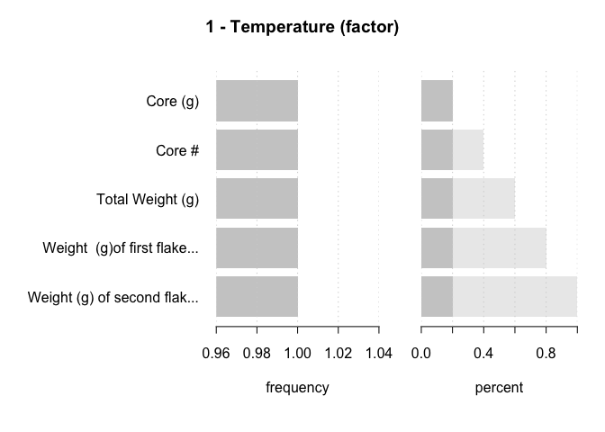<!-- -->

    ## ------------------------------------------------------------------------------ 
    ## 2 - Unheated (numeric)
    ## 
    ##      length        n     NAs  unique         0s       mean     meanCI
    ##           5        5       0     = n          1    471.692   -308.897
    ##               100.0%    0.0%              20.0%             1'252.281
    ##                                                                      
    ##         .05      .10     .25  median        .75        .90        .95
    ##       2.186    4.372  10.930  27.000  1'154.800  1'161.358  1'163.544
    ##                                                                      
    ##       range       sd   vcoef     mad        IQR       skew       kurt
    ##   1'165.730  628.664   1.333  40.030  1'143.870      0.292     -2.253
    ##                                                                      
    ## 
    ##      level  freq   perc  cumfreq  cumperc
    ## 1        0     1  20.0%        1    20.0%
    ## 2    10.93     1  20.0%        2    40.0%
    ## 3       27     1  20.0%        3    60.0%
    ## 4   1154.8     1  20.0%        4    80.0%
    ## 5  1165.73     1  20.0%        5   100.0%

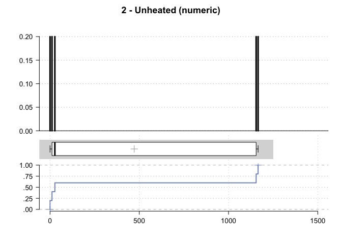<!-- -->

    ## ------------------------------------------------------------------------------ 
    ## 3 - Unheated.1 (numeric)
    ## 
    ##    length        n    NAs  unique       0s     mean     meanCI
    ##         5        5      0     = n        0  403.552   -270.141
    ##             100.0%   0.0%             0.0%           1'077.245
    ##                                                               
    ##       .05      .10    .25  median      .75      .90        .95
    ##     4.846    4.942  5.230  12.000  992.900  998.888  1'000.884
    ##                                                               
    ##     range       sd  vcoef     mad      IQR     skew       kurt
    ##   998.130  542.573  1.344  10.749  987.670    0.292     -2.253
    ##                                                               
    ## 
    ##      level  freq   perc  cumfreq  cumperc
    ## 1     4.75     1  20.0%        1    20.0%
    ## 2     5.23     1  20.0%        2    40.0%
    ## 3       12     1  20.0%        3    60.0%
    ## 4    992.9     1  20.0%        4    80.0%
    ## 5  1002.88     1  20.0%        5   100.0%

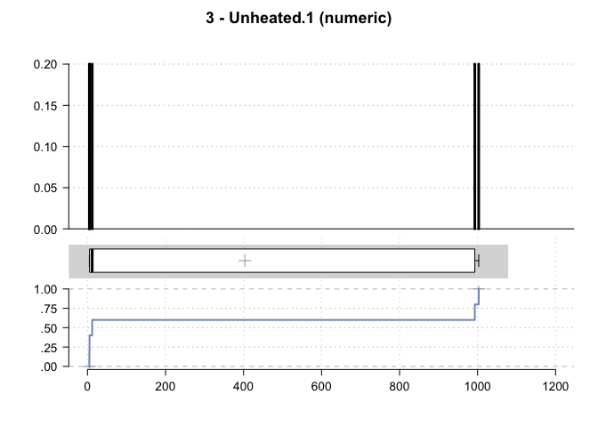<!-- -->

    ## ------------------------------------------------------------------------------ 
    ## 4 - Unheated.2 (numeric)
    ## 
    ##    length        n    NAs  unique       0s     mean    meanCI
    ##         5        5      0     = n        0  366.716  -239.454
    ##             100.0%   0.0%             0.0%            972.886
    ##                                                              
    ##       .05      .10    .25  median      .75      .90       .95
    ##     1.678    2.156  3.590  26.000  899.000  901.874   902.832
    ##                                                              
    ##     range       sd  vcoef     mad      IQR     skew      kurt
    ##   902.590  488.192  1.331  36.768  895.410    0.291    -2.253
    ##                                                              
    ## 
    ##     level  freq   perc  cumfreq  cumperc
    ## 1     1.2     1  20.0%        1    20.0%
    ## 2    3.59     1  20.0%        2    40.0%
    ## 3      26     1  20.0%        3    60.0%
    ## 4     899     1  20.0%        4    80.0%
    ## 5  903.79     1  20.0%        5   100.0%

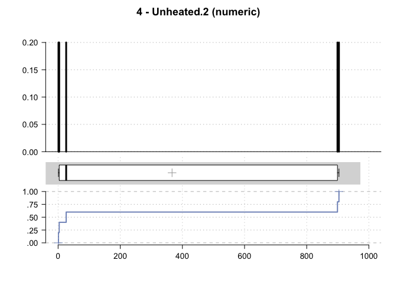<!-- -->

    ## ------------------------------------------------------------------------------ 
    ## 5 - Unheated.3 (numeric)
    ## 
    ##      length        n    NAs  unique         0s       mean     meanCI
    ##           5        5      0     = n          0    447.456   -305.609
    ##               100.0%   0.0%               0.0%             1'200.521
    ##                                                                     
    ##         .05      .10    .25  median        .75        .90        .95
    ##       2.352    2.704  3.760   7.880  1'106.000  1'112.984  1'115.312
    ##                                                                     
    ##       range       sd  vcoef     mad        IQR       skew       kurt
    ##   1'115.640  606.496  1.355   8.718  1'102.240      0.292     -2.253
    ##                                                                     
    ## 
    ##      level  freq   perc  cumfreq  cumperc
    ## 1        2     1  20.0%        1    20.0%
    ## 2     3.76     1  20.0%        2    40.0%
    ## 3     7.88     1  20.0%        3    60.0%
    ## 4     1106     1  20.0%        4    80.0%
    ## 5  1117.64     1  20.0%        5   100.0%

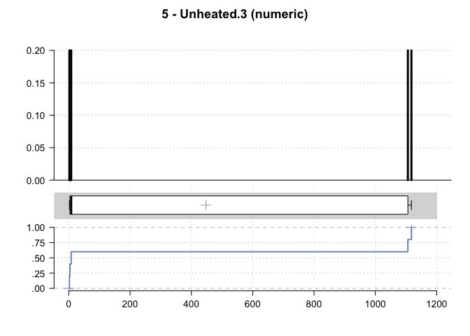<!-- -->

    ## ------------------------------------------------------------------------------ 
    ## 6 - Unheated.4 (numeric)
    ## 
    ##    length        n    NAs  unique       0s     mean     meanCI
    ##         5        5      0     = n        0  379.628   -254.416
    ##             100.0%   0.0%             0.0%           1'013.672
    ##                                                               
    ##       .05      .10    .25  median      .75      .90        .95
    ##     4.142    5.104  7.990   9.000  933.400  940.102    942.336
    ##                                                               
    ##     range       sd  vcoef     mad      IQR     skew       kurt
    ##   941.390  510.641  1.345   8.629  925.410    0.292     -2.253
    ##                                                               
    ## 
    ##     level  freq   perc  cumfreq  cumperc
    ## 1    3.18     1  20.0%        1    20.0%
    ## 2    7.99     1  20.0%        2    40.0%
    ## 3       9     1  20.0%        3    60.0%
    ## 4   933.4     1  20.0%        4    80.0%
    ## 5  944.57     1  20.0%        5   100.0%

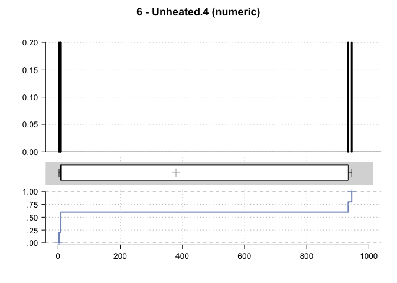<!-- -->

    ## ------------------------------------------------------------------------------ 
    ## 7 - Unheated.5 (numeric)
    ## 
    ##    length        n    NAs  unique       0s     mean    meanCI
    ##         5        5      0     = n        1  348.004  -237.677
    ##             100.0%   0.0%            20.0%            933.685
    ##                                                              
    ##       .05      .10    .25  median      .75      .90       .95
    ##     1.000    2.000  5.000   5.610  861.900  865.266   866.388
    ##                                                              
    ##     range       sd  vcoef     mad      IQR     skew      kurt
    ##   867.510  471.691  1.355   8.317  856.900    0.292    -2.253
    ##                                                              
    ## 
    ##     level  freq   perc  cumfreq  cumperc
    ## 1       0     1  20.0%        1    20.0%
    ## 2       5     1  20.0%        2    40.0%
    ## 3    5.61     1  20.0%        3    60.0%
    ## 4   861.9     1  20.0%        4    80.0%
    ## 5  867.51     1  20.0%        5   100.0%

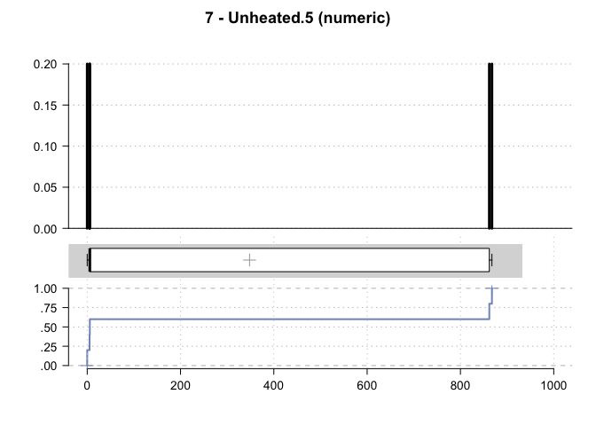<!-- -->

    ## ------------------------------------------------------------------------------ 
    ## 8 - Unheated.6 (numeric)
    ## 
    ##      length        n    NAs  unique         0s       mean     meanCI
    ##           5        5      0     = n          0    454.016   -307.594
    ##               100.0%   0.0%               0.0%             1'215.626
    ##                                                                     
    ##         .05      .10    .25  median        .75        .90        .95
    ##       4.672    5.004  6.000   7.900  1'119.800  1'127.144  1'129.592
    ##                                                                     
    ##       range       sd  vcoef     mad        IQR       skew       kurt
    ##   1'127.700  613.378  1.351   5.278  1'113.800      0.292     -2.253
    ##                                                                     
    ## 
    ##      level  freq   perc  cumfreq  cumperc
    ## 1     4.34     1  20.0%        1    20.0%
    ## 2        6     1  20.0%        2    40.0%
    ## 3      7.9     1  20.0%        3    60.0%
    ## 4   1119.8     1  20.0%        4    80.0%
    ## 5  1132.04     1  20.0%        5   100.0%

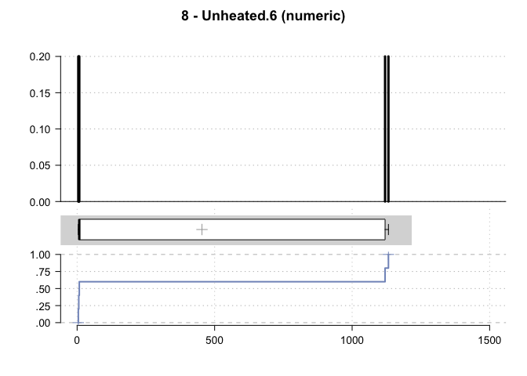<!-- -->

    ## ------------------------------------------------------------------------------ 
    ## 9 - Unheated.7 (numeric)
    ## 
    ##    length        n    NAs  unique       0s     mean     meanCI
    ##         5        5      0     = n        0  385.700   -258.852
    ##             100.0%   0.0%             0.0%           1'030.252
    ##                                                               
    ##       .05      .10    .25  median      .75      .90        .95
    ##     2.318    3.056  5.270  13.000  950.900  955.010    956.380
    ##                                                               
    ##     range       sd  vcoef     mad      IQR     skew       kurt
    ##   956.170  519.103  1.346  16.931  945.630    0.292     -2.253
    ##                                                               
    ## 
    ##     level  freq   perc  cumfreq  cumperc
    ## 1    1.58     1  20.0%        1    20.0%
    ## 2    5.27     1  20.0%        2    40.0%
    ## 3      13     1  20.0%        3    60.0%
    ## 4   950.9     1  20.0%        4    80.0%
    ## 5  957.75     1  20.0%        5   100.0%

<!-- -->

    ## ------------------------------------------------------------------------------ 
    ## 10 - Unheated.8 (numeric)
    ## 
    ##    length        n    NAs  unique       0s     mean     meanCI
    ##         5        5      0     = n        0  386.412   -256.932
    ##             100.0%   0.0%             0.0%           1'029.756
    ##                                                               
    ##       .05      .10    .25  median      .75      .90        .95
    ##     4.532    4.554  4.620  15.000  949.400  954.878    956.704
    ##                                                               
    ##     range       sd  vcoef     mad      IQR     skew       kurt
    ##   954.020  518.130  1.341  15.552  944.780    0.292     -2.253
    ##                                                               
    ## 
    ##     level  freq   perc  cumfreq  cumperc
    ## 1    4.51     1  20.0%        1    20.0%
    ## 2    4.62     1  20.0%        2    40.0%
    ## 3      15     1  20.0%        3    60.0%
    ## 4   949.4     1  20.0%        4    80.0%
    ## 5  958.53     1  20.0%        5   100.0%

<!-- -->

    ## ------------------------------------------------------------------------------ 
    ## 11 - Unheated.9 (numeric)
    ## 
    ##      length        n    NAs  unique         0s       mean     meanCI
    ##           5        5      0     = n          0    467.928   -313.060
    ##               100.0%   0.0%               0.0%             1'248.916
    ##                                                                     
    ##         .05      .10    .25  median        .75        .90        .95
    ##       3.112    3.644  5.240  18.000  1'153.000  1'157.692  1'159.256
    ##                                                                     
    ##       range       sd  vcoef     mad        IQR       skew       kurt
    ##   1'158.240  628.985  1.344  22.862  1'147.760      0.292     -2.253
    ##                                                                     
    ## 
    ##      level  freq   perc  cumfreq  cumperc
    ## 1     2.58     1  20.0%        1    20.0%
    ## 2     5.24     1  20.0%        2    40.0%
    ## 3       18     1  20.0%        3    60.0%
    ## 4     1153     1  20.0%        4    80.0%
    ## 5  1160.82     1  20.0%        5   100.0%

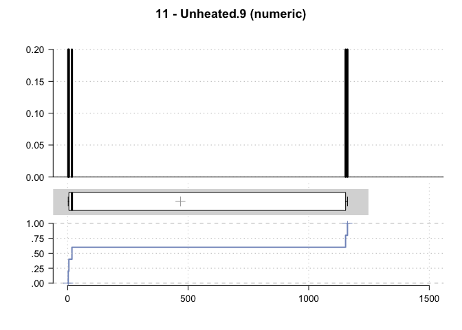<!-- -->

    ## ------------------------------------------------------------------------------ 
    ## 12 - Unheated.10 (numeric)
    ## 
    ##      length        n    NAs  unique         0s       mean     meanCI
    ##           5        5      0     = n          0    456.156   -310.643
    ##               100.0%   0.0%               0.0%             1'222.955
    ##                                                                     
    ##         .05      .10    .25  median        .75        .90        .95
    ##       2.052    2.514  3.900  10.000  1'129.900  1'133.194  1'134.292
    ##                                                                     
    ##       range       sd  vcoef     mad        IQR       skew       kurt
    ##   1'133.800  617.558  1.354  12.469  1'126.000      0.292     -2.253
    ##                                                                     
    ## 
    ##      level  freq   perc  cumfreq  cumperc
    ## 1     1.59     1  20.0%        1    20.0%
    ## 2      3.9     1  20.0%        2    40.0%
    ## 3       10     1  20.0%        3    60.0%
    ## 4   1129.9     1  20.0%        4    80.0%
    ## 5  1135.39     1  20.0%        5   100.0%

<!-- -->

    ## ------------------------------------------------------------------------------ 
    ## 13 - Unheated.11 (numeric)
    ## 
    ##      length        n    NAs  unique         0s       mean     meanCI
    ##           5        5      0     = n          0    483.052   -327.585
    ##               100.0%   0.0%               0.0%             1'293.689
    ##                                                                     
    ##         .05      .10    .25  median        .75        .90        .95
    ##       3.876    3.902  3.980  11.000  1'194.300  1'198.998  1'200.564
    ##                                                                     
    ##       range       sd  vcoef     mad        IQR       skew       kurt
    ##   1'198.280  652.864  1.352  10.601  1'190.320      0.292     -2.253
    ##                                                                     
    ## 
    ##      level  freq   perc  cumfreq  cumperc
    ## 1     3.85     1  20.0%        1    20.0%
    ## 2     3.98     1  20.0%        2    40.0%
    ## 3       11     1  20.0%        3    60.0%
    ## 4   1194.3     1  20.0%        4    80.0%
    ## 5  1202.13     1  20.0%        5   100.0%

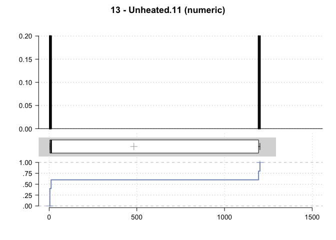<!-- -->

    ## ------------------------------------------------------------------------------ 
    ## 14 - Unheated.12 (numeric)
    ## 
    ##      length        n    NAs  unique         0s       mean     meanCI
    ##           5        5      0     = n          0    508.596   -346.018
    ##               100.0%   0.0%               0.0%             1'363.210
    ##                                                                     
    ##         .05      .10    .25  median        .75        .90        .95
    ##       3.574    4.148  5.870   9.020  1'255.100  1'264.034  1'267.012
    ##                                                                     
    ##       range       sd  vcoef     mad        IQR       skew       kurt
    ##   1'266.990  688.282  1.353   8.925  1'249.230      0.292     -2.253
    ##                                                                     
    ## 
    ##      level  freq   perc  cumfreq  cumperc
    ## 1        3     1  20.0%        1    20.0%
    ## 2     5.87     1  20.0%        2    40.0%
    ## 3     9.02     1  20.0%        3    60.0%
    ## 4   1255.1     1  20.0%        4    80.0%
    ## 5  1269.99     1  20.0%        5   100.0%

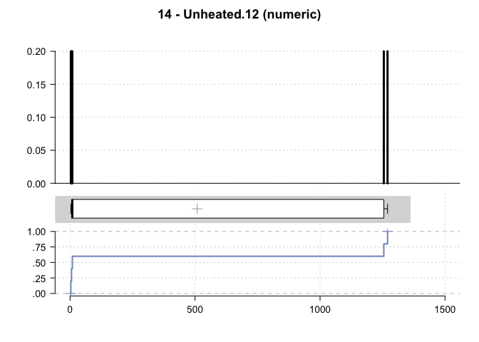<!-- -->

    ## ------------------------------------------------------------------------------ 
    ## 15 - Unheated.13 (numeric)
    ## 
    ##      length        n    NAs  unique       0s       mean     meanCI
    ##           5        5      0     = n        0    409.400   -261.362
    ##               100.0%   0.0%             0.0%             1'080.162
    ##                                                                   
    ##         .05      .10    .25  median      .75        .90        .95
    ##       6.506    6.802  7.690  31.000  994.100  1'002.440  1'005.220
    ##                                                                   
    ##       range       sd  vcoef     mad      IQR       skew       kurt
    ##   1'001.790  540.212  1.320  36.754  986.410      0.292     -2.253
    ##                                                                   
    ## 
    ##    level  freq   perc  cumfreq  cumperc
    ## 1   6.21     1  20.0%        1    20.0%
    ## 2   7.69     1  20.0%        2    40.0%
    ## 3     31     1  20.0%        3    60.0%
    ## 4  994.1     1  20.0%        4    80.0%
    ## 5   1008     1  20.0%        5   100.0%

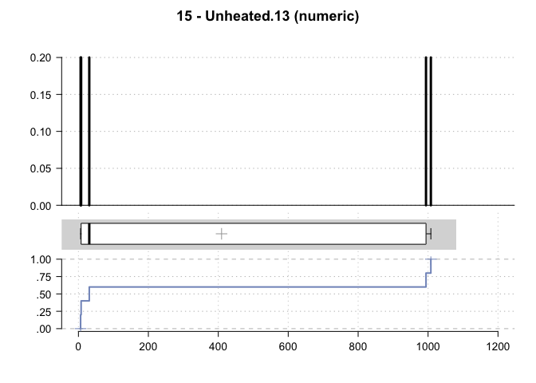<!-- -->

    ## ------------------------------------------------------------------------------ 
    ## 16 - Unheated.14 (numeric)
    ## 
    ##    length        n    NAs  unique       0s     mean    meanCI
    ##         5        5      0     = n        0  317.760  -206.092
    ##             100.0%   0.0%             0.0%            841.612
    ##                                                              
    ##       .05      .10    .25  median      .75      .90       .95
    ##     3.906    4.002  4.290  21.000  775.800  780.660   782.280
    ##                                                              
    ##     range       sd  vcoef     mad      IQR     skew      kurt
    ##   780.090  421.895  1.328  25.486  771.510    0.292    -2.253
    ##                                                              
    ## 
    ##    level  freq   perc  cumfreq  cumperc
    ## 1   3.81     1  20.0%        1    20.0%
    ## 2   4.29     1  20.0%        2    40.0%
    ## 3     21     1  20.0%        3    60.0%
    ## 4  775.8     1  20.0%        4    80.0%
    ## 5  783.9     1  20.0%        5   100.0%

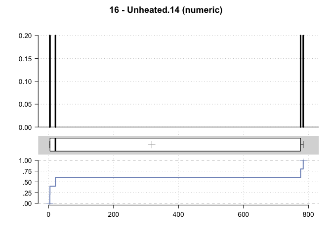<!-- -->

    ## ------------------------------------------------------------------------------ 
    ## 17 - Unheated.15 (numeric)
    ## 
    ##    length        n    NAs  unique       0s     mean    meanCI
    ##         5        5      0     = n        0  363.872  -236.688
    ##             100.0%   0.0%             0.0%            964.432
    ##                                                              
    ##       .05      .10    .25  median      .75      .90       .95
    ##     4.176    4.752  6.480  22.000  888.600  894.648   896.664
    ##                                                              
    ##     range       sd  vcoef     mad      IQR     skew      kurt
    ##   895.080  483.674  1.329  27.280  882.120    0.292    -2.253
    ##                                                              
    ## 
    ##     level  freq   perc  cumfreq  cumperc
    ## 1     3.6     1  20.0%        1    20.0%
    ## 2    6.48     1  20.0%        2    40.0%
    ## 3      22     1  20.0%        3    60.0%
    ## 4   888.6     1  20.0%        4    80.0%
    ## 5  898.68     1  20.0%        5   100.0%

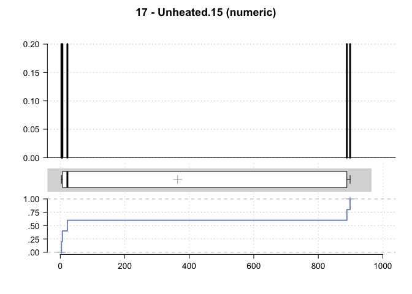<!-- -->

    ## ------------------------------------------------------------------------------ 
    ## 18 - X300C (numeric)
    ## 
    ##      length        n    NAs  unique         0s       mean     meanCI
    ##           5        5      0     = n          0    436.012   -280.994
    ##               100.0%   0.0%               0.0%             1'153.018
    ##                                                                     
    ##         .05      .10    .25  median        .75        .90        .95
    ##       4.766    5.632  8.230  31.000  1'062.400  1'069.678  1'072.104
    ##                                                                     
    ##       range       sd  vcoef     mad        IQR       skew       kurt
    ##   1'070.630  577.456  1.324  40.178  1'054.170      0.292     -2.253
    ##                                                                     
    ## 
    ##      level  freq   perc  cumfreq  cumperc
    ## 1      3.9     1  20.0%        1    20.0%
    ## 2     8.23     1  20.0%        2    40.0%
    ## 3       31     1  20.0%        3    60.0%
    ## 4   1062.4     1  20.0%        4    80.0%
    ## 5  1074.53     1  20.0%        5   100.0%

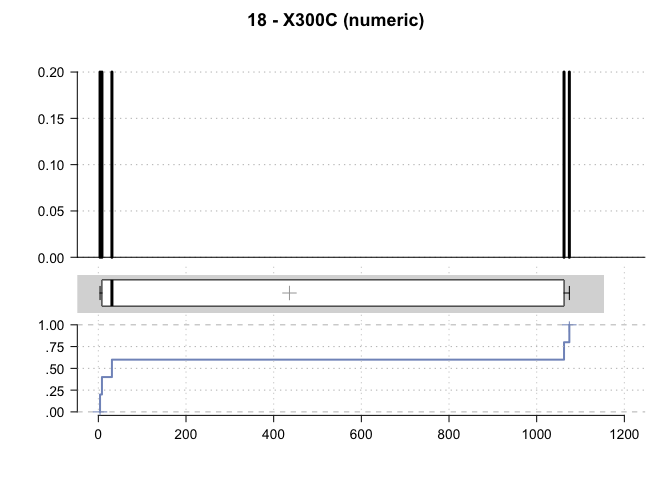<!-- -->

    ## ------------------------------------------------------------------------------ 
    ## 19 - X300C.1 (numeric)
    ## 
    ##    length        n    NAs  unique       0s     mean    meanCI
    ##         5        5      0     = n        0  352.716  -234.712
    ##             100.0%   0.0%             0.0%            940.144
    ##                                                              
    ##       .05      .10    .25  median      .75      .90       .95
    ##     4.904    5.198  6.080  11.000  865.600  872.014   874.152
    ##                                                              
    ##     range       sd  vcoef     mad      IQR     skew      kurt
    ##   871.680  473.097  1.341   9.474  859.520    0.292    -2.253
    ##                                                              
    ## 
    ##     level  freq   perc  cumfreq  cumperc
    ## 1    4.61     1  20.0%        1    20.0%
    ## 2    6.08     1  20.0%        2    40.0%
    ## 3      11     1  20.0%        3    60.0%
    ## 4   865.6     1  20.0%        4    80.0%
    ## 5  876.29     1  20.0%        5   100.0%

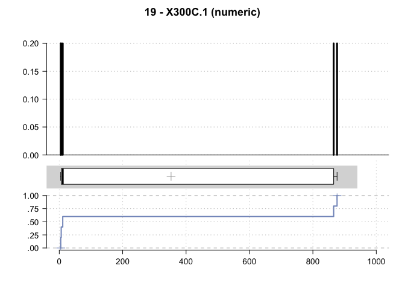<!-- -->

    ## ------------------------------------------------------------------------------ 
    ## 20 - X300C.2 (numeric)
    ## 
    ##    length        n    NAs  unique       0s     mean     meanCI
    ##         5        5      0     = n        0  378.332   -244.466
    ##             100.0%   0.0%             0.0%           1'001.130
    ##                                                               
    ##       .05      .10    .25  median      .75      .90        .95
    ##     3.596    3.642  3.780  29.000  924.000  928.398    929.864
    ##                                                               
    ##     range       sd  vcoef     mad      IQR     skew       kurt
    ##   927.780  501.583  1.326  37.732  920.220    0.291     -2.253
    ##                                                               
    ## 
    ##     level  freq   perc  cumfreq  cumperc
    ## 1    3.55     1  20.0%        1    20.0%
    ## 2    3.78     1  20.0%        2    40.0%
    ## 3      29     1  20.0%        3    60.0%
    ## 4     924     1  20.0%        4    80.0%
    ## 5  931.33     1  20.0%        5   100.0%

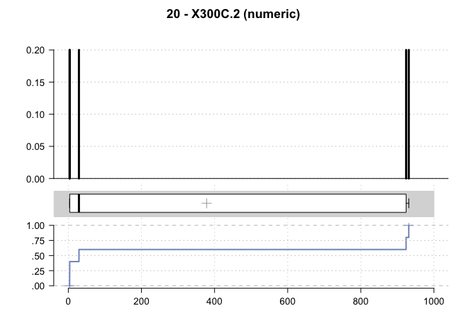<!-- -->

    ## ------------------------------------------------------------------------------ 
    ## 21 - X300C.3 (numeric)
    ## 
    ##    length        n    NAs  unique       0s     mean     meanCI
    ##         5        5      0     = n        0  377.464   -252.623
    ##             100.0%   0.0%             0.0%           1'007.551
    ##                                                               
    ##       .05      .10    .25  median      .75      .90        .95
    ##     4.702    5.454  7.710   9.000  927.500  934.496    936.828
    ##                                                               
    ##     range       sd  vcoef     mad      IQR     skew       kurt
    ##   935.210  507.454  1.344   7.487  919.790    0.292     -2.253
    ##                                                               
    ## 
    ##     level  freq   perc  cumfreq  cumperc
    ## 1    3.95     1  20.0%        1    20.0%
    ## 2    7.71     1  20.0%        2    40.0%
    ## 3       9     1  20.0%        3    60.0%
    ## 4   927.5     1  20.0%        4    80.0%
    ## 5  939.16     1  20.0%        5   100.0%

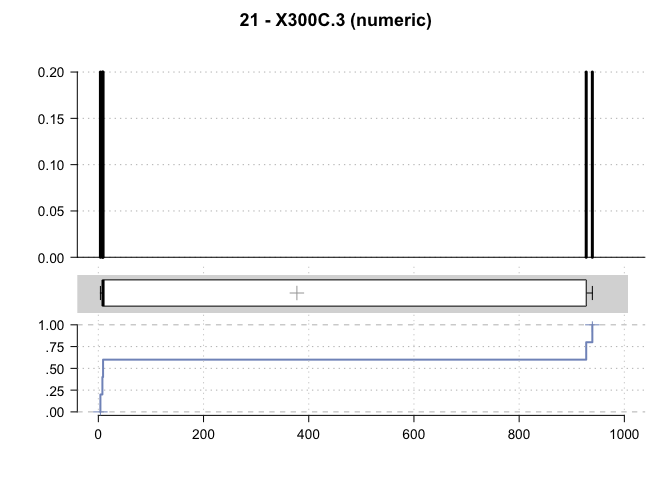<!-- -->

    ## ------------------------------------------------------------------------------ 
    ## 22 - X300C.4 (numeric)
    ## 
    ##    length        n    NAs  unique       0s     mean    meanCI
    ##         5        5      0     = n        0  345.224  -223.882
    ##             100.0%   0.0%             0.0%            914.330
    ##                                                              
    ##       .05      .10    .25  median      .75      .90       .95
    ##     3.556    4.072  5.620  23.000  842.900  848.096   849.828
    ##                                                              
    ##     range       sd  vcoef     mad      IQR     skew      kurt
    ##   848.520  458.341  1.328  29.593  837.280    0.292    -2.253
    ##                                                              
    ## 
    ##     level  freq   perc  cumfreq  cumperc
    ## 1    3.04     1  20.0%        1    20.0%
    ## 2    5.62     1  20.0%        2    40.0%
    ## 3      23     1  20.0%        3    60.0%
    ## 4   842.9     1  20.0%        4    80.0%
    ## 5  851.56     1  20.0%        5   100.0%

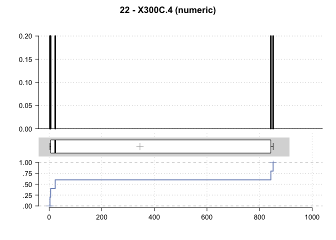<!-- -->

    ## ------------------------------------------------------------------------------ 
    ## 23 - X300C.5 (numeric)
    ## 
    ##      length        n    NAs  unique         0s       mean     meanCI
    ##           5        5      0     = n          0    527.424   -362.606
    ##               100.0%   0.0%               0.0%             1'417.454
    ##                                                                     
    ##         .05      .10    .25  median        .75        .90        .95
    ##       1.836    2.672  5.180   5.680  1'307.200  1'313.716  1'315.888
    ##                                                                     
    ##       range       sd  vcoef     mad        IQR       skew       kurt
    ##   1'317.060  716.804  1.359   6.939  1'302.020      0.292     -2.253
    ##                                                                     
    ## 
    ##      level  freq   perc  cumfreq  cumperc
    ## 1        1     1  20.0%        1    20.0%
    ## 2     5.18     1  20.0%        2    40.0%
    ## 3     5.68     1  20.0%        3    60.0%
    ## 4   1307.2     1  20.0%        4    80.0%
    ## 5  1318.06     1  20.0%        5   100.0%

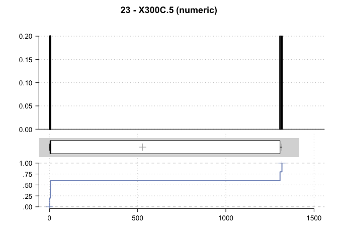<!-- -->

    ## ------------------------------------------------------------------------------ 
    ## 24 - X300C.6 (numeric)
    ## 
    ##    length        n    NAs  unique       0s     mean    meanCI
    ##         5        5      0     = n        0  353.836  -237.926
    ##             100.0%   0.0%             0.0%            945.598
    ##                                                              
    ##       .05      .10    .25  median      .75      .90       .95
    ##     4.424    4.938  6.480   7.000  870.700  876.934   879.012
    ##                                                              
    ##     range       sd  vcoef     mad      IQR     skew      kurt
    ##   877.180  476.588  1.347   4.581  864.220    0.292    -2.253
    ##                                                              
    ## 
    ##     level  freq   perc  cumfreq  cumperc
    ## 1    3.91     1  20.0%        1    20.0%
    ## 2    6.48     1  20.0%        2    40.0%
    ## 3       7     1  20.0%        3    60.0%
    ## 4   870.7     1  20.0%        4    80.0%
    ## 5  881.09     1  20.0%        5   100.0%

<!-- -->

    ## ------------------------------------------------------------------------------ 
    ## 25 - X300C.7 (numeric)
    ## 
    ##    length        n    NAs  unique       0s     mean    meanCI
    ##         5        5      0     = n        0  340.756  -193.596
    ##             100.0%   0.0%             0.0%            875.108
    ##                                                              
    ##       .05      .10    .25  median      .75      .90       .95
    ##     4.968    5.086  5.440  71.000  806.100  812.274   814.332
    ##                                                              
    ##     range       sd  vcoef     mad      IQR     skew      kurt
    ##   811.540  430.352  1.263  98.074  800.660    0.284    -2.249
    ##                                                              
    ## 
    ##     level  freq   perc  cumfreq  cumperc
    ## 1    4.85     1  20.0%        1    20.0%
    ## 2    5.44     1  20.0%        2    40.0%
    ## 3      71     1  20.0%        3    60.0%
    ## 4   806.1     1  20.0%        4    80.0%
    ## 5  816.39     1  20.0%        5   100.0%

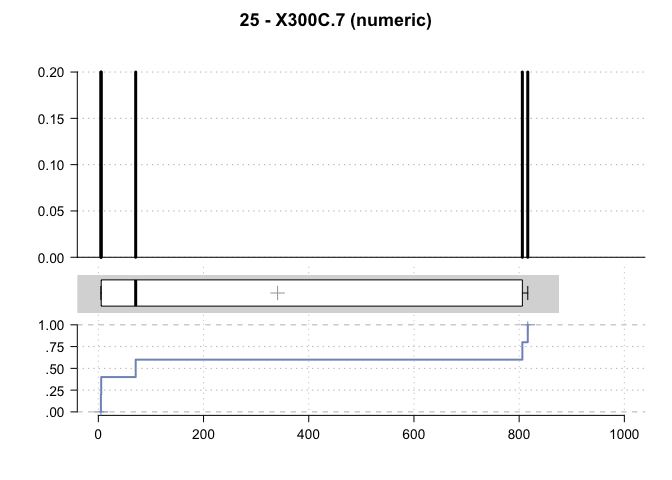<!-- -->

    ## ------------------------------------------------------------------------------ 
    ## 26 - X300C.8 (numeric)
    ## 
    ##      length        n    NAs  unique         0s       mean     meanCI
    ##           5        5      0     = n          0    536.868   -364.795
    ##               100.0%   0.0%               0.0%             1'438.531
    ##                                                                     
    ##         .05      .10    .25  median        .75        .90        .95
    ##       2.966    3.212  3.950  13.000  1'329.000  1'333.002  1'334.336
    ##                                                                     
    ##       range       sd  vcoef     mad        IQR       skew       kurt
    ##   1'332.950  726.173  1.353  15.241  1'325.050      0.292     -2.253
    ##                                                                     
    ## 
    ##      level  freq   perc  cumfreq  cumperc
    ## 1     2.72     1  20.0%        1    20.0%
    ## 2     3.95     1  20.0%        2    40.0%
    ## 3       13     1  20.0%        3    60.0%
    ## 4     1329     1  20.0%        4    80.0%
    ## 5  1335.67     1  20.0%        5   100.0%

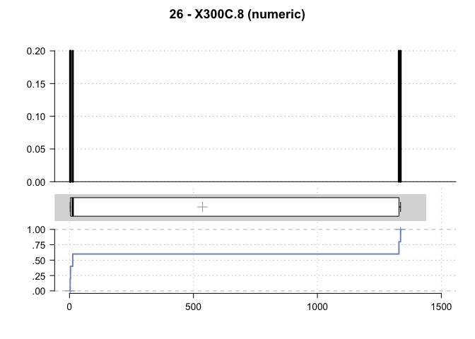<!-- -->

    ## ------------------------------------------------------------------------------ 
    ## 27 - X300C.9 (numeric)
    ## 
    ##    length        n    NAs  unique       0s     mean    meanCI
    ##         5        5      0     = n        0  376.892  -244.378
    ##             100.0%   0.0%             0.0%            998.162
    ##                                                              
    ##       .05      .10    .25  median      .75      .90       .95
    ##     3.158    4.596  8.910  24.000  919.600  925.978   928.104
    ##                                                              
    ##     range       sd  vcoef     mad      IQR     skew      kurt
    ##   928.510  500.353  1.328  33.032  910.690    0.292    -2.253
    ##                                                              
    ## 
    ##     level  freq   perc  cumfreq  cumperc
    ## 1    1.72     1  20.0%        1    20.0%
    ## 2    8.91     1  20.0%        2    40.0%
    ## 3      24     1  20.0%        3    60.0%
    ## 4   919.6     1  20.0%        4    80.0%
    ## 5  930.23     1  20.0%        5   100.0%

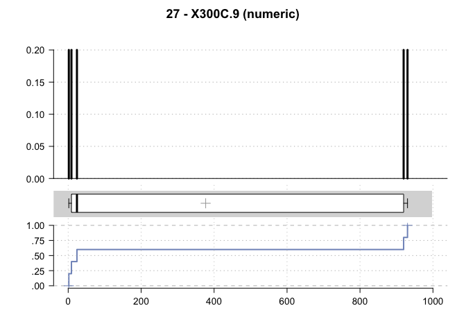<!-- -->

    ## ------------------------------------------------------------------------------ 
    ## 28 - X300C.10 (numeric)
    ## 
    ##    length        n    NAs  unique       0s     mean    meanCI
    ##         5        5      0     = n        0  367.632  -248.154
    ##             100.0%   0.0%             0.0%            983.418
    ##                                                              
    ##       .05      .10    .25  median      .75      .90       .95
    ##     3.752    4.044  4.920   8.000  906.700  911.728   913.404
    ##                                                              
    ##     range       sd  vcoef     mad      IQR     skew      kurt
    ##   911.620  495.936  1.349   6.731  901.780    0.292    -2.253
    ##                                                              
    ## 
    ##     level  freq   perc  cumfreq  cumperc
    ## 1    3.46     1  20.0%        1    20.0%
    ## 2    4.92     1  20.0%        2    40.0%
    ## 3       8     1  20.0%        3    60.0%
    ## 4   906.7     1  20.0%        4    80.0%
    ## 5  915.08     1  20.0%        5   100.0%

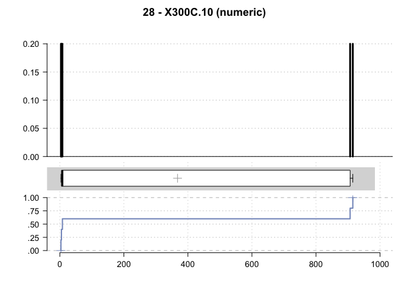<!-- -->

    ## ------------------------------------------------------------------------------ 
    ## 29 - X300C.11 (numeric)
    ## 
    ##      length        n    NAs  unique         0s       mean     meanCI
    ##           5        5      0     = n          0    424.324   -274.553
    ##               100.0%   0.0%               0.0%             1'123.201
    ##                                                                     
    ##         .05      .10    .25  median        .75        .90        .95
    ##       5.786    5.932  6.370  28.000  1'034.800  1'042.006  1'044.408
    ##                                                                     
    ##       range       sd  vcoef     mad        IQR       skew       kurt
    ##   1'041.170  562.855  1.326  33.151  1'028.430      0.292     -2.253
    ##                                                                     
    ## 
    ##      level  freq   perc  cumfreq  cumperc
    ## 1     5.64     1  20.0%        1    20.0%
    ## 2     6.37     1  20.0%        2    40.0%
    ## 3       28     1  20.0%        3    60.0%
    ## 4   1034.8     1  20.0%        4    80.0%
    ## 5  1046.81     1  20.0%        5   100.0%

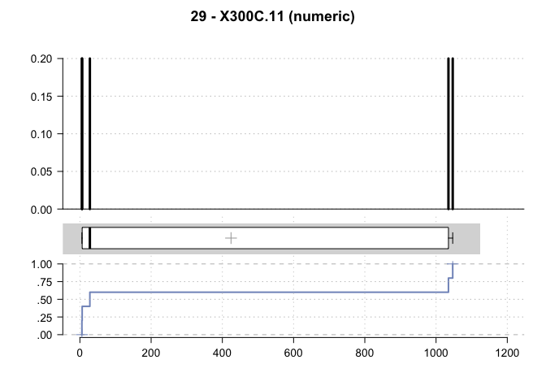<!-- -->

    ## ------------------------------------------------------------------------------ 
    ## 30 - X300C.12 (numeric)
    ## 
    ##    length        n    NAs  unique       0s     mean     meanCI
    ##         5        5      0     = n        0  387.664   -261.531
    ##             100.0%   0.0%             0.0%           1'036.859
    ##                                                               
    ##       .05      .10    .25  median      .75      .90        .95
    ##     3.936    3.952  4.000   9.640  953.600  961.736    964.448
    ##                                                               
    ##     range       sd  vcoef     mad      IQR     skew       kurt
    ##   963.240  522.843  1.349   8.480  949.600    0.292     -2.253
    ##                                                               
    ## 
    ##     level  freq   perc  cumfreq  cumperc
    ## 1    3.92     1  20.0%        1    20.0%
    ## 2       4     1  20.0%        2    40.0%
    ## 3    9.64     1  20.0%        3    60.0%
    ## 4   953.6     1  20.0%        4    80.0%
    ## 5  967.16     1  20.0%        5   100.0%

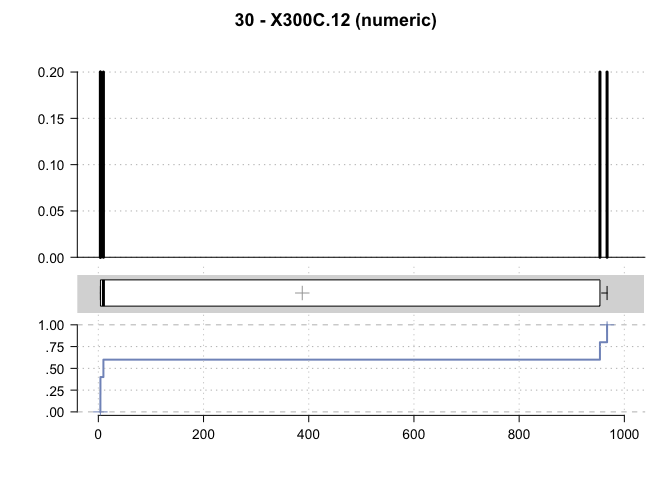<!-- -->

    ## ------------------------------------------------------------------------------ 
    ## 31 - X300C.13 (numeric)
    ## 
    ##      length        n    NAs  unique         0s       mean     meanCI
    ##           5        5      0     = n          0    432.368   -293.915
    ##               100.0%   0.0%               0.0%             1'158.651
    ##                                                                     
    ##         .05      .10    .25  median        .75        .90        .95
    ##       4.744    4.808  5.000   5.940  1'067.800  1'074.172  1'076.296
    ##                                                                     
    ##       range       sd  vcoef     mad        IQR       skew       kurt
    ##   1'073.740  584.927  1.353   1.868  1'062.800      0.292     -2.253
    ##                                                                     
    ## 
    ##      level  freq   perc  cumfreq  cumperc
    ## 1     4.68     1  20.0%        1    20.0%
    ## 2        5     1  20.0%        2    40.0%
    ## 3     5.94     1  20.0%        3    60.0%
    ## 4   1067.8     1  20.0%        4    80.0%
    ## 5  1078.42     1  20.0%        5   100.0%

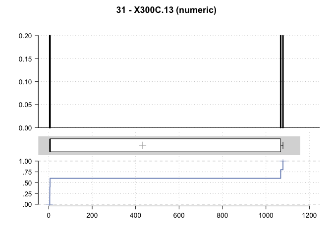<!-- -->

    ## ------------------------------------------------------------------------------ 
    ## 32 - X300C.14 (numeric)
    ## 
    ##      length        n    NAs  unique         0s       mean     meanCI
    ##           5        5      0     = n          0    427.368   -286.572
    ##               100.0%   0.0%               0.0%             1'141.308
    ##                                                                     
    ##         .05      .10    .25  median        .75        .90        .95
    ##       3.844    4.088  4.820  14.000  1'053.000  1'058.052  1'059.736
    ##                                                                     
    ##       range       sd  vcoef     mad        IQR       skew       kurt
    ##   1'057.820  574.986  1.345  15.419  1'048.180      0.292     -2.253
    ##                                                                     
    ## 
    ##      level  freq   perc  cumfreq  cumperc
    ## 1      3.6     1  20.0%        1    20.0%
    ## 2     4.82     1  20.0%        2    40.0%
    ## 3       14     1  20.0%        3    60.0%
    ## 4     1053     1  20.0%        4    80.0%
    ## 5  1061.42     1  20.0%        5   100.0%

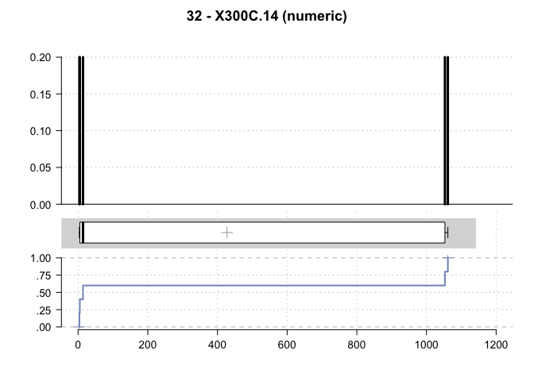<!-- -->

    ## ------------------------------------------------------------------------------ 
    ## 33 - X350C (numeric)
    ## 
    ##    length        n    NAs  unique       0s     mean     meanCI
    ##         5        5      0     = n        0  383.560   -254.614
    ##             100.0%   0.0%             0.0%           1'021.734
    ##                                                               
    ##       .05      .10    .25  median      .75      .90        .95
    ##     3.694    4.798  8.110  14.000  941.200  947.620    949.760
    ##                                                               
    ##     range       sd  vcoef     mad      IQR     skew       kurt
    ##   949.310  513.967  1.340  16.916  933.090    0.292     -2.253
    ##                                                               
    ## 
    ##    level  freq   perc  cumfreq  cumperc
    ## 1   2.59     1  20.0%        1    20.0%
    ## 2   8.11     1  20.0%        2    40.0%
    ## 3     14     1  20.0%        3    60.0%
    ## 4  941.2     1  20.0%        4    80.0%
    ## 5  951.9     1  20.0%        5   100.0%

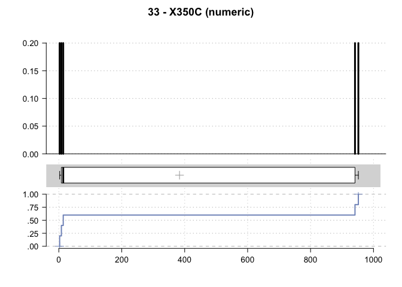<!-- -->

    ## ------------------------------------------------------------------------------ 
    ## 34 - X350C.1 (numeric)
    ## 
    ##      length        n    NAs  unique         0s       mean     meanCI
    ##           5        5      0     = n          0    408.288   -273.326
    ##               100.0%   0.0%               0.0%             1'089.902
    ##                                                                     
    ##         .05      .10    .25  median        .75        .90        .95
    ##       3.260    4.160  6.860  13.000  1'005.000  1'010.532  1'012.376
    ##                                                                     
    ##       range       sd  vcoef     mad        IQR       skew       kurt
    ##   1'011.860  548.952  1.345  15.775    998.140      0.292     -2.253
    ##                                                                     
    ## 
    ##      level  freq   perc  cumfreq  cumperc
    ## 1     2.36     1  20.0%        1    20.0%
    ## 2     6.86     1  20.0%        2    40.0%
    ## 3       13     1  20.0%        3    60.0%
    ## 4     1005     1  20.0%        4    80.0%
    ## 5  1014.22     1  20.0%        5   100.0%

<!-- -->

    ## ------------------------------------------------------------------------------ 
    ## 35 - X350C.2 (numeric)
    ## 
    ##    length        n    NAs   unique       0s     mean    meanCI
    ##         5        5      0      = n        0  346.972  -200.294
    ##             100.0%   0.0%              0.0%            894.238
    ##                                                               
    ##       .05      .10    .25   median      .75      .90       .95
    ##     2.140    3.090  5.940   70.000  825.300  829.578   831.004
    ##                                                               
    ##     range       sd  vcoef      mad      IQR     skew      kurt
    ##   831.240  440.752  1.270  102.018  819.360    0.284    -2.250
    ##                                                               
    ## 
    ##     level  freq   perc  cumfreq  cumperc
    ## 1    1.19     1  20.0%        1    20.0%
    ## 2    5.94     1  20.0%        2    40.0%
    ## 3      70     1  20.0%        3    60.0%
    ## 4   825.3     1  20.0%        4    80.0%
    ## 5  832.43     1  20.0%        5   100.0%

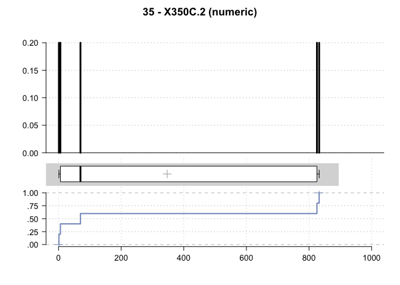<!-- -->

    ## ------------------------------------------------------------------------------ 
    ## 36 - X350C.3 (numeric)
    ## 
    ##   length       n    NAs  unique      0s    mean    meanCI
    ##        5       5      0     = n       0  386.68   -266.18
    ##           100.0%   0.0%            0.0%          1'039.54
    ##                                                          
    ##      .05     .10    .25  median     .75     .90       .95
    ##     1.10    1.20   1.50    5.60  959.10  963.36    964.78
    ##                                                          
    ##    range      sd  vcoef     mad     IQR    skew      kurt
    ##   965.20  525.80   1.36    6.82  957.60    0.29     -2.25
    ##                                                          
    ## 
    ##    level  freq   perc  cumfreq  cumperc
    ## 1      1     1  20.0%        1    20.0%
    ## 2    1.5     1  20.0%        2    40.0%
    ## 3    5.6     1  20.0%        3    60.0%
    ## 4  959.1     1  20.0%        4    80.0%
    ## 5  966.2     1  20.0%        5   100.0%

<!-- -->

    ## ------------------------------------------------------------------------------ 
    ## 37 - X350C.4 (numeric)
    ## 
    ##      length        n    NAs  unique         0s       mean     meanCI
    ##           5        5      0     = n          0    406.252   -274.385
    ##               100.0%   0.0%               0.0%             1'086.889
    ##                                                                     
    ##         .05      .10    .25  median        .75        .90        .95
    ##       5.060    5.120  5.300   7.530  1'000.300  1'007.998  1'010.564
    ##                                                                     
    ##       range       sd  vcoef     mad        IQR       skew       kurt
    ##   1'008.130  548.165  1.349   3.751    995.000      0.292     -2.253
    ##                                                                     
    ## 
    ##      level  freq   perc  cumfreq  cumperc
    ## 1        5     1  20.0%        1    20.0%
    ## 2      5.3     1  20.0%        2    40.0%
    ## 3     7.53     1  20.0%        3    60.0%
    ## 4   1000.3     1  20.0%        4    80.0%
    ## 5  1013.13     1  20.0%        5   100.0%

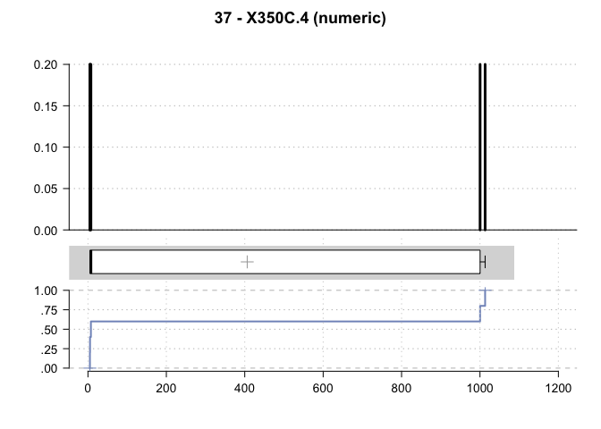<!-- -->

    ## ------------------------------------------------------------------------------ 
    ## 38 - X350C.5 (numeric)
    ## 
    ##    length        n    NAs  unique       0s     mean    meanCI
    ##         5        5      0     = n        0  260.788  -164.946
    ##             100.0%   0.0%             0.0%            686.522
    ##                                                              
    ##       .05      .10    .25  median      .75      .90       .95
    ##     1.826    2.432  4.250  26.000  633.500  636.782   637.876
    ##                                                              
    ##     range       sd  vcoef     mad      IQR     skew      kurt
    ##   637.750  342.873  1.315  36.739  629.250    0.290    -2.252
    ##                                                              
    ## 
    ##     level  freq   perc  cumfreq  cumperc
    ## 1    1.22     1  20.0%        1    20.0%
    ## 2    4.25     1  20.0%        2    40.0%
    ## 3      26     1  20.0%        3    60.0%
    ## 4   633.5     1  20.0%        4    80.0%
    ## 5  638.97     1  20.0%        5   100.0%

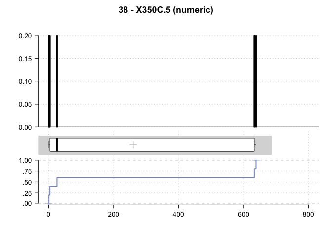<!-- -->

    ## ------------------------------------------------------------------------------ 
    ## 39 - X350C.6 (numeric)
    ## 
    ##    length        n    NAs  unique       0s     mean    meanCI
    ##         5        5      0     = n        0  357.720  -238.717
    ##             100.0%   0.0%             0.0%            954.157
    ##                                                              
    ##       .05      .10    .25  median      .75      .90       .95
    ##     5.202    5.334  5.730  10.000  878.500  884.980   887.140
    ##                                                              
    ##     range       sd  vcoef     mad      IQR     skew      kurt
    ##   884.230  480.353  1.343   7.309  872.770    0.292    -2.253
    ##                                                              
    ## 
    ##    level  freq   perc  cumfreq  cumperc
    ## 1   5.07     1  20.0%        1    20.0%
    ## 2   5.73     1  20.0%        2    40.0%
    ## 3     10     1  20.0%        3    60.0%
    ## 4  878.5     1  20.0%        4    80.0%
    ## 5  889.3     1  20.0%        5   100.0%

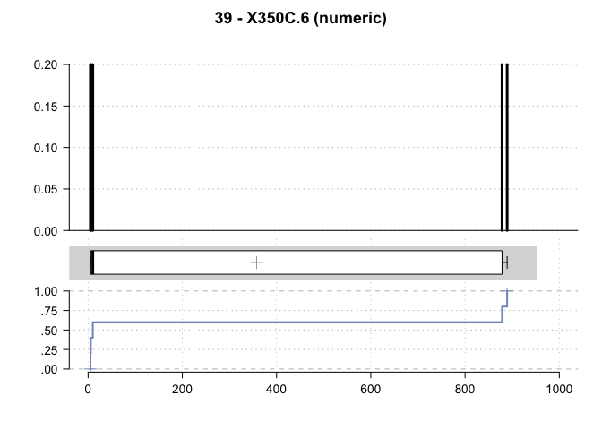<!-- -->

    ## ------------------------------------------------------------------------------ 
    ## 40 - X350C.7 (numeric)
    ## 
    ##    length        n    NAs  unique       0s     mean    meanCI
    ##         5        5      0     = n        0  324.548  -211.575
    ##             100.0%   0.0%             0.0%            860.671
    ##                                                              
    ##       .05      .10    .25  median      .75      .90       .95
    ##     4.594    4.788  5.370  18.000  792.600  798.462   800.416
    ##                                                              
    ##     range       sd  vcoef     mad      IQR     skew      kurt
    ##   797.970  431.778  1.330  20.163  787.230    0.292    -2.253
    ##                                                              
    ## 
    ##     level  freq   perc  cumfreq  cumperc
    ## 1     4.4     1  20.0%        1    20.0%
    ## 2    5.37     1  20.0%        2    40.0%
    ## 3      18     1  20.0%        3    60.0%
    ## 4   792.6     1  20.0%        4    80.0%
    ## 5  802.37     1  20.0%        5   100.0%

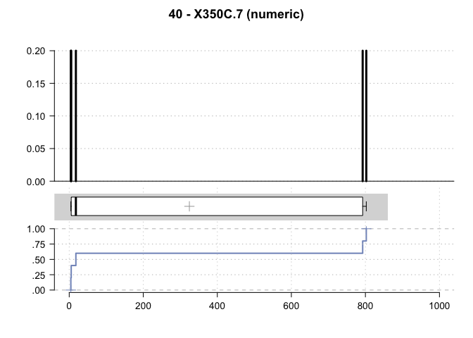<!-- -->

    ## ------------------------------------------------------------------------------ 
    ## 41 - X350C.8 (numeric)
    ## 
    ##      length        n    NAs  unique         0s       mean     meanCI
    ##           5        5      0     = n          0    413.156   -280.703
    ##               100.0%   0.0%               0.0%             1'107.015
    ##                                                                     
    ##         .05      .10    .25  median        .75        .90        .95
    ##       4.328    4.506  5.040   6.000  1'020.700  1'026.214  1'028.052
    ##                                                                     
    ##       range       sd  vcoef     mad        IQR       skew       kurt
    ##   1'025.740  558.814  1.353   2.743  1'015.660      0.292     -2.253
    ##                                                                     
    ## 
    ##      level  freq   perc  cumfreq  cumperc
    ## 1     4.15     1  20.0%        1    20.0%
    ## 2     5.04     1  20.0%        2    40.0%
    ## 3        6     1  20.0%        3    60.0%
    ## 4   1020.7     1  20.0%        4    80.0%
    ## 5  1029.89     1  20.0%        5   100.0%

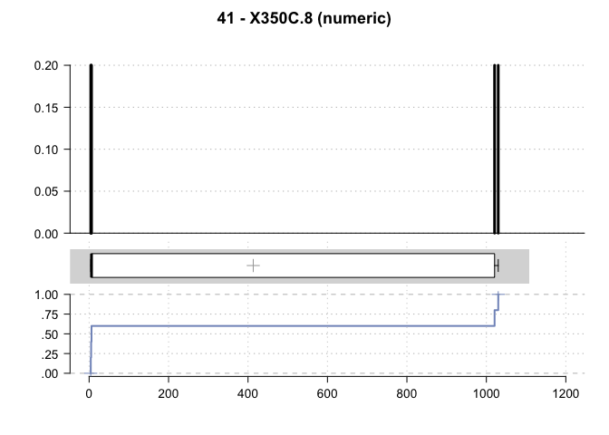<!-- -->

    ## ------------------------------------------------------------------------------ 
    ## 42 - X350C.9 (numeric)
    ## 
    ##    length        n    NAs  unique       0s     mean    meanCI
    ##         5        5      0     = n        0  345.252  -229.238
    ##             100.0%   0.0%             0.0%            919.742
    ##                                                              
    ##       .05      .10    .25  median      .75      .90       .95
    ##     4.612    4.914  5.820  12.000  847.000  853.078   855.104
    ##                                                              
    ##     range       sd  vcoef     mad      IQR     skew      kurt
    ##   852.820  462.678  1.340  11.401  841.180    0.292    -2.253
    ##                                                              
    ## 
    ##     level  freq   perc  cumfreq  cumperc
    ## 1    4.31     1  20.0%        1    20.0%
    ## 2    5.82     1  20.0%        2    40.0%
    ## 3      12     1  20.0%        3    60.0%
    ## 4     847     1  20.0%        4    80.0%
    ## 5  857.13     1  20.0%        5   100.0%

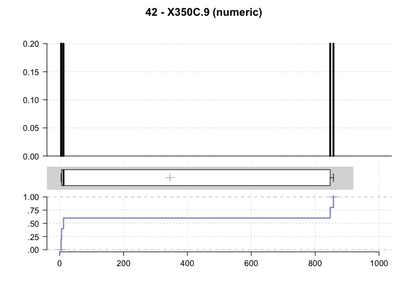<!-- -->

    ## ------------------------------------------------------------------------------ 
    ## 43 - X350C.10 (numeric)
    ## 
    ##    length        n    NAs  unique       0s     mean    meanCI
    ##         5        5      0     = n        0  278.864  -175.477
    ##             100.0%   0.0%             0.0%            733.205
    ##                                                              
    ##       .05      .10    .25  median      .75      .90       .95
    ##     3.796    4.652  7.220  25.000  674.500  680.596   682.628
    ##                                                              
    ##     range       sd  vcoef     mad      IQR     skew      kurt
    ##   681.720  365.913  1.312  32.706  667.280    0.291    -2.252
    ##                                                              
    ## 
    ##     level  freq   perc  cumfreq  cumperc
    ## 1    2.94     1  20.0%        1    20.0%
    ## 2    7.22     1  20.0%        2    40.0%
    ## 3      25     1  20.0%        3    60.0%
    ## 4   674.5     1  20.0%        4    80.0%
    ## 5  684.66     1  20.0%        5   100.0%

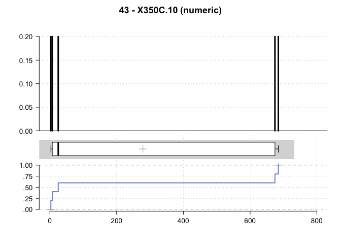<!-- -->

    ## ------------------------------------------------------------------------------ 
    ## 44 - X350C.11 (numeric)
    ## 
    ##    length        n    NAs  unique       0s     mean    meanCI
    ##         5        5      0     = n        0  363.768  -238.618
    ##             100.0%   0.0%             0.0%            966.154
    ##                                                              
    ##       .05      .10    .25  median      .75      .90       .95
    ##     3.912    4.144  4.840  20.000  890.900  896.012   897.716
    ##                                                              
    ##     range       sd  vcoef     mad      IQR     skew      kurt
    ##   895.740  485.144  1.334  24.196  886.060    0.292    -2.253
    ##                                                              
    ## 
    ##     level  freq   perc  cumfreq  cumperc
    ## 1    3.68     1  20.0%        1    20.0%
    ## 2    4.84     1  20.0%        2    40.0%
    ## 3      20     1  20.0%        3    60.0%
    ## 4   890.9     1  20.0%        4    80.0%
    ## 5  899.42     1  20.0%        5   100.0%

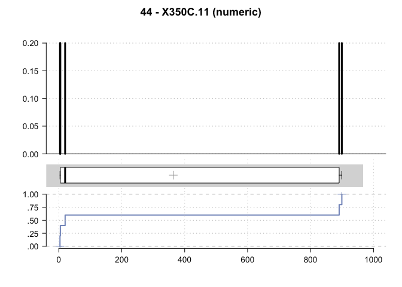<!-- -->

    ## ------------------------------------------------------------------------------ 
    ## 45 - X350C.12 (numeric)
    ## 
    ##    length        n    NAs  unique       0s     mean    meanCI
    ##         5        5      0     = n        0  372.096  -245.436
    ##             100.0%   0.0%             0.0%            989.628
    ##                                                              
    ##       .05      .10    .25  median      .75      .90       .95
    ##     4.770    5.170  6.370  16.000  911.500  917.944   920.092
    ##                                                              
    ##     range       sd  vcoef     mad      IQR     skew      kurt
    ##   917.870  497.342  1.337  17.243  905.130    0.292    -2.253
    ##                                                              
    ## 
    ##     level  freq   perc  cumfreq  cumperc
    ## 1    4.37     1  20.0%        1    20.0%
    ## 2    6.37     1  20.0%        2    40.0%
    ## 3      16     1  20.0%        3    60.0%
    ## 4   911.5     1  20.0%        4    80.0%
    ## 5  922.24     1  20.0%        5   100.0%

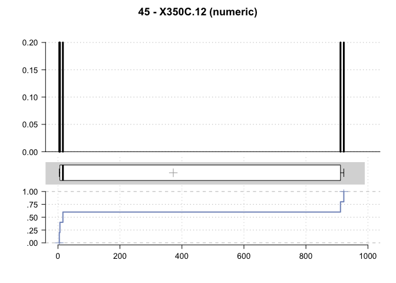<!-- -->

    ## ------------------------------------------------------------------------------ 
    ## 46 - X350C.13 (numeric)
    ## 
    ##    length        n    NAs  unique       0s     mean    meanCI
    ##         5        5      0     = n        0  351.000  -222.626
    ##             100.0%   0.0%             0.0%            924.626
    ##                                                              
    ##       .05      .10    .25  median      .75      .90       .95
    ##     5.948    6.016  6.220  29.000  850.900  858.160   860.580
    ##                                                              
    ##     range       sd  vcoef     mad      IQR     skew      kurt
    ##   857.120  461.982  1.316  34.278  844.680    0.291    -2.253
    ##                                                              
    ## 
    ##    level  freq   perc  cumfreq  cumperc
    ## 1   5.88     1  20.0%        1    20.0%
    ## 2   6.22     1  20.0%        2    40.0%
    ## 3     29     1  20.0%        3    60.0%
    ## 4  850.9     1  20.0%        4    80.0%
    ## 5    863     1  20.0%        5   100.0%

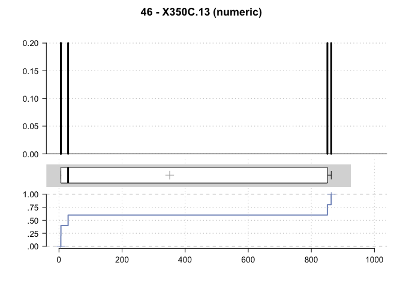<!-- -->

    ## ------------------------------------------------------------------------------ 
    ## 47 - X350C.14 (numeric)
    ## 
    ##   length       n    NAs  unique      0s    mean   meanCI
    ##        5       5      0     = n       0  341.74  -221.15
    ##           100.0%   0.0%            0.0%           904.63
    ##                                                         
    ##      .05     .10    .25  median     .75     .90      .95
    ##     4.78    5.31   6.90   21.00  832.70  839.39   841.62
    ##                                                         
    ##    range      sd  vcoef     mad     IQR    skew     kurt
    ##   839.60  453.33   1.33   24.83  825.80    0.29    -2.25
    ##                                                         
    ## 
    ##     level  freq   perc  cumfreq  cumperc
    ## 1    4.25     1  20.0%        1    20.0%
    ## 2     6.9     1  20.0%        2    40.0%
    ## 3      21     1  20.0%        3    60.0%
    ## 4   832.7     1  20.0%        4    80.0%
    ## 5  843.85     1  20.0%        5   100.0%

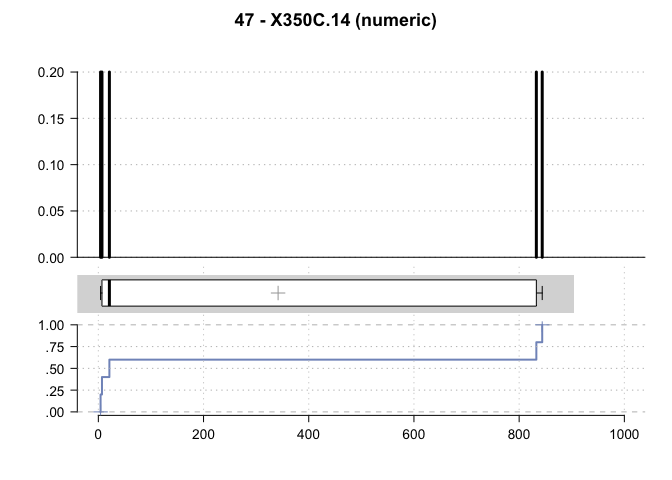<!-- -->

    ## ------------------------------------------------------------------------------ 
    ## 48 - X (numeric)
    ## 
    ##     length         n       NAs    unique        0s      mean    meanCI
    ##          5         1         4       = n         0  972.6361      <NA>
    ##                20.0%     80.0%                0.0%                <NA>
    ##                                                                       
    ##        .05       .10       .25    median       .75       .90       .95
    ##   972.6361  972.6361  972.6361  972.6361  972.6361  972.6361  972.6361
    ##                                                                       
    ##      range        sd     vcoef       mad       IQR      skew      kurt
    ##     0.0000      <NA>      <NA>    0.0000    0.0000      <NA>      <NA>
    ##                                                                       
    ## 
    ##         level  freq    perc  cumfreq  cumperc
    ## 1  972.636087     1  100.0%        1   100.0%

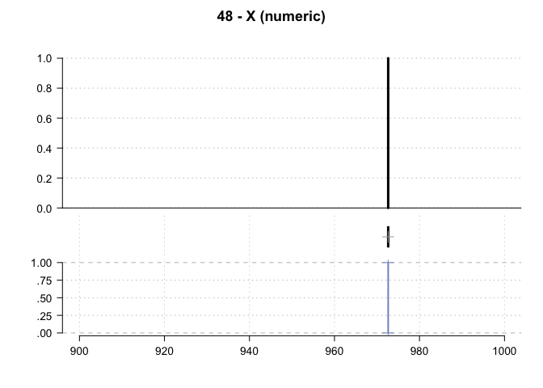<!-- -->
