Expand Archaeological Data
================

## GitHub Documents

This is an R Markdown format used for publishing markdown documents to
GitHub. When you click the **Knit** button all R code chunks are run and
a markdown file (.md) suitable for publishing to GitHub is
    generated.

## Add needed libraries

``` r
library(tidyverse)
```

    ## ── Attaching packages ─────────────────────────────────────── tidyverse 1.3.0 ──

    ## ✓ ggplot2 3.2.1     ✓ purrr   0.3.3
    ## ✓ tibble  2.1.3     ✓ dplyr   0.8.3
    ## ✓ tidyr   1.0.0     ✓ stringr 1.4.0
    ## ✓ readr   1.3.1     ✓ forcats 0.4.0

    ## ── Conflicts ────────────────────────────────────────── tidyverse_conflicts() ──
    ## x dplyr::filter() masks stats::filter()
    ## x dplyr::lag()    masks stats::lag()

``` r
library(forcats)
library(data.table)
```

    ## 
    ## Attaching package: 'data.table'

    ## The following objects are masked from 'package:dplyr':
    ## 
    ##     between, first, last

    ## The following object is masked from 'package:purrr':
    ## 
    ##     transpose

``` r
library(DescTools)
```

    ## 
    ## Attaching package: 'DescTools'

    ## The following object is masked from 'package:data.table':
    ## 
    ##     %like%

## This is a Project that is Intended to Expand the Use of Open Data in Paleolithic Research

The following code snippets are focused on trying to exapnd the use of
avaialble data in Paleolithic research. These blocks of core are focused
on providing an example of the kind of data
available.

``` r
rezek <- fread('https://static-content.springer.com/esm/art%3A10.1038%2Fs41559-018-0488-4/MediaObjects/41559_2018_488_MOESM3_ESM.csv')
head(rezek)
```

    ##          SITENAME Unit ID LEVEL Assemblage code PERIOD  INDUSTRY LENGTH (mm)
    ## 1: Khor Musa 1017       -                 N1017      B Khormusan      25.290
    ## 2: Khor Musa 1017       -                 N1017      B Khormusan      25.355
    ## 3: Khor Musa 1017       -                 N1017      B Khormusan      25.450
    ## 4: Khor Musa 1017       -                 N1017      B Khormusan      25.570
    ## 5: Khor Musa 1017       -                 N1017      B Khormusan      25.655
    ## 6: Khor Musa 1017       -                 N1017      B Khormusan      25.800
    ##    WIDTH (mm) THICK (mm) Platform Width (mm) PD (mm) EPA (degree) MASS (g)
    ## 1:     22.325      3.100              20.120   5.375           90        2
    ## 2:     12.950      2.005              14.025   1.800           90        1
    ## 3:     21.760      3.330              10.500   2.570           81        2
    ## 4:     13.250      3.390              15.480   4.665           88        1
    ## 5:     21.045      5.280              11.680   2.940          110        3
    ## 6:     18.090      3.215              13.025   4.340           84        2
    ##    length*width/thickness^2
    ## 1:                   58.751
    ## 2:                   81.678
    ## 3:                   49.941
    ## 4:                   29.481
    ## 5:                   19.367
    ## 6:                   45.154

``` r
Desc(rezek)
```

    ## ------------------------------------------------------------------------------ 
    ## Describe rezek (data.table, data.frame):
    ## 
    ## data frame:  18167 obs. of  14 variables
    ##      15611 complete cases (85.9%)
    ## 
    ##   Nr  ColName                   Class      NAs           Levels
    ##   1   SITENAME                  character     .                
    ##   2   Unit ID                   character     .                
    ##   3   LEVEL                     character     .                
    ##   4   Assemblage code           character     .                
    ##   5   PERIOD                    character     .                
    ##   6   INDUSTRY                  character     .                
    ##   7   LENGTH (mm)               numeric      14 (0.1%)         
    ##   8   WIDTH (mm)                numeric      20 (0.1%)         
    ##   9   THICK (mm)                numeric      25 (0.1%)         
    ##   10  Platform Width (mm)       numeric    2348 (12.9%)        
    ##   11  PD (mm)                   numeric    1916 (10.5%)        
    ##   12  EPA (degree)              integer    2018 (11.1%)        
    ##   13  MASS (g)                  numeric      72 (0.4%)         
    ##   14  length*width/thickness^2  numeric      46 (0.3%)         
    ## 
    ## 
    ## ------------------------------------------------------------------------------ 
    ## 1 - SITENAME (character)
    ## 
    ##   length      n    NAs unique levels  dupes
    ##   18'167 18'167      0     34     34      y
    ##          100.0%   0.0%                     
    ## 
    ##                  level   freq   perc  cumfreq  cumperc
    ## 1        PCH IV Bordes  4'174  23.0%    4'174    23.0%
    ## 2           AbriPataud  2'653  14.6%    6'827    37.6%
    ## 3         Abri Peyrony  2'104  11.6%    8'931    49.2%
    ## 4       LaugerieHauteE  1'801   9.9%   10'732    59.1%
    ## 5           PCH IV New  1'581   8.7%   12'313    67.8%
    ## 6        Roc de Marsal  1'330   7.3%   13'643    75.1%
    ## 7        Combe Capelle    701   3.9%   14'344    79.0%
    ## 8       Contrebandiers    534   2.9%   14'878    81.9%
    ## 9   Rosh Ein Mor (D15)    379   2.1%   15'257    84.0%
    ## 10              FxJj63    247   1.4%   15'504    85.3%
    ## 11             Warwasi    207   1.1%   15'711    86.5%
    ## 12           Ksar Akil    199   1.1%   15'910    87.6%
    ## ... etc.
    ##  [list output truncated]

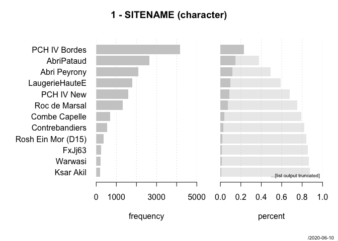<!-- -->

    ## ------------------------------------------------------------------------------ 
    ## 2 - Unit ID (character)
    ## 
    ##   length      n    NAs unique levels  dupes
    ##   18'167 18'167      0 11'582 11'582      y
    ##          100.0%   0.0%                     
    ## 
    ##     level   freq   perc  cumfreq  cumperc
    ## 1          4'956  27.3%    4'956    27.3%
    ## 2       -  1'049   5.8%    6'005    33.1%
    ## 3     581     40   0.2%    6'045    33.3%
    ## 4     580     26   0.1%    6'071    33.4%
    ## 5     475     20   0.1%    6'091    33.5%
    ## 6     469     15   0.1%    6'106    33.6%
    ## 7     517     14   0.1%    6'120    33.7%
    ## 8     520     14   0.1%    6'134    33.8%
    ## 9     466     12   0.1%    6'146    33.8%
    ## 10    457     10   0.1%    6'156    33.9%
    ## 11    464      9   0.0%    6'165    33.9%
    ## 12    521      9   0.0%    6'174    34.0%
    ## ... etc.
    ##  [list output truncated]

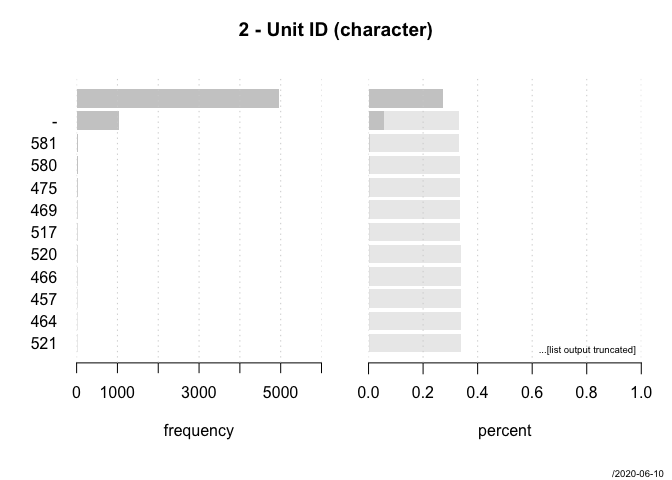<!-- -->

    ## ------------------------------------------------------------------------------ 
    ## 3 - LEVEL (character)
    ## 
    ##   length      n    NAs unique levels  dupes
    ##   18'167 18'167      0     88     88      y
    ##          100.0%   0.0%                     
    ## 
    ##     level   freq  perc  cumfreq  cumperc
    ## 1      3B  1'482  8.2%    1'482     8.2%
    ## 2      6A  1'163  6.4%    2'645    14.6%
    ## 3      4C  1'111  6.1%    3'756    20.7%
    ## 4       8  1'056  5.8%    4'812    26.5%
    ## 5            996  5.5%    5'808    32.0%
    ## 6    L-3B    796  4.4%    6'604    36.4%
    ## 7      3A    728  4.0%    7'332    40.4%
    ## 8       4    656  3.6%    7'988    44.0%
    ## 9    U-3A    557  3.1%    8'545    47.0%
    ## 10      5    541  3.0%    9'086    50.0%
    ## 11   L-3A    478  2.6%    9'564    52.6%
    ## 12      3    453  2.5%   10'017    55.1%
    ## ... etc.
    ##  [list output truncated]

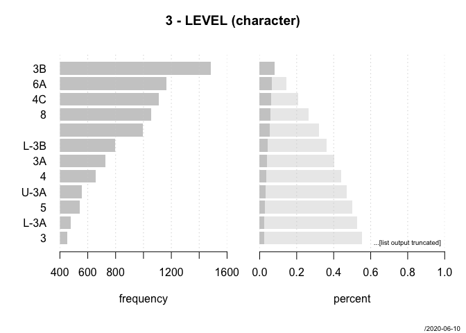<!-- -->

    ## ------------------------------------------------------------------------------ 
    ## 4 - Assemblage code (character)
    ## 
    ##   length      n    NAs unique levels  dupes
    ##   18'167 18'167      0     81     81      y
    ##          100.0%   0.0%                     
    ## 
    ##        level   freq  perc  cumfreq  cumperc
    ## 1      PDA3B  1'482  8.2%    1'482     8.2%
    ## 2      PDA6A  1'157  6.4%    2'639    14.5%
    ## 3      PDA4C  1'019  5.6%    3'658    20.1%
    ## 4     AP-L3B    796  4.4%    4'454    24.5%
    ## 5      PDA3A    728  4.0%    5'182    28.5%
    ## 6     AP-U3A    557  3.1%    5'739    31.6%
    ## 7     AP-L3A    478  2.6%    6'217    34.2%
    ## 8       PDA8    411  2.3%    6'628    36.5%
    ## 9   LHE10-16    395  2.2%    7'023    38.7%
    ## 10     CB5-6    384  2.1%    7'407    40.8%
    ## 11       AP4    355  2.0%    7'762    42.7%
    ## 12     PDA6B    352  1.9%    8'114    44.7%
    ## ... etc.
    ##  [list output truncated]

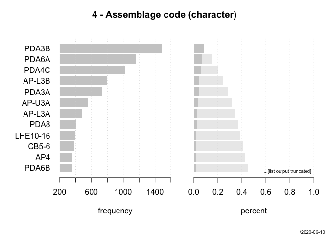<!-- -->

    ## ------------------------------------------------------------------------------ 
    ## 5 - PERIOD (character)
    ## 
    ##   length      n    NAs unique levels  dupes
    ##   18'167 18'167      0      3      3      y
    ##          100.0%   0.0%                     
    ## 
    ##    level    freq   perc  cumfreq  cumperc
    ## 1      B  11'940  65.7%   11'940    65.7%
    ## 2      C   5'360  29.5%   17'300    95.2%
    ## 3      A     867   4.8%   18'167   100.0%

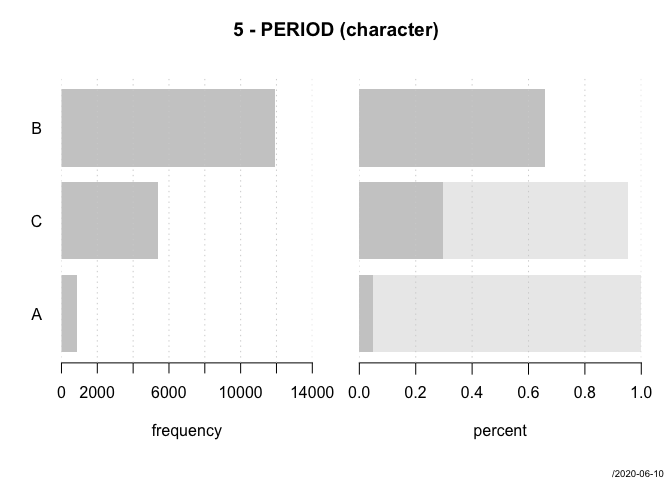<!-- -->

    ## ------------------------------------------------------------------------------ 
    ## 6 - INDUSTRY (character)
    ## 
    ##   length      n    NAs unique levels  dupes
    ##   18'167 18'167      0     23     23      y
    ##          100.0%   0.0%                     
    ## 
    ##                    level   freq   perc  cumfreq  cumperc
    ## 1             Mousterian  6'964  38.3%    6'964    38.3%
    ## 2                    MTA  2'210  12.2%    9'174    50.5%
    ## 3        Middle Magdalen  1'672   9.2%   10'846    59.7%
    ## 4       Quina Mousterian  1'201   6.6%   12'047    66.3%
    ## 5            Early Aurig    853   4.7%   12'900    71.0%
    ## 6   Levantine Mousterian    828   4.6%   13'728    75.6%
    ## 7           Recent Aurig    664   3.7%   14'392    79.2%
    ## 8         NW African MSA    534   2.9%   14'926    82.2%
    ## 9                Oldowan    379   2.1%   15'305    84.2%
    ## 10         Middle Gravet    355   2.0%   15'660    86.2%
    ## 11         Recent Gravet    340   1.9%   16'000    88.1%
    ## 12             Acheulian    334   1.8%   16'334    89.9%
    ## ... etc.
    ##  [list output truncated]

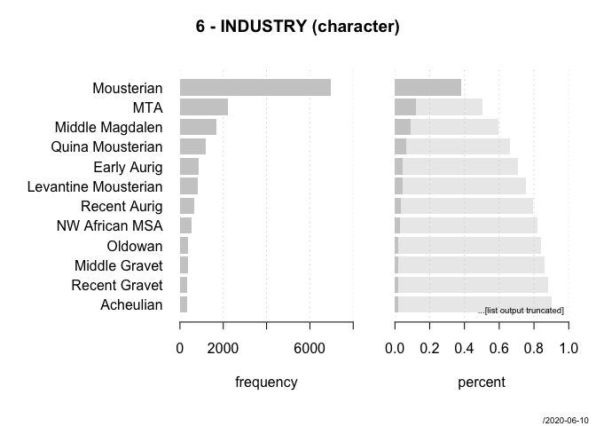<!-- -->

    ## ------------------------------------------------------------------------------ 
    ## 7 - LENGTH (mm) (numeric)
    ## 
    ##    length       n     NAs  unique      0s    mean  meanCI
    ##    18'167  18'153      14  10'027       0  44.159  43.899
    ##             99.9%    0.1%            0.0%          44.418
    ##                                                          
    ##       .05     .10     .25  median     .75     .90     .95
    ##    25.670  27.450  32.225  40.310  51.935  65.448  75.730
    ##                                                          
    ##     range      sd   vcoef     mad     IQR    skew    kurt
    ##   480.100  17.844   0.404  13.833  19.710   3.993  60.863
    ##                                                          
    ## lowest : 2.0, 4.15, 6.29, 7.96, 8.72
    ## highest: 286.9, 411.4, 416.2, 449.1, 482.1

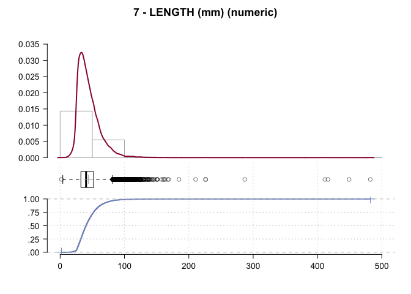<!-- -->

    ## ------------------------------------------------------------------------------ 
    ## 8 - WIDTH (mm) (numeric)
    ## 
    ##     length        n      NAs   unique       0s     mean   meanCI
    ##     18'167   18'147       20    8'694        0  28.5159  28.3410
    ##               99.9%     0.1%              0.0%           28.6907
    ##                                                                 
    ##        .05      .10      .25   median      .75      .90      .95
    ##    14.2300  16.7630  21.2700  26.8400  33.5725  41.7900  47.7570
    ##                                                                 
    ##      range       sd    vcoef      mad      IQR     skew     kurt
    ##   356.6800  12.0159   0.4214   8.9475  12.3025   4.8358  90.8906
    ##                                                                 
    ## lowest : 1.62, 3.37, 3.38, 3.66, 3.76
    ## highest: 205.8, 291.1, 293.6, 341.7, 358.3

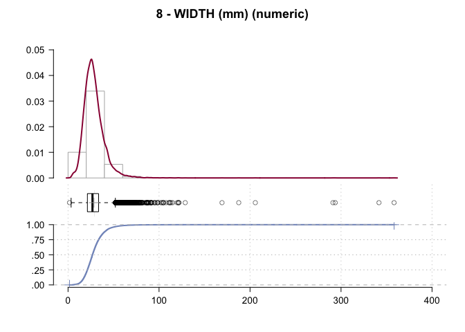<!-- -->

    ## ------------------------------------------------------------------------------ 
    ## 9 - THICK (mm) (numeric)
    ## 
    ##      length        n      NAs   unique       0s      mean       meanCI
    ##      18'167   18'142       25    4'520        0   7.71416      7.63379
    ##                99.9%     0.1%              0.0%                7.79453
    ##                                                                       
    ##         .05      .10      .25   median      .75       .90          .95
    ##     3.15500  3.75000  4.97125  6.80000  9.32000  12.46950     14.99425
    ##                                                                       
    ##       range       sd    vcoef      mad      IQR      skew         kurt
    ##   483.94000  5.52265  0.71591  3.08381  4.34875  36.94597  3'080.78744
    ##                                                                       
    ## lowest : 1.06, 1.15, 1.205, 1.23, 1.26
    ## highest: 60.8, 64.84, 66.98, 80.3, 485.0

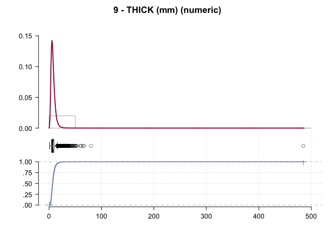<!-- -->

    ## ------------------------------------------------------------------------------ 
    ## 10 - Platform Width (mm) (numeric)
    ## 
    ##     length       n      NAs   unique       0s     mean   meanCI
    ##     18'167  15'819    2'348    7'436        0  18.4296  18.2789
    ##              87.1%    12.9%              0.0%           18.5803
    ##                                                                
    ##        .05     .10      .25   median      .75      .90      .95
    ##     6.4295  8.1550  11.5625  16.5400  23.2400  30.8900  36.4820
    ##                                                                
    ##      range      sd    vcoef      mad      IQR     skew     kurt
    ##   124.2050  9.6690   0.5246   8.3322  11.6775   1.4469   4.3576
    ##                                                                
    ## lowest : 2.09, 2.15, 2.23, 2.37, 2.39
    ## highest: 90.15, 91.285, 92.0, 100.555, 126.295

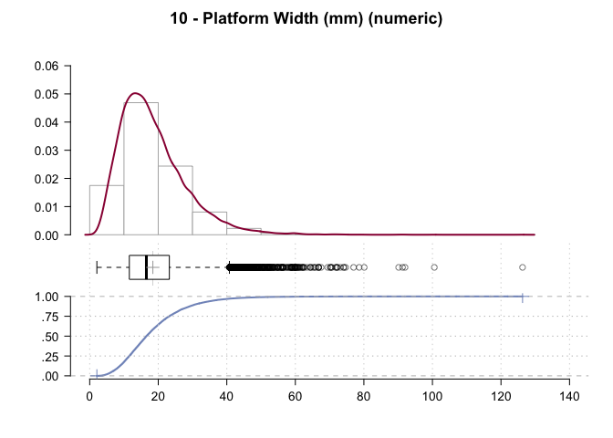<!-- -->

    ## ------------------------------------------------------------------------------ 
    ## 11 - PD (mm) (numeric)
    ## 
    ##    length       n     NAs  unique      0s     mean   meanCI
    ##    18'167  16'251   1'916   3'773       0   6.2000   6.1483
    ##             89.5%   10.5%            0.0%            6.2517
    ##                                                            
    ##       .05     .10     .25  median     .75      .90      .95
    ##    2.2200  2.7200  3.8700  5.5600  7.7825  10.2900  12.2725
    ##                                                            
    ##     range      sd   vcoef     mad     IQR     skew     kurt
    ##   57.4200  3.3620  0.5423  2.8021  3.9125   2.0244  11.4891
    ##                                                            
    ## lowest : 0.88, 1.0, 1.01, 1.02, 1.04
    ## highest: 33.795, 35.435, 44.56, 51.73, 58.3

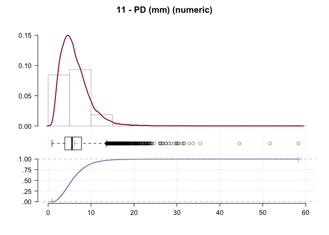<!-- -->

    ## ------------------------------------------------------------------------------ 
    ## 12 - EPA (degree) (integer)
    ## 
    ##   length       n    NAs  unique     0s   mean  meanCI
    ##   18'167  16'149  2'018     100      0  82.01   81.80
    ##            88.9%  11.1%           0.0%          82.23
    ##                                                      
    ##      .05     .10    .25  median    .75    .90     .95
    ##    59.00   64.00  73.00   83.00  91.00  99.00  104.00
    ##                                                      
    ##    range      sd  vcoef     mad    IQR   skew    kurt
    ##   100.00   13.76   0.17   13.34  18.00  -0.14    0.26
    ##                                                      
    ## lowest : 30, 31, 32, 34 (3), 35 (4)
    ## highest: 126 (7), 127 (4), 128 (2), 129, 130 (5)

<!-- -->

    ## ------------------------------------------------------------------------------ 
    ## 13 - MASS (g) (numeric)
    ## 
    ##   length       n    NAs  unique     0s   mean  meanCI
    ##   18'167  18'095     72     755      0  15.58   15.22
    ##            99.6%   0.4%           0.0%          15.94
    ##                                                      
    ##      .05     .10    .25  median    .75    .90     .95
    ##     2.00    3.00   5.00    9.00  18.00  32.00   47.13
    ##                                                      
    ##    range      sd  vcoef     mad    IQR   skew    kurt
    ##   644.70   24.69   1.58    7.41  13.00  10.17  185.15
    ##                                                      
    ## lowest : 0.3, 0.5, 0.6 (2), 0.7 (3), 0.8
    ## highest: 589.0, 621.0, 639.0, 644.0, 645.0
    ## 
    ## heap(?): remarkable frequency (5.9%) for the mode(s) (= 6)

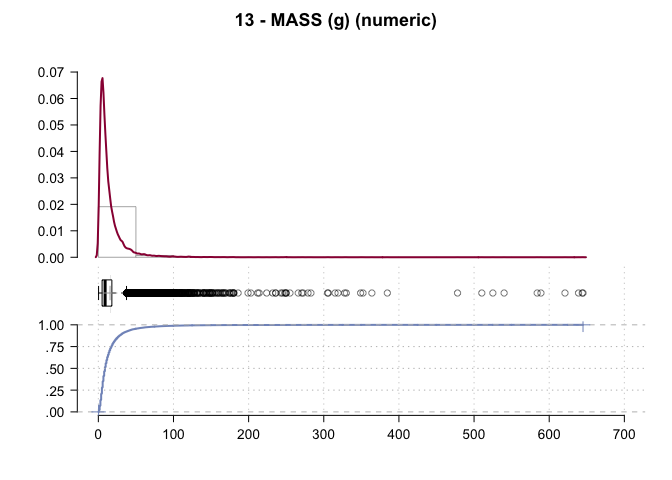<!-- -->

    ## ------------------------------------------------------------------------------ 
    ## 14 - length*width/thickness^2 (numeric)
    ## 
    ##           length              n            NAs         unique             0s
    ##           18'167         18'121             46         15'706              0
    ##                           99.7%           0.3%                          0.0%
    ##                                                                             
    ##              .05            .10            .25         median            .75
    ##     6.5730000000   8.6620000000  13.5930000000  23.2610000000  39.9600000000
    ##                                                                             
    ##            range             sd          vcoef            mad            IQR
    ##   446.2961351510  30.5534298111   0.9458313898  17.2589466000  26.3670000000
    ##                                                                             
    ##            mean         meanCI
    ##   32.3032520807  31.8583688961
    ##                  32.7481352654
    ##                               
    ##             .90            .95
    ##   65.7150000000  87.2370000000
    ##                               
    ##            skew           kurt
    ##    3.3986168117  20.9154701843
    ##                               
    ## lowest : 0.001864849, 0.508, 0.55236218, 0.673, 0.888
    ## highest: 404.299, 405.736, 406.852, 424.261, 446.298

<!-- --> \#\# Reti

Reti published both archaeological and experimental data sets in
