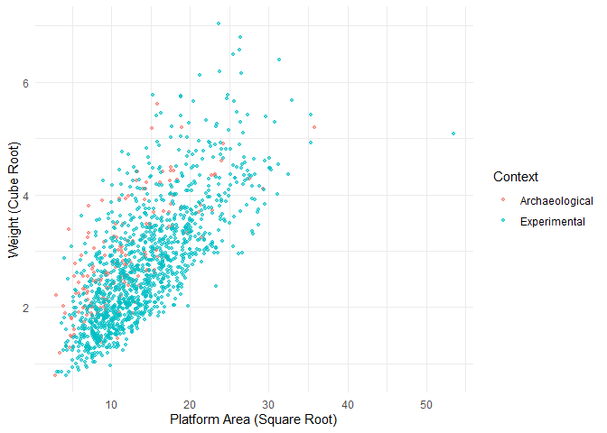

## Reti 2016 - Quantifying Oldowan Stone Tool Production at Olduvai Gorge, Tanzania

Reti (2016) published both an Oldowan archaeological data set and an
experimental data set. This data set can be found on this [figshare
page](https://figshare.com/articles/Reti_PLOS_ONE_Data_xlsx/2056551/1)
and downloaded as an Excel file. The data include a variety of variables
for whole flakes, including detailed measurements of flake platforms.

``` r
library(readxl)
library(ggplot2)
library(dplyr)
library(magrittr)

# Place the Excel file in a subfolder called data before 
# running the following code.

# Read the Excel file and use dplyr to rename some variables
# to remove the spaces.
Reti <- read_xlsx("data/RetiPLOSONEData.xlsx") %>%
  rename(B_Thickness = 'B Thickness',
         P_Cortex = 'P Cortex',
         Platform_Area = 'Platform Area',
         Area_Root = 'Area Root',
         Max_Dimension = 'Max Dimension')    
```

The following figure shows the relationship between platform surface
area and flake size (weight). Both variables are adjusted for their
different scales. Color coding reflects the actual Oldowan data versus
the experimental data set.

``` r
p = ggplot(Reti, aes(Platform_Area ^(1/2), Weight^(1/3), color = Context))
p = p + geom_point(alpha = .6, size = 1)
p = p + ylab('Weight (Cube Root)')
p = p + xlab('Platform Area (Square Root)')
p = p + theme_minimal()
p
```

<!-- -->

<div id="refs" class="references hanging-indent">

<div id="ref-reti_quantifying_2016">

Reti, Jay S. 2016. “Quantifying Oldowan Stone Tool Production at Olduvai
Gorge, Tanzania.” *PLOS ONE* 11 (1): e0147352.
<https://doi.org/10.1371/journal.pone.0147352>.

</div>

</div>
