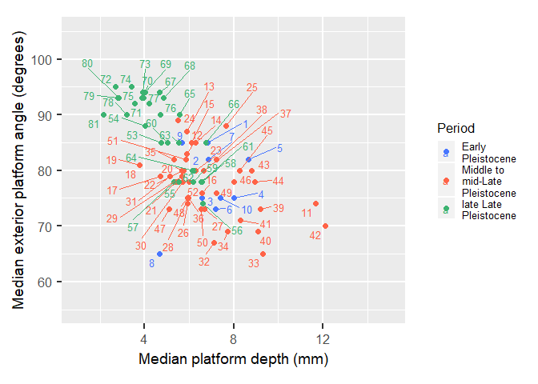

## Rezek 2018 - Two million years of flaking stone and the evolutionary efficiency of stone tool technology

Režek et al. (2018) published a large data set of flake measurements
spanning the Oldowan to the Upper Paleolithic in their paper considering
flake efficiency through time. In the initial publication, there are
some mistakes in the shared data (duplicate cases). A revised data set
and R code to make the figures in the paper were subsequenty published
with a correction. These can be found on this [zenodo
page](https://zenodo.org/record/1408081#.XyhvEygzZWG) as a zip file. We
have used this code to make these examples. To run the code examples
given here, download this zip file and place its contents in a folder
called data.

``` r
library(ggplot2)
library(ggrepel)
library(dplyr)
library(magrittr)
library(knitr)

Flake_data = read.csv("data/Flake_data.csv", header = TRUE, sep = ',') %>%
  rename(LENGTH = LENGTH..mm.,
         WIDTH = WIDTH..mm.,
         THICK = THICK..mm.,
         PlatformWidth = Platform.Width..mm.,
         PD = PD..mm.,
         EPA = EPA..degree.,
         MASS = MASS..g.)

Summary_data = read.csv("data/Summary_data.csv", header = TRUE, sep = ',') %>%
  rename(Median.PD = Median.PD..mm.,
         Median.EPA = Median.EPA..degrees.)
```

The following figure shows the relationship between median platform
depth and median exterior platform angle (EPA) for the studied
assemblages.

``` r
p = ggplot(Summary_data, aes(x = Median.PD, y = Median.EPA, 
                          color = PERIOD, 
                          size = 10  ))
p = p + geom_point(size = 2)
p = p + coord_fixed(ratio = 0.25)
p = p + scale_color_manual(name = "Period",
                           values = c("royalblue1", "tomato", "mediumseagreen"),
                           labels = c('Early\nPleistocene',
                                      'Middle to\nmid-Late\nPleistocene',
                                      'late Late\nPleistocene'))
p = p + geom_text_repel(aes(label = ID), size = 3.5)
p = p + labs(x = "Median platform depth (mm)",
             y = "Median exterior platform angle (degrees)")
p = p + xlim(1, 15) + ylim(55, 105) 
p = p + theme_grey(20)
p = p + theme(legend.text = element_text(size = 10),
              legend.title = element_text(size = 12),
              axis.text = element_text(size = 12),
              axis.title = element_text(size = 14)) 
p
```

<!-- -->

``` r
caption = paste(1:nrow(Summary_data), Summary_data$Assemblage.code, collapse = ', ')
```

Assemblage codes - 1 Fw20, 2 Fx1, 3 Fx3, 4 Fx10, 5 Fx38, 6 Fx82, 7 Fx16,
8 Fx18, 9 Fx20M, 10 Fx63, 11 ELF, 12 T-D, 13 D15-A7, 14 D15-C8, 15 S-B2,
16 CB5-6, 17 CB4, 18 B-E-G, 19 W-A-CC, 20 PDA8, 21 PDA6B, 22 PDA6A, 23
PDA5B, 24 N1017, 25 D40, 26 RDM9, 27 RDM8, 28 RDM7, 29 RDM6, 30 RDM5, 31
PDA5A, 32 RDM4, 33 RDM3, 34 RDM2, 35 PDA4C, 36 PDA4A, 37 KA28, 38
CCII4E, 39 CCII4C, 40 CCII4B, 41 CCII4A, 42 CCI2B, 43 CCI2A, 44 CCI1E,
45 CCI1D1, 46 CCI1D, 47 AP-L3A, 48 AP-L3B, 49 AP-U2, 50 AP-U3A, 51
PDA3B, 52 PDA3A, 53 COT3, 54 RC8, 55 AP14, 56 AP13, 57 AP12, 58 AP11, 59
AP9-10, 60 D100A, 61 D31-L, 62 D31-U, 63 D34, 64 AP8, 65 AP7, 66 AP6, 67
AP5, 68 AP4, 69 AP3, 70 AP2, 71 LHE40, 72 LHE36-38, 73 LHE31, 74 LHE30,
75 LHE21-28, 76 LHE18-20, 77 LHE10-16, 78 FD-U, 79 LHE4-8, 80 LHE2-3, 81
MAD5-6

And here is a summary of the data set provided in this figure.

``` r
kable(Flake_data %>% 
      filter(!is.na(PD) & !is.na(EPA)) %>%
      group_by(Assemblage.code) %>%   
      summarize(N = n(),
            MedianPD = median(PD),
            MedianEPA = median(EPA)) )
```

| Assemblage.code |    N | MedianPD | MedianEPA |
| :-------------- | ---: | -------: | --------: |
| AP-L3A          |   66 |   5.1000 |      73.0 |
| AP-L3B          |  180 |   5.9250 |      74.5 |
| AP-U2           |   39 |   7.2100 |      76.0 |
| AP-U3A          |   77 |   6.5500 |      73.0 |
| AP11            |  269 |   6.5800 |      78.0 |
| AP12            |  160 |   5.3300 |      78.0 |
| AP13            |  165 |   6.6100 |      74.0 |
| AP14            |  147 |   5.5200 |      78.0 |
| AP2             |  217 |   3.9400 |      93.0 |
| AP3             |  238 |   4.0300 |      93.5 |
| AP4             |  355 |   4.8600 |      93.0 |
| AP5             |  326 |   4.6600 |      94.0 |
| AP6             |  161 |   6.7600 |      85.0 |
| AP7             |  287 |   5.5600 |      90.0 |
| AP8             |  216 |   6.2200 |      80.0 |
| AP9-10          |  112 |   6.1800 |      77.5 |
| B-E-G           |   79 |   3.7800 |      81.0 |
| CB4             |   86 |   4.7050 |      79.0 |
| CB5-6           |  255 |   6.5700 |      76.0 |
| CCI1D           |  156 |   8.0000 |      78.0 |
| CCI1D1          |   38 |   8.2500 |      80.0 |
| CCI1E           |  178 |   8.9500 |      77.5 |
| CCI2A           |   97 |   8.8000 |      80.0 |
| CCI2B           |   53 |  12.1000 |      70.0 |
| CCII4A          |   47 |   8.3000 |      71.0 |
| CCII4B          |   39 |   9.1000 |      69.0 |
| CCII4C          |   55 |   9.2000 |      73.0 |
| CCII4E          |   34 |   7.2300 |      81.5 |
| COT3            |   97 |   4.7300 |      85.0 |
| D100A           |  123 |   5.0350 |      85.0 |
| D15-A7          |  194 |   5.8925 |      86.5 |
| D15-C8          |  185 |   6.2950 |      85.0 |
| D31-L           |  112 |   6.5500 |      78.0 |
| D31-U           |   79 |   6.1250 |      80.0 |
| D34             |   90 |   5.5250 |      84.5 |
| D40             |  150 |   7.6525 |      88.0 |
| ELF             |   75 |  11.6800 |      74.0 |
| FD-U            |  146 |   3.2100 |      90.0 |
| Fw20            |   59 |   6.8400 |      85.0 |
| Fx1             |   39 |   6.2300 |      80.0 |
| Fx10            |  142 |   8.0050 |      75.0 |
| Fx16            |   75 |   6.8500 |      82.0 |
| Fx18            |   96 |   4.6700 |      65.0 |
| Fx20M           |   60 |   5.6850 |      85.0 |
| Fx3             |   29 |   6.5900 |      75.0 |
| Fx38            |   10 |   8.6500 |      81.5 |
| Fx63            |  230 |   7.3900 |      75.0 |
| Fx82            |   78 |   7.1750 |      72.5 |
| KA28            |  199 |   6.6300 |      80.0 |
| LHE10-16        |  395 |   4.2100 |      92.0 |
| LHE18-20        |  130 |   4.7100 |      90.0 |
| LHE2-3          |  127 |   2.8500 |      93.0 |
| LHE21-28        |  273 |   3.8900 |      93.0 |
| LHE30           |  165 |   3.4200 |      95.0 |
| LHE31           |  277 |   3.9300 |      94.0 |
| LHE36-38        |  189 |   2.7000 |      95.0 |
| LHE4-8          |  122 |   2.8050 |      93.0 |
| LHE40           |  123 |   3.5400 |      92.0 |
| MAD5-6          |   85 |   2.1500 |      90.0 |
| N1017           |  116 |   5.4875 |      89.0 |
| PDA3A           |  723 |   5.9900 |      78.0 |
| PDA3B           | 1479 |   5.8450 |      82.0 |
| PDA4A           |   81 |   5.9750 |      75.0 |
| PDA4C           | 1016 |   5.3200 |      82.0 |
| PDA5A           |  204 |   5.1425 |      79.0 |
| PDA5B           |  319 |   6.2650 |      80.0 |
| PDA6A           | 1155 |   5.6550 |      80.0 |
| PDA6B           |  350 |   5.4175 |      78.0 |
| PDA8            |  408 |   5.7400 |      80.0 |
| RC8             |  174 |   4.0100 |      88.0 |
| RDM2            |  121 |   7.7300 |      69.0 |
| RDM3            |   23 |   9.3000 |      65.0 |
| RDM4            |  275 |   7.1000 |      67.0 |
| RDM5            |  188 |   5.6950 |      77.5 |
| RDM6            |   34 |   5.6850 |      78.5 |
| RDM7            |  160 |   5.9550 |      74.5 |
| RDM8            |  179 |   6.6700 |      73.0 |
| RDM9            |  349 |   5.9200 |      74.0 |
| S-B2            |  179 |   6.1200 |      85.0 |
| T-D             |  120 |   5.8750 |      83.0 |
| W-A-CCC         |  206 |   3.7700 |      81.0 |

<div id="refs" class="references hanging-indent">

<div id="ref-rezek_two_2018">

Režek, Željko, Harold L. Dibble, Shannon P. McPherron, David R. Braun,
and Sam C. Lin. 2018. “Two Million Years of Flaking Stone and the
Evolutionary Efficiency of Stone Tool Technology.” *Nature Ecology &
Evolution*, March, 1. <https://doi.org/10.1038/s41559-018-0488-4>.

</div>

</div>
