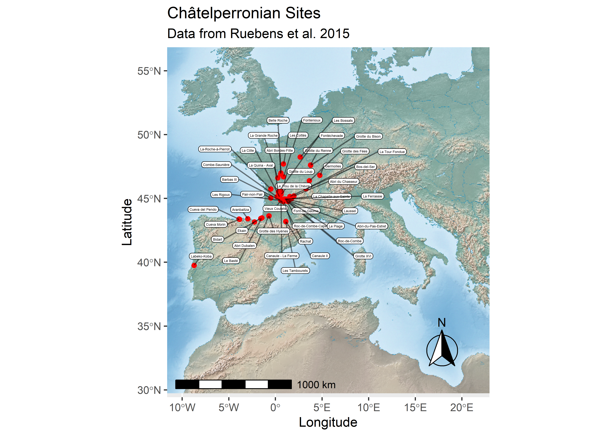

## Ruebens, McPherron & Hublin 2015 - On the local Mousterian origin of the Châtelperronian: Integrating typo-technological, chronostratigraphic and contextual data

In Ruebens, McPherron, and Hublin (2015) we included in the
Supplementary Information a spreadsheet of summary data on
Châtelperronian sites. Here we show what some of those data look like
by plotting the category 1 and 2 sites and listing some of the data.

``` r
library(ggplot2)
library(ggrepel)
library(dplyr)
library(tidyr)
library(magrittr)
library(readxl)
library(knitr)
library(sf)
library(raster)
library(RStoolbox)
library(leaflet)
library(maptools)
library(ggspatial)
library(ggmap)
library(mapview)
library(tiff)
library(rgdal)

webshot::install_phantomjs(force = TRUE)

# These CSV files are tabs one and two from the spreadsheet in the SI
# of Ruebens et al. 2015.  Some columns, like sitename, have names that need 
# to be corrected.
cp_sites1 = read_excel('data/Ruebens et al 2015.xlsx', sheet = 2, skip = 1) %>%
  rename(Sitename = 'Site name')

cp_sites2 = read_excel('data/Ruebens et al 2015.xlsx', sheet = 3, skip = 1) %>%
  rename(Sitename = 'Site name') %>%
  drop_na()
```

``` r
# Need to make an ROI
# Take the sites and create square around it
# Load the sites and make them to sf objects 
cp_sites1_sf <- st_as_sf(cp_sites1, coords = c("Long.", "Lat."), crs = 4326, agr = "constant")
cp_sites2_sf <- st_as_sf(cp_sites2, coords = c("Long.", "Lat."), crs = 4326, agr = "constant")

# Row bind them into one dataframe
cp_sites_sf <- rbind(cp_sites1_sf, cp_sites2_sf)

# And save it as a shapefile
st_write(cp_sites_sf, "data/Reubens_Sites.shp", append = FALSE)
```

    ## Deleting layer `Reubens_Sites' using driver `ESRI Shapefile'
    ## Writing layer `Reubens_Sites' to data source `data/Reubens_Sites.shp' using driver `ESRI Shapefile'
    ## Writing 46 features with 6 fields and geometry type Point.

``` r
# Read the ROI for Reubens map 
ReubensROI<-st_read("data/Reubens_ROI.shp")
```

    ## Reading layer `Reubens_ROI' from data source `C:\Users\mcpherro\mpiCloud\R\ArchData\Ruebens et al 2015\data\Reubens_ROI.shp' using driver `ESRI Shapefile'
    ## Simple feature collection with 1 feature and 1 field
    ## geometry type:  POLYGON
    ## dimension:      XY
    ## bbox:           xmin: -10.04696 ymin: 30.67512 xmax: 21.37523 ymax: 55.59026
    ## geographic CRS: WGS 84

Here is a Leaflet version of the map. When rendered within rStudio this
produces a dynamic map that can be zoomed and where each data point
shows all of the data attached to that point.

``` r
htmltitle <- "<h5> Reubens 2015 Archaeological Sites </h5>"

mylabels <- paste(
  "Site Name: ", cp_sites_sf$Sitename, "<br/>",
  "Community: ", cp_sites_sf$Community, "<br/>",
  "Region: ", cp_sites_sf$Region, "<br/>",
  "Location: ", cp_sites_sf$Location, "<br/>",
  "Information: ", cp_sites_sf$`Contextual information`, "<br/>",
  "References: ", cp_sites_sf$`Key References`) %>% lapply(htmltools::HTML)

m <- leaflet() %>%
      addTiles %>%
      addMarkers(data = cp_sites1_sf,
                  popup = ~Sitename,
                  label = mylabels,
                  labelOptions = labelOptions(style = list("font-weight" = "normal", padding = "3px 8px"), 
                                              textsize = "13px", direction = "auto")) %>%
      addControl(html=htmltitle, position = "topright")
  
m
```

<!-- -->

The following code saves the HTML code from the Leafet map. You can view
the [dynamic map
here](https://davidrbraun.github.io/ArchData/index.html).

``` r
mapshot(m, 'docs/index.html')
```

Here is a static map of all Category 1 (Châtelperronian sites with good
contextual information) and Category 2 (Châtelperronian sites needing
some better contextual information) sites considered in Ruebens,
McPherron, and Hublin (2015).

``` r
# Download this base map from https://www.naturalearthdata.com/downloads/
# Here we also used qGIS to clip the map to the area of Europe we are interested in,
# and saved it as a geoTIFF called bgmap.tif
bgmap <- brick("data/bgmap.tif")

map <- ggplot()
map = map + ggRGB(bgmap, r = 1, g = 2, b = 3,  ggLayer = TRUE)
map = map + geom_sf(data = ReubensROI, color = NA, fill = NA)
map = map + geom_sf(data = cp_sites_sf, size = 1.5, color = 'red')
map = map + ggrepel::geom_label_repel(data = cp_sites_sf,
                                      aes(label = Sitename, geometry = geometry),
                                      stat = "sf_coordinates", min.segment.length = 0,
                                      colour = "black", segment.colour = "black",
                                      label.size = 0.2, nudge_x = 0.5, size = 1,
                                      segment.alpha = .5, point.padding = .1,
                                      label.padding = .1)
map = map + ggtitle('Châtelperronian Sites', subtitle = 'Data from Ruebens et al. 2015')
map = map + annotation_scale(location = "bl", width_hint = 0.5) 
map = map + annotation_north_arrow(location = "br", which_north = "true", 
        pad_x = unit(0.25, "in"), pad_y = unit(0.3, "in"),
        style = north_arrow_fancy_orienteering)
map = map + xlab('Longitude') + ylab('Latitude')
map = map + coord_sf()
map 
```

<!-- -->

And here is another way of making that same map. This version better
preserves the resolution of the underlying base map.

``` r
# Download this base map from https://www.naturalearthdata.com/downloads/
# Here we also used qGIS to clip the map to the area of Europe we are interested in,
# and saved it as a geoTIFF called bgmap.tif.  You can likely make this map without first clipping it.

# The first line loads the map as a raster dataset.
# The second line reads the spatial limits of the map.
bgmap = as.raster(readTIFF("data/bgmap.tif", native = TRUE, convert = TRUE))
bgmap_limits = readGDAL('data/bgmap.tif')@bbox
```

    ## data/bgmap.tif has GDAL driver GTiff 
    ## and has 2501 rows and 2835 columns

``` r
map <- ggplot()
map = map + annotation_raster(bgmap,
                          xmin = bgmap_limits[1,1],
                          xmax = bgmap_limits[1,2],
                          ymin = bgmap_limits[2,1],
                          ymax = bgmap_limits[2,2]) 
map = map + geom_sf(data = ReubensROI, color = NA, fill = NA)
map = map + geom_sf(data = cp_sites_sf, size = 1.5, color = 'red')
map = map + ggrepel::geom_label_repel(data = cp_sites_sf,
                                      aes(label = Sitename, geometry = geometry),
                                      stat = "sf_coordinates", min.segment.length = 0,
                                      colour = "black", segment.colour = "black",
                                      label.size = 0.2, nudge_x = 0.5, size = 1,
                                      segment.alpha = .5, point.padding = .1,
                                      label.padding = .1)
map = map + ggtitle('Châtelperronian Sites', subtitle = 'Data from Ruebens et al. 2015')
map = map + annotation_scale(location = "bl", width_hint = 0.5) 
map = map + annotation_north_arrow(location = "br", which_north = "true", 
        pad_x = unit(0.25, "in"), pad_y = unit(0.3, "in"),
        style = north_arrow_fancy_orienteering)
map = map + xlab('Longitude') + ylab('Latitude')
map = map + coord_sf()
map 
```

<!-- -->

Here are two views on the data themselves. First the Category 1 sites.

``` r
kable(cp_sites1_sf)
```

| Sitename             | Community              | Region               | Contextual information                                                         | Location    | Key References                                   | geometry              |
| :------------------- | :--------------------- | :------------------- | :----------------------------------------------------------------------------- | :---------- | :----------------------------------------------- | :-------------------- |
| Bidart               | Bidart                 | Pyrénées-Atlantiques | collected in 1975 by Normand and excavated in 1976-77 by Chauchat              | open-air    | Chauchat, 1977; Bachellerie, 2011                | POINT (-1.587 43.436) |
| Canaule II           | Creysse                | Dordogne             | excavated 1968-1969 by Guichard                                                | open-air    | Guichard, 1970; Bachellerie et al., 2007, 2011   | POINT (0.582 44.861)  |
| Cueva Morin          | Villaneva-Villescusa   | Cantabria            | excavated 1912-1919; and 1966-1969 by Gonzalez Echegaray and Freeman           | cave        | Gonzalez Echegaray & Freeman, 1971 and 1973      | POINT (-3.84 43.361)  |
| Grotte du Bison      | Arcy-sur-Cure          | Yonne                | excavated 1959-1963 by A. Leroi-Gourhan & F. Hours, since 1995 by F. David     | cave        | David et al., 2005                               | POINT (3.769 47.595)  |
| Grotte du Loup       | Cosnac                 | Corrèze              | excavated 1966-1972 by Mazière, 2012-2013 by A. Michel                         | cave        | Mazière and Raynal, 1983                         | POINT (0.63 45.51)    |
| Grotte du Renne      | Arcy-sur-Cure          | Yonne                | excavated 1949-1963 by A. Leroi-Gourhan                                        | cave        | Leroi-Gourhan, 1961; Connet, 2002                | POINT (3.75 47.62)    |
| La Côte              | Neuvic sur l’Isle      | Dordogne             | discovered in 1966 and excavated 1972 by J-P. Texier & J. Gaussen              | open-air    | Gaussen and Texier, 1974; Pelegrin, 1995         | POINT (0.468 45.104)  |
| La Grande Roche      | Quinçay                | Vienne               | discovered in 1952 and excavated 1968-1990 by Lévêque                          | cave        | Lévêque,1987; Roussel, 2011                      | POINT (0.238 46.605)  |
| La-Roche-à-Pierrot   | Saint-Césaire          | Charente-Maritime    | excavated 1977-1993 by Lévêque, and since 2013 by Bachellerie                  | rockshelter | Lévêque et al., 1993; Soressi, 2010              | POINT (-0.506 45.747) |
| Le Basté             | Saint Pierre d’Irube   | Pyrénées-Atlantiques | excavated 1966-1967 by Chauchat and Thibault                                   | open-air    | Chauchat, 1968; Bachellerie, 2011                | POINT (-1.46 43.477)  |
| Le Trou de la Chèvre | Bourdeilles            | Dordogne             | excavated 1948-1955 by Arambourou and Jude                                     | rockshelter | Arambourou and Jude, 1964                        | POINT (0.581 45.321)  |
| Les Cottés           | Saint-Pierre de Maillé | Vienne               | first work in 1881, excavations 1958-1961 by Pradel, and since 2006 by Soressi | cave        | Primault, 2003; Soressi et al., 2010             | POINT (0.851 47.7)    |
| Les Tambourets       | Couladère              | Haute Garonne        | collected by Méroc in 1963, excavated 1973, 1975, 1980 by Bricker and Alaux    | open-air    | Bricker and Laville, 1977; Bricker, 2014         | POINT (1.099 43.201)  |
| Roc-de-Combe         | Nadaillac              | Lot                  | excavated 1959 by Labrot, and 1966 by F. Bordes                                | cave        | Bordes and Labrot, 1967; Sonneville-Bordes, 2002 | POINT (1.333 44.767)  |
| Vieux Coutets        | Creysse                | Dordogne             | large-scale rescue excavation in 2003                                          | open-air    | Grigoletto et al., 2008                          | POINT (0.568 44.864)  |

And the Category 2 sites.

``` r
kable(cp_sites1_sf)
```

| Sitename             | Community              | Region               | Contextual information                                                         | Location    | Key References                                   | geometry              |
| :------------------- | :--------------------- | :------------------- | :----------------------------------------------------------------------------- | :---------- | :----------------------------------------------- | :-------------------- |
| Bidart               | Bidart                 | Pyrénées-Atlantiques | collected in 1975 by Normand and excavated in 1976-77 by Chauchat              | open-air    | Chauchat, 1977; Bachellerie, 2011                | POINT (-1.587 43.436) |
| Canaule II           | Creysse                | Dordogne             | excavated 1968-1969 by Guichard                                                | open-air    | Guichard, 1970; Bachellerie et al., 2007, 2011   | POINT (0.582 44.861)  |
| Cueva Morin          | Villaneva-Villescusa   | Cantabria            | excavated 1912-1919; and 1966-1969 by Gonzalez Echegaray and Freeman           | cave        | Gonzalez Echegaray & Freeman, 1971 and 1973      | POINT (-3.84 43.361)  |
| Grotte du Bison      | Arcy-sur-Cure          | Yonne                | excavated 1959-1963 by A. Leroi-Gourhan & F. Hours, since 1995 by F. David     | cave        | David et al., 2005                               | POINT (3.769 47.595)  |
| Grotte du Loup       | Cosnac                 | Corrèze              | excavated 1966-1972 by Mazière, 2012-2013 by A. Michel                         | cave        | Mazière and Raynal, 1983                         | POINT (0.63 45.51)    |
| Grotte du Renne      | Arcy-sur-Cure          | Yonne                | excavated 1949-1963 by A. Leroi-Gourhan                                        | cave        | Leroi-Gourhan, 1961; Connet, 2002                | POINT (3.75 47.62)    |
| La Côte              | Neuvic sur l’Isle      | Dordogne             | discovered in 1966 and excavated 1972 by J-P. Texier & J. Gaussen              | open-air    | Gaussen and Texier, 1974; Pelegrin, 1995         | POINT (0.468 45.104)  |
| La Grande Roche      | Quinçay                | Vienne               | discovered in 1952 and excavated 1968-1990 by Lévêque                          | cave        | Lévêque,1987; Roussel, 2011                      | POINT (0.238 46.605)  |
| La-Roche-à-Pierrot   | Saint-Césaire          | Charente-Maritime    | excavated 1977-1993 by Lévêque, and since 2013 by Bachellerie                  | rockshelter | Lévêque et al., 1993; Soressi, 2010              | POINT (-0.506 45.747) |
| Le Basté             | Saint Pierre d’Irube   | Pyrénées-Atlantiques | excavated 1966-1967 by Chauchat and Thibault                                   | open-air    | Chauchat, 1968; Bachellerie, 2011                | POINT (-1.46 43.477)  |
| Le Trou de la Chèvre | Bourdeilles            | Dordogne             | excavated 1948-1955 by Arambourou and Jude                                     | rockshelter | Arambourou and Jude, 1964                        | POINT (0.581 45.321)  |
| Les Cottés           | Saint-Pierre de Maillé | Vienne               | first work in 1881, excavations 1958-1961 by Pradel, and since 2006 by Soressi | cave        | Primault, 2003; Soressi et al., 2010             | POINT (0.851 47.7)    |
| Les Tambourets       | Couladère              | Haute Garonne        | collected by Méroc in 1963, excavated 1973, 1975, 1980 by Bricker and Alaux    | open-air    | Bricker and Laville, 1977; Bricker, 2014         | POINT (1.099 43.201)  |
| Roc-de-Combe         | Nadaillac              | Lot                  | excavated 1959 by Labrot, and 1966 by F. Bordes                                | cave        | Bordes and Labrot, 1967; Sonneville-Bordes, 2002 | POINT (1.333 44.767)  |
| Vieux Coutets        | Creysse                | Dordogne             | large-scale rescue excavation in 2003                                          | open-air    | Grigoletto et al., 2008                          | POINT (0.568 44.864)  |

To see this map in google view this file as a kml on google earth

``` r
cp_sites_sp<-as(cp_sites_sf, "Spatial")

kmlPoints(cp_sites_sp,kmlfile = "Reubens_map.kml", kmlname="Reubens_map",icon="http://www.gstatic.com/mapspro/images/stock/962-wht-diamond-blank.png", name=paste(cp_sites_sp$Sitename), description = paste(cp_sites_sp$Concerns))
```

<div id="refs" class="references hanging-indent">

<div id="ref-ruebens_local_2015">

Ruebens, Karen, Shannon JP McPherron, and Jean-Jacques Hublin. 2015. “On
the Local Mousterian Origin of the Châtelperronian: Integrating
Typo-Technological, Chronostratigraphic and Contextual Data.” *Journal
of Human Evolution* 86: 55–91.

</div>

</div>
