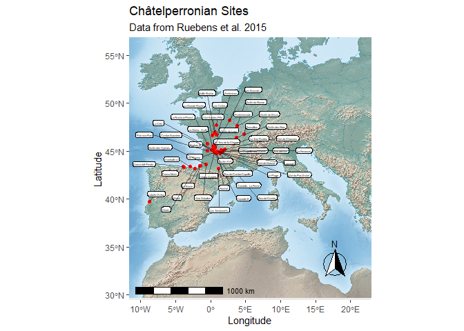

## Ruebens, McPherron & Hublin 2015 - On the local Mousterian origin of the Châtelperronian: Integrating typo-technological, chronostratigraphic and contextual data

In Ruebens, McPherron, and Hublin (2015) we included in the
Supplementary Information a spreadsheet of summary data on
Châtelperronian sites. Here we show what some of those data look like
by plotting the category 1 and 2 sites and listing some of the data.

``` r
library(ggplot2)
library(ggrepel)
library(dplyr)
library(magrittr)
library(knitr)
library(sf)
library(raster)
library(RStoolbox)

# These CSV files are tabs one and two from the spreadsheet in the SI
# of Ruebens et al. 2015.  Some columns, like sitename, have names that need 
# to be corrected.
cp_sites1 = read.csv("data/Reubens_Category_1.csv", header = TRUE, sep = ',') %>%
  rename(Sitename = 'ï..Site.name')
cp_sites2 = read.csv("data/Reubens_Category_2.csv", header = TRUE, sep = ',') %>%
  rename(Sitename = 'ï..Site.name')
```

``` r
# Need to make an ROI
# Take the sites and create square around it
# Load the sites and make them to sf objects 
cp_sites1_sf <- st_as_sf(cp_sites1, coords = c("Long.", "Lat."), crs = 4326, agr = "constant")
cp_sites2_sf <- st_as_sf(cp_sites2, coords = c("Long.", "Lat."), crs = 4326, agr = "constant")

# Add this field so that both dataframes have the same columns
cp_sites1_sf$Concerns = NA

# Row bind them into one dataframe
cp_sites_sf <- rbind(cp_sites1_sf, cp_sites2_sf)

# And save it as a shapefile
st_write(cp_sites_sf, "data/Reubens_Sites.shp", append = FALSE)
```

    ## Deleting layer `Reubens_Sites' using driver `ESRI Shapefile'
    ## Writing layer `Reubens_Sites' to data source `data/Reubens_Sites.shp' using driver `ESRI Shapefile'
    ## Writing 46 features with 7 fields and geometry type Point.

``` r
# Read the ROI for Reubens map 
ReubensROI<-st_read("data/Reubens_ROI.shp")
```

    ## Reading layer `Reubens_ROI' from data source `C:\Users\mcpherro\mpiCloud\R\ArchData\Ruebens et al 2015\data\Reubens_ROI.shp' using driver `ESRI Shapefile'
    ## Simple feature collection with 1 feature and 1 field
    ## geometry type:  POLYGON
    ## dimension:      XY
    ## bbox:           xmin: -10.04696 ymin: 30.67512 xmax: 21.37523 ymax: 55.59026
    ## CRS:            4326

Here is a map of all Category 1 (Châtelperronian sites with good
contextual information) and Category 2 (Châtelperronian sites needing
some better contextual information) sites considered in Ruebens,
McPherron, and Hublin (2015).

``` r
bgmap <- brick("data/bgmap.tif")

map <- ggplot()
map = map + ggRGB(bgmap, r = 1, g = 2, b = 3,  ggLayer = TRUE)
map = map + geom_sf(data = ReubensROI, color = NA, fill = NA)
map = map + geom_sf(data = cp_sites_sf, size = 1.5, color = 'red')
map = map + ggrepel::geom_label_repel(data = cp_sites_sf,
                                      aes(label = Sitename, geometry = geometry),
                                      stat = "sf_coordinates", min.segment.length = 0,
                                      colour = "black", segment.colour = "black",
                                      label.size = 0.2, nudge_x = 0.5, size = 1,
                                      segment.alpha = .5, point.padding = .1,
                                      label.padding = .1)
map = map + ggtitle('Châtelperronian Sites', subtitle = 'Data from Ruebens et al. 2015')
map = map + xlab('Longitude') + ylab('Latitude')
map = map + coord_sf()
map 
```

<!-- -->

Here are two views on the data themselves. First the Category 1 sites.

``` r
kable(cp_sites1_sf)
```

| Sitename              | Community               | Region                 | Contextual.information                                                         | Location    | Key.References                                   | geometry          | Concerns |
| :-------------------- | :---------------------- | :--------------------- | :----------------------------------------------------------------------------- | :---------- | :----------------------------------------------- | :---------------- | :------- |
| Bidart                | Bidart                  | Pyrénées-Atlantiques | collected in 1975 by Normand and excavated in 1976-77 by Chauchat              | open-air    | Chauchat, 1977; Bachellerie, 2011                | c(-1.587, 43.436) | NA       |
| Canaule II            | Creysse                 | Dordogne               | excavated 1968-1969 by Guichard                                                | open-air    | Guichard, 1970; Bachellerie et al., 2007, 2011   | c(0.582, 44.861)  | NA       |
| Cueva Morin           | Villaneva-Villescusa    | Cantabria              | excavated 1912-1919; and 1966-1969 by Gonzalez Echegaray and Freeman           | cave        | Gonzalez Echegaray & Freeman, 1971 and 1973      | c(-3.84, 43.361)  | NA       |
| Grotte du Bison       | Arcy-sur-Cure           | Yonne                  | excavated 1959-1963 by A. Leroi-Gourhan & F. Hours, since 1995 by F. David     | cave        | David et al., 2005                               | c(3.769, 47.595)  | NA       |
| Grotte du Loup        | Cosnac                  | Corrèze               | excavated 1966-1972 by Mazière, 2012-2013 by A. Michel                        | cave        | Mazière and Raynal, 1983                        | c(0.63, 45.51)    | NA       |
| Grotte du Renne       | Arcy-sur-Cure           | Yonne                  | excavated 1949-1963 by A. Leroi-Gourhan                                        | cave        | Leroi-Gourhan, 1961; Connet, 2002                | c(3.75, 47.62)    | NA       |
| La Côte              | Neuvic sur l’Isle       | Dordogne               | discovered in 1966 and excavated 1972 by J-P. Texier & J. Gaussen              | open-air    | Gaussen and Texier, 1974; Pelegrin, 1995         | c(0.468, 45.104)  | NA       |
| La Grande Roche       | Quinçay                | Vienne                 | discovered in 1952 and excavated 1968-1990 by Lévêque                        | cave        | Lévêque,1987; Roussel, 2011                    | c(0.238, 46.605)  | NA       |
| La-Roche-à-Pierrot   | Saint-Césaire          | Charente-Maritime      | excavated 1977-1993 by Lévêque, and since 2013 by Bachellerie                | rockshelter | Lévêque et al., 1993; Soressi, 2010            | c(-0.506, 45.747) | NA       |
| Le Basté             | Saint Pierre d’Irube    | Pyrénées-Atlantiques | excavated 1966-1967 by Chauchat and Thibault                                   | open-air    | Chauchat, 1968; Bachellerie, 2011                | c(-1.46, 43.477)  | NA       |
| Le Trou de la Chèvre | Bourdeilles             | Dordogne               | excavated 1948-1955 by Arambourou and Jude                                     | rockshelter | Arambourou and Jude, 1964                        | c(0.581, 45.321)  | NA       |
| Les Cottés           | Saint-Pierre de Maillé | Vienne                 | first work in 1881, excavations 1958-1961 by Pradel, and since 2006 by Soressi | cave        | Primault, 2003; Soressi et al., 2010             | c(0.851, 47.7)    | NA       |
| Les Tambourets        | Couladère              | Haute Garonne          | collected by Méroc in 1963, excavated 1973, 1975, 1980 by Bricker and Alaux   | open-air    | Bricker and Laville, 1977; Bricker, 2014         | c(1.099, 43.201)  | NA       |
| Roc-de-Combe          | Nadaillac               | Lot                    | excavated 1959 by Labrot, and 1966 by F. Bordes                                | cave        | Bordes and Labrot, 1967; Sonneville-Bordes, 2002 | c(1.333, 44.767)  | NA       |
| Vieux Coutets         | Creysse                 | Dordogne               | large-scale rescue excavation in 2003                                          | open-air    | Grigoletto et al., 2008                          | c(0.568, 44.864)  | NA       |

And the Category 2 sites.

``` r
kable(cp_sites1_sf)
```

| Sitename              | Community               | Region                 | Contextual.information                                                         | Location    | Key.References                                   | geometry          | Concerns |
| :-------------------- | :---------------------- | :--------------------- | :----------------------------------------------------------------------------- | :---------- | :----------------------------------------------- | :---------------- | :------- |
| Bidart                | Bidart                  | Pyrénées-Atlantiques | collected in 1975 by Normand and excavated in 1976-77 by Chauchat              | open-air    | Chauchat, 1977; Bachellerie, 2011                | c(-1.587, 43.436) | NA       |
| Canaule II            | Creysse                 | Dordogne               | excavated 1968-1969 by Guichard                                                | open-air    | Guichard, 1970; Bachellerie et al., 2007, 2011   | c(0.582, 44.861)  | NA       |
| Cueva Morin           | Villaneva-Villescusa    | Cantabria              | excavated 1912-1919; and 1966-1969 by Gonzalez Echegaray and Freeman           | cave        | Gonzalez Echegaray & Freeman, 1971 and 1973      | c(-3.84, 43.361)  | NA       |
| Grotte du Bison       | Arcy-sur-Cure           | Yonne                  | excavated 1959-1963 by A. Leroi-Gourhan & F. Hours, since 1995 by F. David     | cave        | David et al., 2005                               | c(3.769, 47.595)  | NA       |
| Grotte du Loup        | Cosnac                  | Corrèze               | excavated 1966-1972 by Mazière, 2012-2013 by A. Michel                        | cave        | Mazière and Raynal, 1983                        | c(0.63, 45.51)    | NA       |
| Grotte du Renne       | Arcy-sur-Cure           | Yonne                  | excavated 1949-1963 by A. Leroi-Gourhan                                        | cave        | Leroi-Gourhan, 1961; Connet, 2002                | c(3.75, 47.62)    | NA       |
| La Côte              | Neuvic sur l’Isle       | Dordogne               | discovered in 1966 and excavated 1972 by J-P. Texier & J. Gaussen              | open-air    | Gaussen and Texier, 1974; Pelegrin, 1995         | c(0.468, 45.104)  | NA       |
| La Grande Roche       | Quinçay                | Vienne                 | discovered in 1952 and excavated 1968-1990 by Lévêque                        | cave        | Lévêque,1987; Roussel, 2011                    | c(0.238, 46.605)  | NA       |
| La-Roche-à-Pierrot   | Saint-Césaire          | Charente-Maritime      | excavated 1977-1993 by Lévêque, and since 2013 by Bachellerie                | rockshelter | Lévêque et al., 1993; Soressi, 2010            | c(-0.506, 45.747) | NA       |
| Le Basté             | Saint Pierre d’Irube    | Pyrénées-Atlantiques | excavated 1966-1967 by Chauchat and Thibault                                   | open-air    | Chauchat, 1968; Bachellerie, 2011                | c(-1.46, 43.477)  | NA       |
| Le Trou de la Chèvre | Bourdeilles             | Dordogne               | excavated 1948-1955 by Arambourou and Jude                                     | rockshelter | Arambourou and Jude, 1964                        | c(0.581, 45.321)  | NA       |
| Les Cottés           | Saint-Pierre de Maillé | Vienne                 | first work in 1881, excavations 1958-1961 by Pradel, and since 2006 by Soressi | cave        | Primault, 2003; Soressi et al., 2010             | c(0.851, 47.7)    | NA       |
| Les Tambourets        | Couladère              | Haute Garonne          | collected by Méroc in 1963, excavated 1973, 1975, 1980 by Bricker and Alaux   | open-air    | Bricker and Laville, 1977; Bricker, 2014         | c(1.099, 43.201)  | NA       |
| Roc-de-Combe          | Nadaillac               | Lot                    | excavated 1959 by Labrot, and 1966 by F. Bordes                                | cave        | Bordes and Labrot, 1967; Sonneville-Bordes, 2002 | c(1.333, 44.767)  | NA       |
| Vieux Coutets         | Creysse                 | Dordogne               | large-scale rescue excavation in 2003                                          | open-air    | Grigoletto et al., 2008                          | c(0.568, 44.864)  | NA       |

<div id="refs" class="references hanging-indent">

<div id="ref-ruebens_local_2015">

Ruebens, Karen, Shannon JP McPherron, and Jean-Jacques Hublin. 2015. “On
the Local Mousterian Origin of the Châtelperronian: Integrating
Typo-Technological, Chronostratigraphic and Contextual Data.” *Journal
of Human Evolution* 86: 55–91.

</div>

</div>
