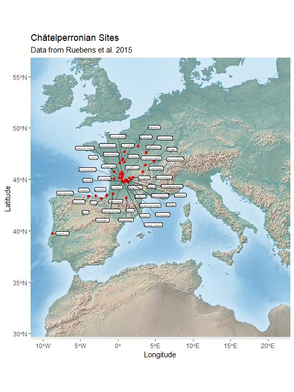

## Ruebens, McPherron & Hublin 2015 - On the local Mousterian origin of the Châtelperronian: Integrating typo-technological, chronostratigraphic and contextual data

In Ruebens, McPherron, and Hublin (2015) we included summary data.

``` r
library(ggplot2)
library(ggrepel)
library(dplyr)
library(magrittr)
library(knitr)

cp_sites1 = read.csv("data/Reubens_Category_1.csv", header = TRUE, sep = ',')

cp_sites2 = read.csv("data/Reubens_Category_2.csv", header = TRUE, sep = ',')
```

``` r
#library(ggmap)
#library(ggrepel)
#library(raster)
#library(mapdata)
library(ggplot2)
library(dplyr)
library(sf)
library(raster)
#library(sp)
#library(pander)
library(ggrepel)
library(RStoolbox)
#library(RColorBrewer)
#library(manipulate) # Included with RStudio
#library(lubridate)
```

``` r
europe = raster('data/elevation9x9.tif')

#need to make an ROI
#Take the sites and creata square around it
#Load the sites and make them to sf objects 
cp_sites1_sf<-st_as_sf(cp_sites1, coords = c("Long.", "Lat."), crs = 4326, agr = "constant")

cp_sites2_sf<-st_as_sf(cp_sites2, coords = c("Long.", "Lat."), crs = 4326, agr = "constant")


names(cp_sites1_sf)[1] = "Sitename"
names(cp_sites2_sf)[1] = "Sitename"

cp_sites1_sf$Concerns=NA
cp_sites_sf<-rbind(cp_sites1_sf,cp_sites2_sf)

#Now out put them as shapefiles

st_write(cp_sites_sf,"Reubens_Sites.shp", append = FALSE)
```

    ## Deleting layer `Reubens_Sites' using driver `ESRI Shapefile'
    ## Writing layer `Reubens_Sites' to data source `Reubens_Sites.shp' using driver `ESRI Shapefile'
    ## Writing 46 features with 7 fields and geometry type Point.

``` r
#Read in ROI for Reubens map 

ReubensROI<-st_read("data/Reubens_ROI.shp")
```

    ## Reading layer `Reubens_ROI' from data source `C:\Users\mcpherro\mpiCloud\R\ArchData\Ruebens et al 2015\data\Reubens_ROI.shp' using driver `ESRI Shapefile'
    ## Simple feature collection with 1 feature and 1 field
    ## geometry type:  POLYGON
    ## dimension:      XY
    ## bbox:           xmin: -10.04696 ymin: 30.67512 xmax: 21.37523 ymax: 55.59026
    ## CRS:            4326

Load in maps and the distriubtuion of sites

``` r
bgmap<-brick("data/bgmap.tif")

reubensmap2<-ggplot()+
ggRGB(bgmap, r=3, g=2, b=1,  ggLayer = TRUE)+
  geom_sf(data=ReubensROI,color=NA,fill=NA)+
geom_sf(data=cp_sites_sf,size=1.5, color = 'red')+
  ggrepel::geom_label_repel(data=cp_sites_sf, aes(label=Sitename, geometry=geometry), stat= "sf_coordinates", min.segment.length = 0, colour= "black",segment.colour="black",label.size = 0.4,nudge_x = 0.5, size = 1.7, segment.alpha = .5,point.padding = .3)+
   ggtitle('Châtelperronian Sites', subtitle = 'Data from Ruebens et al. 2015')+
   xlab('Longitude') + ylab('Latitude')+
  coord_sf()
  
reubensmap2
```

<!-- -->

``` r
reubensmap1<-ggplot()+
  ggR(europe, stretch="hist", ggLayer = TRUE, geom_raster=TRUE)+
  scale_fill_gradientn(name="Altitude",colours = terrain.colors(300))

reubensmap2<-ggplot()+
  geom_sf(data=cp_sites_sf)+
  ggrepel::geom_label_repel(data=cp_sites_sf, aes(label=Sitename, geometry=geometry), stat= "sf_coordinates", min.segment.length = 0, colour= "black",segment.colour="black",nudge_x = 0.05, size = 2.5)+
#  coord_sf()+
  ggtitle('Châtelperronian Sites', subtitle = 'Data from Ruebens et al. 2015')
```

<div id="refs" class="references hanging-indent">

<div id="ref-ruebens_local_2015">

Ruebens, Karen, Shannon JP McPherron, and Jean-Jacques Hublin. 2015. “On
the Local Mousterian Origin of the Châtelperronian: Integrating
Typo-Technological, Chronostratigraphic and Contextual Data.” *Journal
of Human Evolution* 86: 55–91.

</div>

</div>
